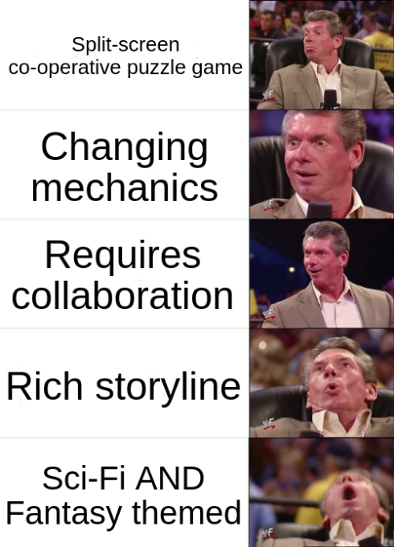

In the waning light of 2025, December 31^st^, I finished [Split Fiction](https://en.wikipedia.org/wiki/Split_Fiction).
It stole the easily won "Phill's Game of the Year" award.

<!--more-->

## It Took Two

Back in 2023, [Neebs Gaming](https://neebsflix.com/about-us) &mdash; the best gaming channel in the world &mdash; started a playthrough of [_It Takes Two_](https://en.wikipedia.org/wiki/It_Takes_Two_(video_game)).



It looked really fun, so I enlisted my partner Loz to play it with me.
The game is called _It Takes Two_ partially because it actually takes two people to play it.

As a split-screen cooperative game, it requires every puzzle in the game to be solved by both players working together.
For example, one player controlling platforms for the other to jump across.
Throughout the game, each player gets special abilities which are required to solve parts of the puzzle.
This means that if one of you sucks, you cannot progress.

This may seem annoying, but it gives the two of you a huge sense of team accomplishment.

The game keeps the mechanic fresh by changing the special abilities, and by extension the game mechanics, frequently.
One second you go from being able to change your size &mdash; small to fit through small gaps and large to move heavy objects &mdash; to being able to control time with a magical stopwatch.

These changes are expertly woven into the rich story that ties it all together, and never feels disjointed.
Each environment that you get to explore has fun little mini-games that allow you to take a break from the main story; want to see which of you is the better button-masher?
Time for some tug of war.

I felt sad when we finished, not just because the main story itself is sad, but because Loz and I didn't have anything else to play together, as a team.

After leaving a two player co-operative puzzle game sized-hole in my heart, I moved on from _It Takes Two_.

## Split Fiction

Then, in 2025, the creators of _It Takes Two_ ([_Hazelight Studios_](https://en.wikipedia.org/wiki/Hazelight_Studios)) released _Split Fiction_.



Another split-screen, co-operative puzzle game?\
Unique and interesting mechanics which change throughout the game?\
Requiring collaboration in order to progress?\
Rich storyline woven throughout?\
Sci-Fi _and_ Fantasy themed?

{style="width:50%;" class="items-center mx-auto"}

If there is one genre I am in love with, it is Sci-Fi.
And if there is one genre my partner is in love with, it is Fantasy.
This game was surely made for us.

After just having finished the game, I can confidently say that _Split Fiction_ took the game mechanics from _It Takes Two_, and turned them all the way [up to 11](https://en.wikipedia.org/wiki/Up_to_eleven).

The premise of the game is that you play as two authors who get thrust into their own stories when they are trapped in a machine designed to steal their creative ideas.
Zoe writes fantasy, and Mio writes Sci-Fi.
In your attempts to escape, you travel through each 'level' solving puzzles.
Levels alternate between the two genres, the mechanics change between them, and there are lots of fun side-missions[^1], helping the game stay fresh.

[^1]: You wanted to play as a Pig that can double jump by farting sparkles, right?

As far as games go, it is not massively challenging, but that doesn't matter.
The game is more about the time spent working as a team with your friend; getting a sense of shared accomplishment.

This game is visually outstanding and so much fun, but the thing that sets it above anything I have played recently was the gameplay.
The last couple of levels had me shouting "this is such good level design" again and again.
Just when we had settled into the idea of a final boss-fight, to mirror the others, the game completely changed the dynamic on us[^2].

[^2]:Unfortunately, I don't want to spoil it for you, so I can't explain it much more than that.

The sound design for _Split Fiction_ can't be overstated either.
One of my annoyances with _It Takes Two_ was that the quirky interjections from the two characters got a bit grating after a while.
_Split Fiction_ managed to avoid this, but I can't quite put my finger on how.
The main characters still interject, and there are plenty of cutscenes, but it feels more natural, less forced.
Their contributions often supported the player, by explaining a puzzle mechanic, or giving a hint.

One of the final sequences featured some of the best orchestral music I have heard in a game for a long time.
In a true "all is lost" moment, the composer _Jonatan Järpehag_ did a perfect job of capturing my emotions[^3] whilst I still concentrated on not dying in the game.

[^3]: [Here's a link](https://www.youtube.com/watch?v=8rESEZGJlaw&t=80s) if you want to listen to it yourself.
      It had real 'Simba watching his father die' vibes.

One final thing I want to praise about _Split Fiction_ is the 'friends pass'.

> Invite a friend to play for free online using the Friend's Pass.
> As long as one of you owns the game, both of you can play!
>
> &mdash; [Split Fiction Official Website](https://www.ea.com/games/split-fiction/split-fiction/features/friends-pass)

Sure, you could argue that this is pretty much mandatory for a co-operative game that _literally_ cannot be played without a second person, but it was nice to see.
EA could have decided to extract more money from players, but they didn't.
In a modern world where everything seems like it's designed to take the most money from you, this was a welcome relief.

So, I think it's pretty clear that _Split Fiction_ is a solid 10/10 game for me.
If you don't have a friend to play it with, then this is going to be a tough sell.
If you hate games which keep changing the mechanics on you, just when you got used to them, then this might not be the game for you.

But, if you love a great story, fun puzzles, and impressive visuals, then I cannot recommend _Split Fiction_ enough.
