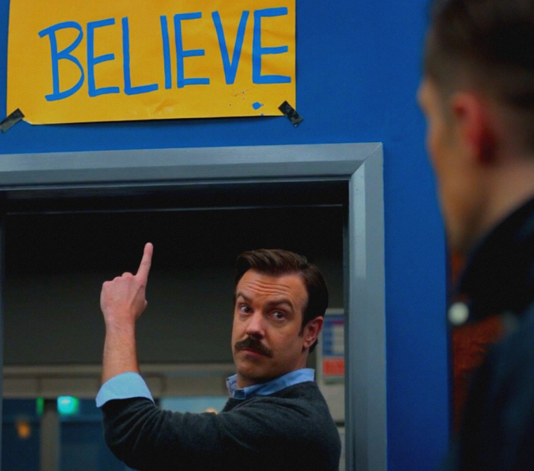

I just finished Season 3 of [War of the Worlds (2019)](https://en.wikipedia.org/wiki/War_of_the_Worlds_(2019_TV_series)), and I wish I had stopped at Season 2.

<!--more-->

Not to be confused with the [BBC Miniseries](https://en.wikipedia.org/wiki/The_War_of_the_Worlds_(British_TV_series)) which originally aired on the 17^th^ November 2019, _War of the Worlds (2019)_ is a completely different thing, originally aired on the 28^th^ October 2019; a mere 20 days earlier.

Have we done enough _War of the Worlds_ yet?
Can we mark this as complete?
Did we win?

> [!WARNING] So many spoilers
> If you want to watch the War of the Worlds, Lost, Into the Night, or the Walking Dead, don't read this.
> It is going to contain a lot of spoilers.

## War of the what?

_War of the Worlds (2019)_ is a pretty interesting take on the original story from [H. G. Wells](https://en.wikipedia.org/wiki/The_War_of_the_Worlds).
Instead of slippery, tentacled Martians being the ones that want to harvest us for our delicious blood, this adaption replaces the enemy with something far worse.
Humanities ultimate enemy.

Itself.

I know what you are thinking, doesn't this kinda make the whole title wrong because there are not multiple worlds fighting with one another?
Yes, but also no, because these Humans are from another planet, but they were from our planet originally.
Let me explain.

At some point two of our main characters, Emily and Sascha, leave planet Earth to go be 'Adam and Eve' on another planet.
They do this by flying there in a super advanced spaceship (I will get back to this later).
Once there, they create a whole world of rather sickly humans who all inherited Sascha's Muscular Dystrophy and Emily's unnamed degenerative genetic condition which results in blindness.
Sascha also happens to be a massive sociopath who tells all of his flock that everyone back on earth is to blame for their situation.
This eventually leads to them invading earth to take back what should be theirs.
They do this using the aforementioned super advanced spaceship to go back in time six months before Emily and Sascha left, to wipe out all the people on Earth.

Confused yet?
I hope you liked [Back to the Future](https://en.wikipedia.org/wiki/Back_to_the_Future), because this plot _heavily_ relies on time-travel, and doesn't like you thinking about it too hard.

You know, now I'm writing this plot down, it seems worse than when I was watching it.

Remember the cool tripod Martian ships from other adaptations?
Nope, none of that here please.
Those tripods were replaced with [Boston Dynamics-like](https://nypost.com/2020/04/02/how-those-creepy-war-of-the-worlds-aliens-came-to-life-on-epix/) robot dogs which hunt down survivors.

So we don't have alien tripods, and we don't actually have aliens.
What are we left with?
Surely something is faithful to the original book?

Really, the only thing that is semi-faithful is that the 'Aliens' need our blood/organs, to cure their shopping list of ailments.
That, and they used overwhelming force and technological superiority when invading.

Anyway, one of the main characters, Bill, spurred on by everyone he knows and loved dying, develops a pathogen which will only target the 'Aliens'.
He infects Emily, but before she can infect others, both her and Sascha are shoved into a ship and sent into space.
Bringing us right back to the start of our time-loop.

Stop it.
Don't think about where all the technology came from in the first place.
It's not that kind of show.

Bill, realizing that he just set into motion the event that will come back to start this whole pesky invasion, travels further back in time to push Emily off a roof.

Aaand, Scene.

## Something was good, right?

Despite being as close to the source material as the [Artemis Fowl film](https://en.wikipedia.org/wiki/Artemis_Fowl_(film)) was to the original books, I really enjoyed the **first two** seasons of _War of the Worlds (2019)_.

The Science-Fiction aspect of it was great.

The show started off well with the 'Aliens' using a signal that disrupts human brainwaves, resulting in 99% of the worlds' population dropping dead where they stood.
It felt suitably tense, and well explained, without making the 'science' sound implausible.

The explanations of how the 'Aliens' just appeared near Earth by bending space and time, using quantum something-something to travel the vast distances, landed well.
I'm going to ignore how dumb it was that being able to shift dozens of building-size ships from a neighbouring star system, to earth, is something that gives a huge power advantage, for the 'Aliens' to never use it again.

The CGI on the robot dogs was convincing, and nothing brought me out of it to start asking questions.
If we ignore the fact that these dogs can occasionally act like elite-level snipers, but forget they have a gun when main characters are wandering around with their plot-armour hanging out, the dogs looked cool.

The locations used for filming had a nice breadth to them, from abandoned London, to the French Alps.
None of the filming felt overly dark, and the pacing was good.

I have to give a shout-out to the actor of Sascha, Mathieu Torloting, who did such a good job of playing a sociopath, that he genuinely made me hate him.

One final thing that stood out to me, was how non-American it was.
American television often refuses to depict the death of children, or if it does, handles it off-screen.
_War of the Worlds (2019)_ did not shy away from this (and other gritty topics).
It makes sense, an 'Alien' race is wiping out humanity, why would they stop at the teenagers?

## Room for improvement

This was apparently Science-Fiction.
So maybe we could arm the 'quantum bending Aliens' with something more than a regular rifle?
These 'Aliens' can instantaneously jump between star systems and create a sound that causes people to die on the spot, do we really only get guns versus guns?
I was in the market for something more futuristic than a _'clever dog with a gun on it'_.

One of my 'hated film tropes' in apocalypse films, is the band of survivors keeping someone around, even though they know that person is a complete liability.
Another being 'failure to communicate'.

Multiple times throughout the **first two** seasons the main characters of Emily and Sascha either don't disclose important information, or are downright dangerous to the others in the group, but we keep them around.
At least if you don't want to get rid of them, keep an eye on them.
Christ.

This resulted in multiple needless deaths which grated after a while.

Finally, I might be the only person that noticed that they filmed the same parking garage location for somewhere in Northern France, and in Central London.

## Overstay your welcome

So, to the whole point of this blog.
Personally I think that _War of the Worlds (2019)_ went the same way as [Lost](https://en.wikipedia.org/wiki/Lost_(TV_series)), [Into the Night](https://en.wikipedia.org/wiki/Into_the_Night_(TV_series)), and [The Walking Dead](https://en.wikipedia.org/wiki/The_Walking_Dead_(TV_series)) before it.

It lost its way, and it went on too long.

### Lost Out

_Lost_ &mdash; a show which holds the most 'why was there a polar bear' awards &mdash; was fantastic.
A plane crashes on an island in the middle of the ocean, and the survivors have to learn to work together to ~~survive~~ not die.
But wait, some weird stuff is happening on the island.

Mysterious.

Lost should have called it when the main characters got back home in Season 4.
It would have been a perfect ending, but never let a good ending stop your studios' revenue stream.
Two more seasons followed, where the main cast _go back_ to the island and then more mad stuff happens, eventually painting itself into such a chaotic corner it had to play the 'they were all actually dead the whole time' card.

I warned you there would be spoilers, and it was the last two seasons of _Lost_ that spoiled the previous four.

### Into the Bin

_Into the Night_ has a perfect premise.
When the sun suddenly starts killing people instantly, passengers on an overnight flight from Brussels attempt to survive by flying into the night.

Season 1 was a claustrophobic, almost one-room, mesmerizing piece of storytelling.
Action takes place on the plane, the only pilot falls ill, other passengers go crazy.
They have to land to refuel.
It's a race against time.
Life as they know it is over, but they try to contact other survivors regardless.

The season ends with them finding a military bunker.
Story over; the interesting premise of them flying a plane around the planet complete.

But wait, Season 2 arrives.
The unique concept of the Sun and the plane is replaced with humans fighting each other for control of the bunker.
The military faction vs the survivors of the plane.
Now it's just a high school drama where people can't go outside for half the day.

### The Walking Away

And the last example I have.
_The Walking Dead_.

_The Walking Dead_ has to be the most perfect example of what _War of the Worlds (2019)_ suffered from.
A zombie apocalypse.
Fear.
Scarcity.
An overall sense of hopelessness.
I couldn't get enough of this world that Season 1 constructed.
_The Walking Dead_ made zombies scary.

But then somewhere in Season 4 or 5, it turned from a harrowing zombie show, to Eastenders with the undead.
The final straw was Season 7, Episode 1, where a new villain brutally murders Glenn, a long-running main character.
What made _The Walking Dead_ interesting **for me** was the world, the scenery, the challenges, and most importantly, the zombies.

What I did not care about, was people fighting people.
It's a fine line in apocalyptic media, because ultimately it always turns out that the greatest enemy is just other people doing terrible things.
But as that barbed-wire covered baseball bat was caving in Glenn's head, I realized that the see-saw of interesting world building and 'bad people do bad things' had tipped to far in the wrong direction to keep my attention, and I was out.

## Season 3

You've probably guessed what my annoyance with Season 3 of _War of the Worlds (2019)_ is by now.

If you remember, at the end of Season 2, Bill goes back in time to push Emily off of a roof; breaking the time loop forever.
This is a great ending.
The 'alien' invasion is over, and the main characters are back in the past, before the attack.
The attack no longer happens.

Where could you possibly go from there?

Well, what if a black hole the size of Europe (that we failed to mention at the end of Season 2) appears above the planet, Bill goes to prison, and the 'aliens' manage to travel back in time too and want to destroy the planet again?
Sound good?

Everything that made the first two seasons good &mdash; the haunting emptiness of an abandoned world and a technically superior enemy who never sleeps &mdash; is replaced by the setting of a departure lounge crime novel.
Hours spent watching the protagonists evading the Metropolitan Police are hours of my life I want back.

It's like the sequel for [The NeverEnding Story](https://en.wikipedia.org/wiki/The_NeverEnding_Story_(film)) is Bastian trying to figure out how to make Falcors death tax-deductible.

What if [Die Hard](https://en.wikipedia.org/wiki/Die_Hard) 2 was just John McClane trying to get his health insurance to pay for the operation that will remove the glass lodged in his feet?

Once the series has diverted from the main themes that drew me to it, it's dead to me.
Maybe there is room in the market for a TV recommendation site that just tells you when to stop watching.

## Believe

Look, Season 3 of _War of the Worlds (2019)_ was not as bad as some things I've seen lately[^2], and I know a lot of peoples time and effort went into it.
I'm also aware that overstaying ones welcome has been a thing forever; we all remember Red Dwarf after they brought everyone back to life, right?

[^2]: It's hard to top how terrible [Rebel Moon](https://en.wikipedia.org/wiki/Rebel_Moon) was.

Maybe it's just me and I need to learn to cut my losses earlier.

Last year I binge-watched [Ted Lasso](https://en.wikipedia.org/wiki/Ted_Lasso) and I loved every episode.
Season 4 is coming out soon, and I hope it doesn't make the mistake of drawing out something special for too long.

One of the leading actors, Hannah Waddingham, described its reprisal, after the astonishingly perfect ending of Season 3, as a ["beloved dog that was buried, and now we've exhumed it"](https://www.glamourmagazine.co.uk/article/ted-lasso-season-4-cast-plot-trailer).

{style="width:50%;" class="items-center mx-auto"}

Maybe I just shouldn't watch it.
