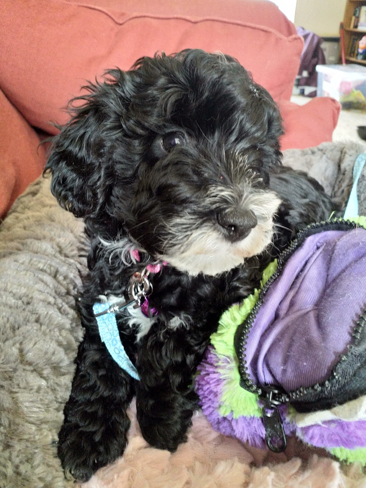
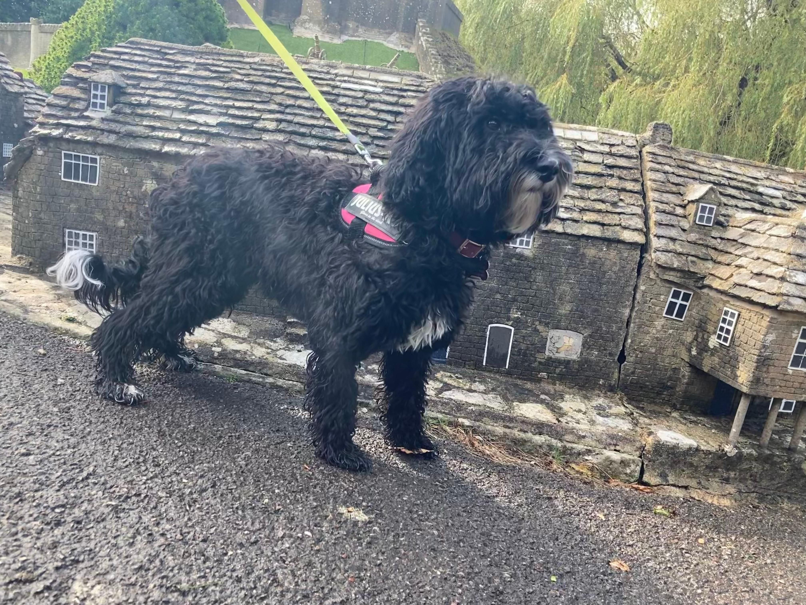
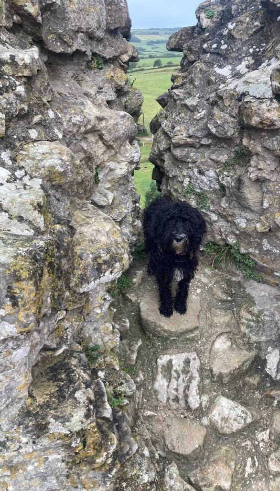
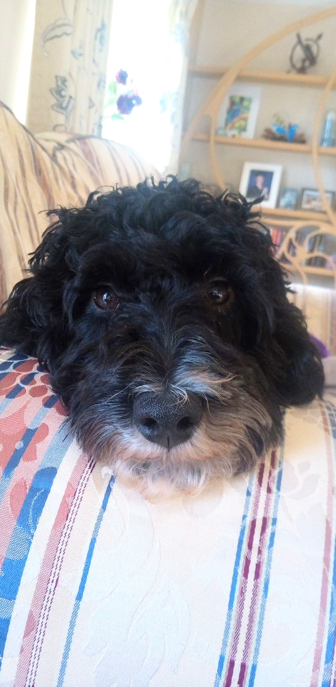
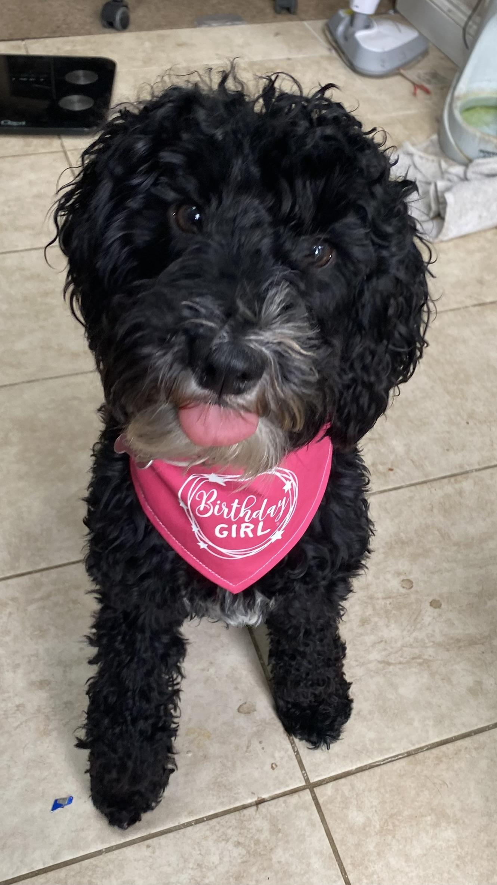
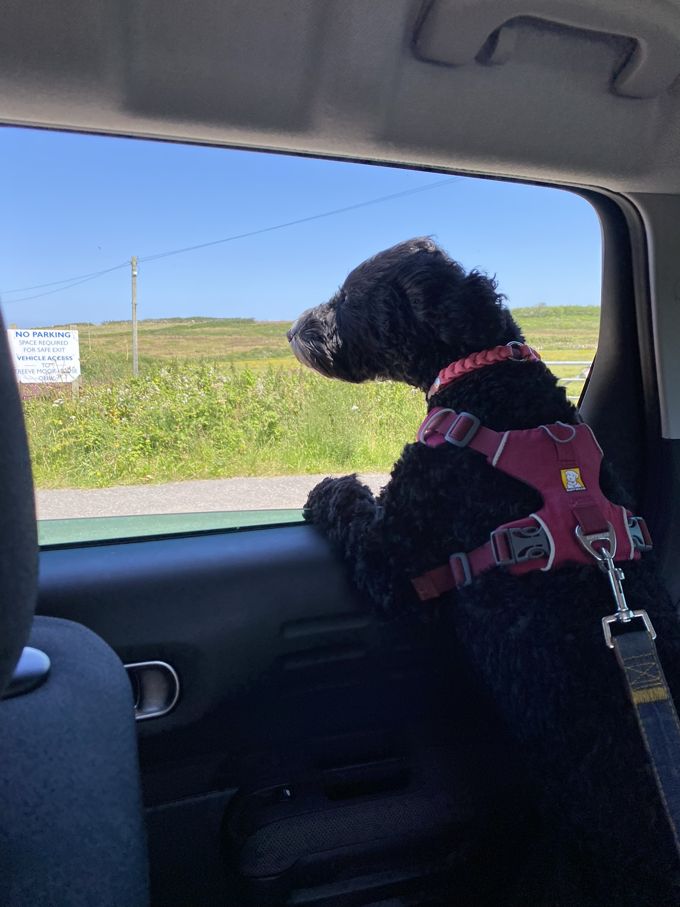
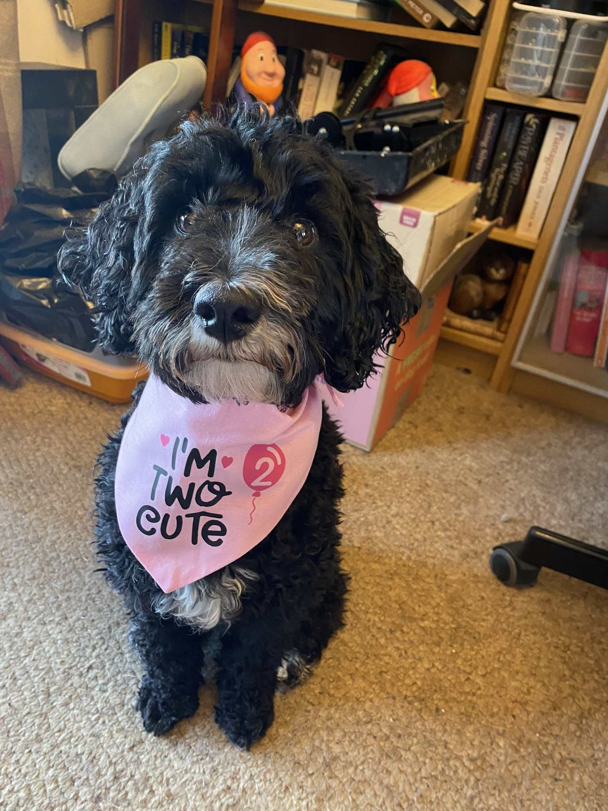
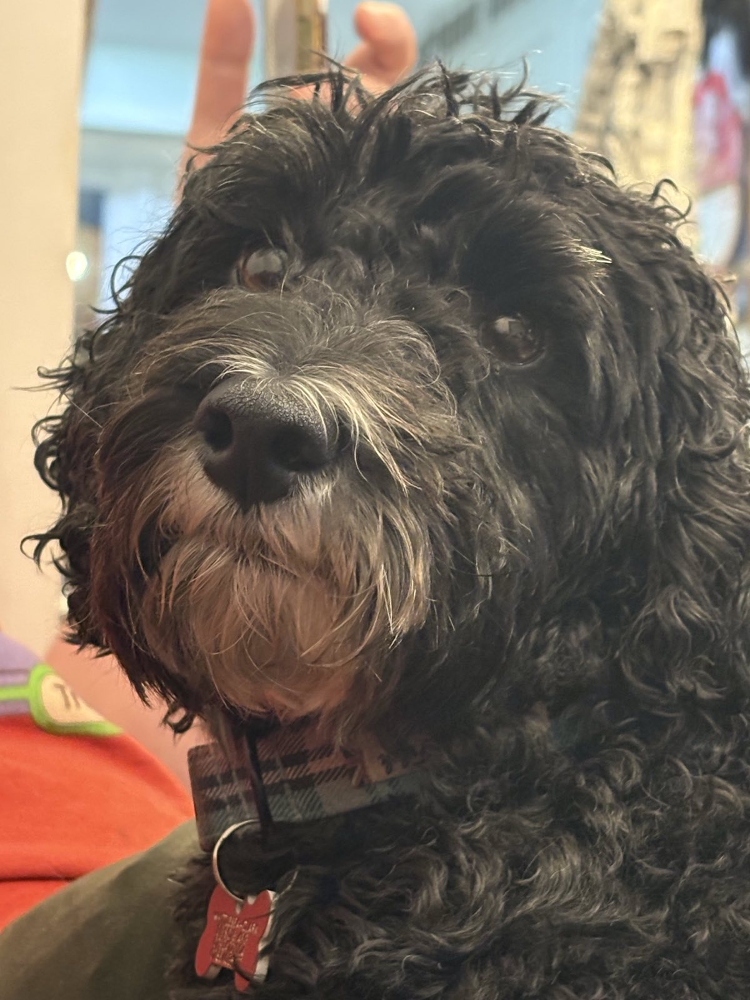
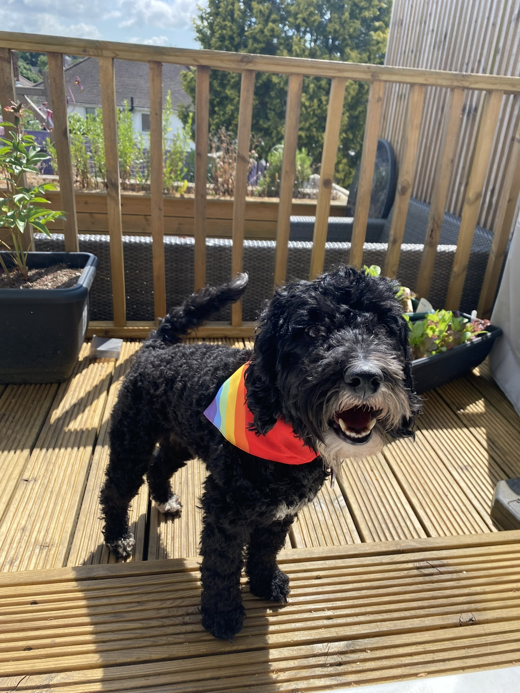

Today is my first dog Ada's six birthday!

<!--more-->

If you have read my [about page](../../about/index.md), you will know I have quite a few animals.

Ada was a lockdown puppy.
We picked her up in the midst of the UK's [first lockdown](https://en.wikipedia.org/wiki/COVID-19_lockdown_in_the_United_Kingdom), on the 23^rd^ of May 2020, and she has been a constant in my life ever since.

I had put off getting a dog for many years, but like half the country, I decided "why not, I'm going to be at home anyway" after my other half started to show signs of cabin fever.
I'm glad I waited, because she is a sweetheart.

She's 3/4 Poodle and the rest is a Jack Russell, which I guess makes her a Jackapoo.
Unfortunately that gave her the cleverness of a Poodle, and the stubbornness of a Jack Russell.

If she doesn't want to do something, no food, toys, or bribery will get her to do it.

We trained her to not bark in the house, but that means she communicates in other ways.
A paw on your arm means she needs something, and you should stop what you are doing.
A ring of the bells at the back door means she needs to head outside for reasons only she knows (normally to chase a cat).

She cocks her leg to pee (which I have been informed is not very ladylike), and she will carry a treat around for days until she's ready to enjoy it.

She bounds onto my stomach when I lie down in bed, just to make sure I give her, and not my phone, attention.

Ada is unique &mdash; just like every animal &mdash; and I am so glad I have gotten to spend almost six years with her.

<!-- markdownlint-disable MD033 -->

  
  
  
  
  
  
  
  
  

<!-- markdownlint-enable MD033 -->

I hope I get many more.
