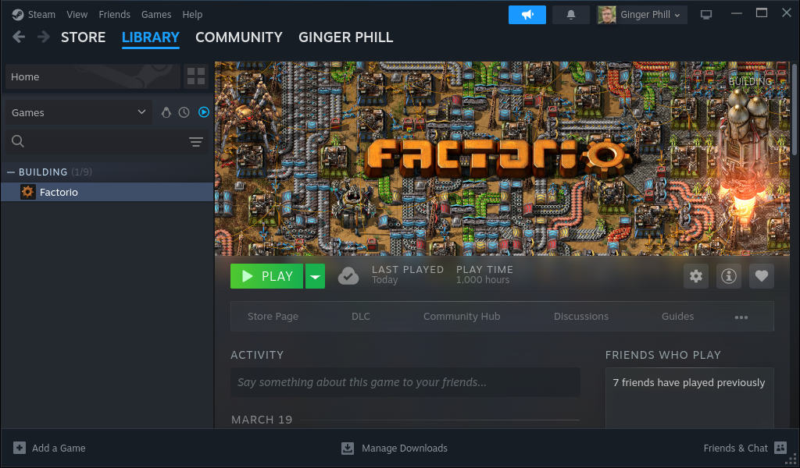
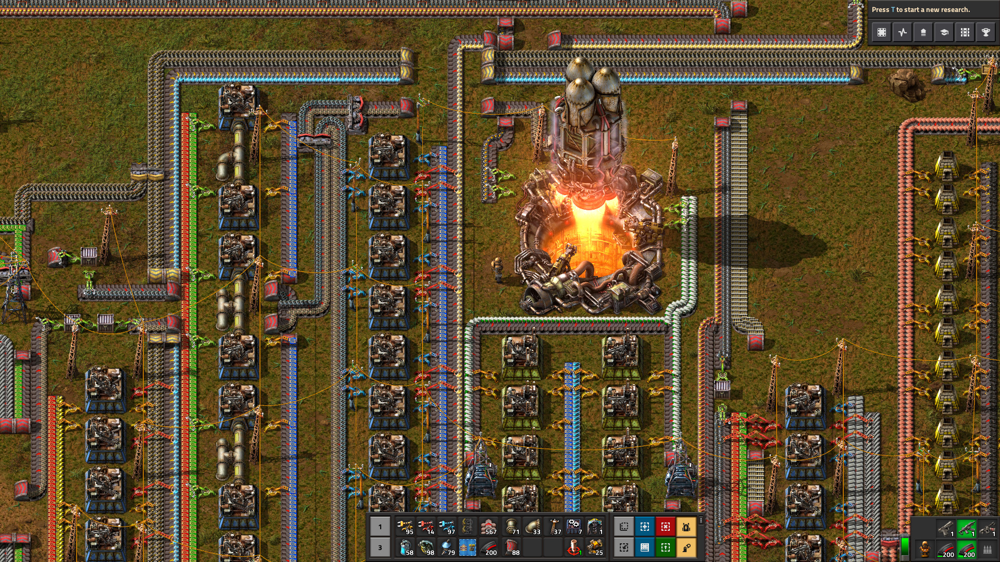
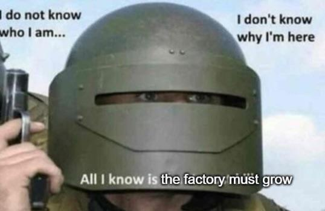
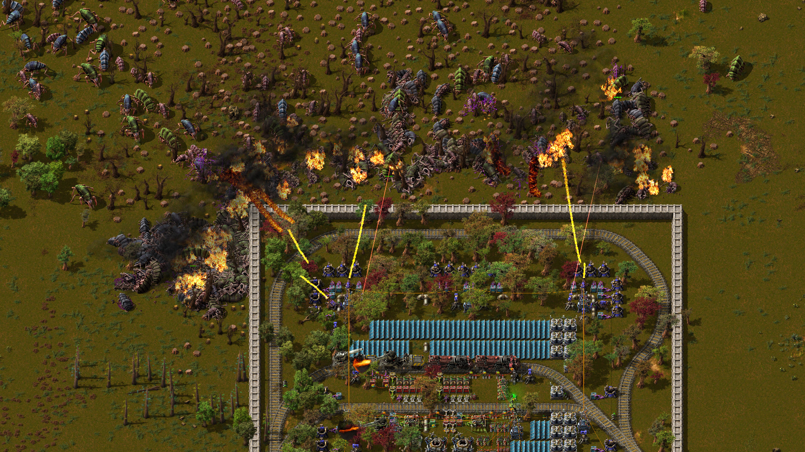
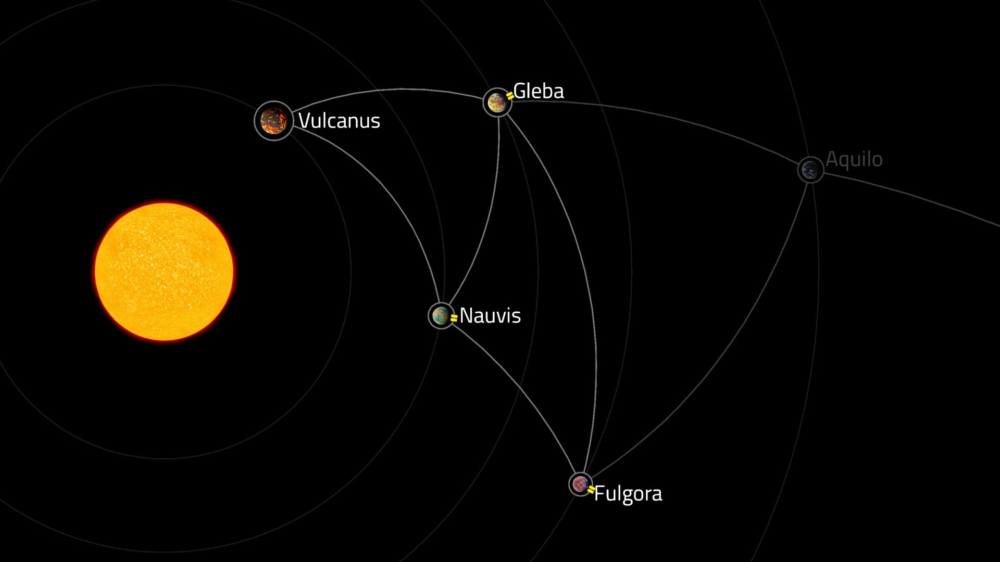
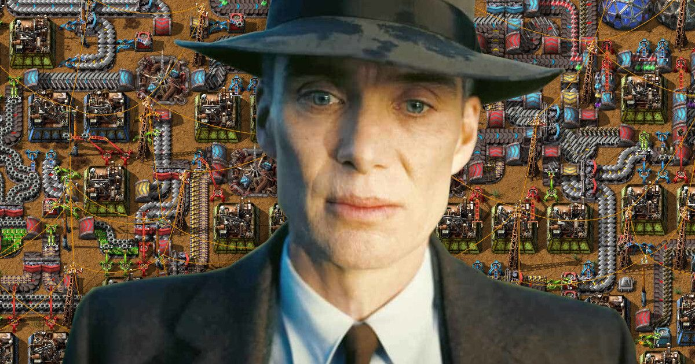

Years ago, I was convinced by a friend to play a game where you build a rocket.
I didn't think much of [Factorio](https://en.wikipedia.org/wiki/Factorio), and I didn't expect to ever dedicate 100 hours to it, let alone 1000.

<!--more-->

## How Long?

Many moons later, and here we are.
I can officially say that I have spent _one thousand hours_ on something that isn't work, eating, or sleeping[^1].

[^1]: I'm sure I have spent that much time doing other things, but they don't have a handy 'Hours Played' metric.

To put that into context, 1000 hours is:

- ~42 days
- ~6 weeks
- ~1.4 months

Yes.
I have spent a **month and a half** playing a single game.

Looking at my Steam profile, the time I have spent playing Factorio dwarfs my next most played games:


  type: 'bar',
  data: {
    labels: ['Factorio', '7 Days to Die', 'Valheim', 'ARK'],
    datasets: [{
      label: '# of hours',
      data: [1000, 280, 236, 171],
    }]
  }


Is it an addiction?
Maybe.

## Factorio

I won't do a full breakdown of the game and its mechanic, but I will say that it is addicting for someone with my type of brain.
You are tasked with taking raw materials from the ground (e.g. Oil, Copper, Iron, Uranium), and turning them into products, which you then turn into other products.

For example, Copper is turned into Copper Plate, which is turned into Copper Wire, which is added to some other components to make Electronic Circuits, all the way up to building a full rocket, so you can escape the planet.

This sounds simple, but a core mechanic of the game is resource scarcity.
Started building rocket parts?
Well now your Electric Circuit production needs expanding, as it can't keep up with the demand.
But now your Copper mining setup needs expanding, but to do that you need to improve the throughput of the belts that carry the copper to the main factory...

And so on.

There is always _something_ that needs optimizing, expanding, or moving around.
Science research unlocks better machines, which require the redesign of your factory.
Space is not limited, but you don't want to have a messy base.
What if guests come to visit, and they see your spaghetti mess all over your Low Density Structure manufacturing?
It's just not done.

You are effectively given a blank canvas where the only constraint is the amount of time you want to spend on it.

But it's not all plain sailing.
There is a native species on the planet which is rather annoyed it's new neighbour is dumping so much pollution into the atmosphere.
If you don't keep an eye on the amount you generate, they will come over with a strongly worded letter.

I **loved** Factorio, and I sunk over 600 hours into the original game, without getting bored[^2].

[^2]: Luckily I updated the [about](../../about/index.md) page of this blog with the number of hours I had played before I moved onto the DLC.
      644.1 hours as of the 20^th^ April 2025.

It's probably the only game I have played where I would rate it '★★★★★ 5/5', but not recommend it to my friends.
As a game it is phenomenal, but it's too dangerous.

This review from Steam sums it up best:

> Look. If you're a Software Engineer... Just don't buy the game. You'll be playing at 4am Tuesday morning wondering where hell the last 72 hours went and how you missed work on monday.  
> Your wife will hate you  
> Your dog will hate you  
> You will never sleep again
>
> The factory must grow.
>
> &mdash; [Ashtoruin](https://steamcommunity.com/id/Ashtoruin/recommended/427520/)

I would also like to point out that this game runs smooth as butter on my 10-year-old Ubuntu X260 ThinkPad.
Which, if you think about it, is wild.

## Space Age DLC

Then, just as I had resolved to put down Factorio for good, Wube &mdash; the makers of Factorio &mdash; released the [Space Age DLC](https://www.factorio.com/space-age/content).

Calling Space Age a 'DLC' really undersells the size of it.

The original game takes place on a single planet, 'Nauvis'.
You crash-landed, leaving you with nothing but your pickaxe, and the 'goal' is to launch a rocket into space.

The Space Age DLC expands on the original single-planet game, by adding four new planets.

Similarly to the original game, you start confined to Nauvis.
But to 'win' you have to escape the solar system instead.
To do this you need to colonize each planet, using each planet's natural resources to build new and specialized machines.
These machines can make your factory more efficient, but most importantly, they allow you to manufacture the next products in your [technology tree](https://en.wikipedia.org/wiki/Technology_tree).

To get from one planet to another you have to master 'space platforms'; setting up a solar-system-wide delivery network to get resources to where they are needed.

Each planet has a very distinct theme that stops any of the gameplay from feeling repetitive.
The volcanic wasteland on Vulcanus, lightning storms on Fulgora, freezing cold on Aquilo, and the swamps of Gleba, each give different challenges that don't disappoint.

In my mind, Space Age is a whole other game which deserves its own '★★★★★ 5/5', but if anything, it makes the addiction problem worse.
There is so much more to do, and now you have a factory on each planet to optimize.

Your five factories must now grow.

## Am I Done?

I don't think so.

I think what draws me to this game is the simplicity, the freedom, and logic of it.

The game dumps you on a planet and gestures broadly into the distance.\
Go ahead.\
_Build_.

Machines consume, and produce at a known rate; but they act like the pieces of a puzzle.
Machines have to be fed, and drawn from.
Belts and pipes are needed to carry products to where they are needed next, but they are eternally in the way.

The game brings you on a journey of ever-increasing complexity; managing the creation and combination of hundreds of different items.
An orchestra of manufacturing.

You can play the game like it's the industrial revolution, pumping pollution out and denying that climate change is real.
Or you can prioritize renewable energy, and live in harmony with the native creatures.

There's a deep satisfaction in knowing you have built something perfectly balanced, compact, or modular.

According to my statistics on Steam, I'm doing about 200 hours every six months.
That's about an hour a day.
My current play through called 'no blueprints darling' &mdash; where I have to design and balance everything myself, without looking for help online &mdash; has been going on for 160 hours.

There are multiple other ways I could 'spice up' Factorio for many more hours.
I haven't even tried mods yet.
Maybe the one that turns every item into [a fluid](https://mods.factorio.com/mod/pneumatic-transport)?

Then there's the third dimension compatible [Satisfactory](https://www.satisfactorygame.com/) to work my way through.

---

★★★★★ 5/5 - The factory must grow!
