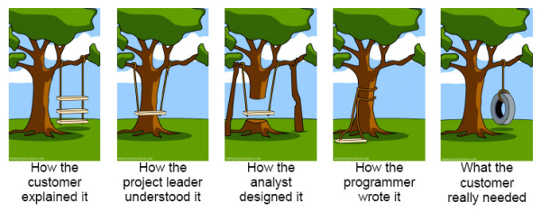
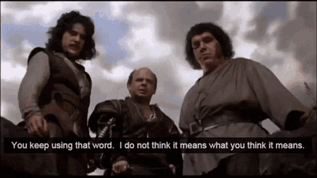
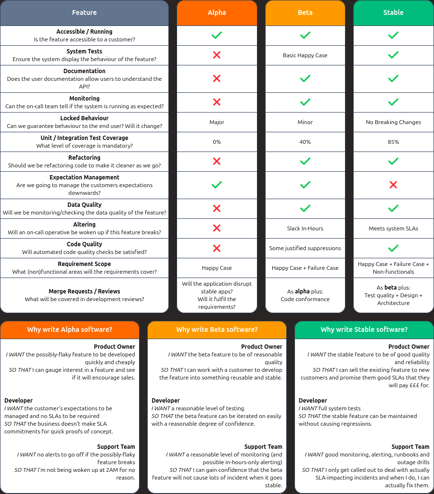
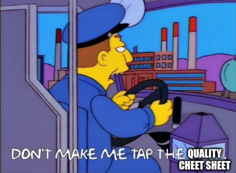

Many moons ago, when I used to write software, I realized I was misinterpreting stakeholders, and they me.
We were using the same words, but thinking of different things.

<!--more-->

## Misunderstandings

Over a period of time sales, support, and product were getting annoyed with me for 'taking too long' to build simple things, or 'delivering rubbish' too quickly.
I was deeply confused.
How could I possibly be taking too long on some projects, and not building quality solutions, _at the same time_?

After (probably too long), I realized I was being told one thing, but through the various layers of engineering process, we were building the wrong thing[^1].
It reminded me of a very old image, which visually depicts the differences in what a customer _needs_, and what is delivered to them.

[^1]: From my perspective, there was probably a degree of distrust in sales, that if I build a _real_ prototype, they would sell it as a full product.

Specifically, when I was being asked by sales to build a quick prototype for a customer, I was building a 'bells & whistles' grade solution.
And then, when I was being asked to build a 'production' grade solution, I was building a prototype[^2].
We were using the same words to explain what we wanted &mdash; like 'production', 'prototype', 'alpha', etc. &mdash; but we had different ideas of what they entailed.

[^2]: A bit of an over-simplification, but you get the idea.

{style="width:50%;"}

Obviously, we needed to agree on what words meant.
When they said the customer wants a prototype, what does that mean?
When something is production, what _is_ it?

## A Vernacular Cheat Sheet

> **Vernacular** (_noun_)
>
> The form of a language that a particular group of speakers use naturally, especially in informal situations.

Agreeing on what a word means is hard because to do that, you need more words which you might not agree on.

So I came up with a cheat sheet.
Thirteen properties, shown on a single side of A3, which we could put up on the wall and agree on.
These properties seemed like the most important things to me at the time, and if you look at a delivery from a technical lens, they probably still are.

Splitting the quality of software down into 'alpha', 'beta', and 'stable'; where quality increases from one to the next, but so does the amount of time required to build it.
Importantly I avoid the use of the word 'production' here.
Production is overloaded as a term, and is commonly used to describe a deployment environment.
'Alpha' code can be in production, for example.


> [!WARNING] Screen Size Warning
> I have tried my best to recreate the cheat sheet in some lovely CSS.
>
> Your screen is a bit too small, so here is an image instead.



So, as an example: if Sales asked us for an 'alpha' feature, we would deliver something that met the basic functional requirements, but might fall over, and the customer would find out, not us.

Critically, Sales should have managed that customers expectations that they were getting something quick to try, but 'stable' it would not be.

If Sales came back to complain, we could tap the sign.

{style="width:50%;"}

The primary output of this was that we 'were on the same page', but it also helped each department gain confidence in one another.
Sales were no longer worried we were going to 'over-engineer' quality into something when it wasn't needed, and engineering were not worried that something we built in a rush would wake us up at 4am.

## Parting Thought

Whenever I use the phrase 'we are on the same page', I think of this quote:

> "Are we all on the same page, Delilah?"  
> "The same page? I don't even think we're even in the same library."
>
> &mdash; Sarah Ockler
