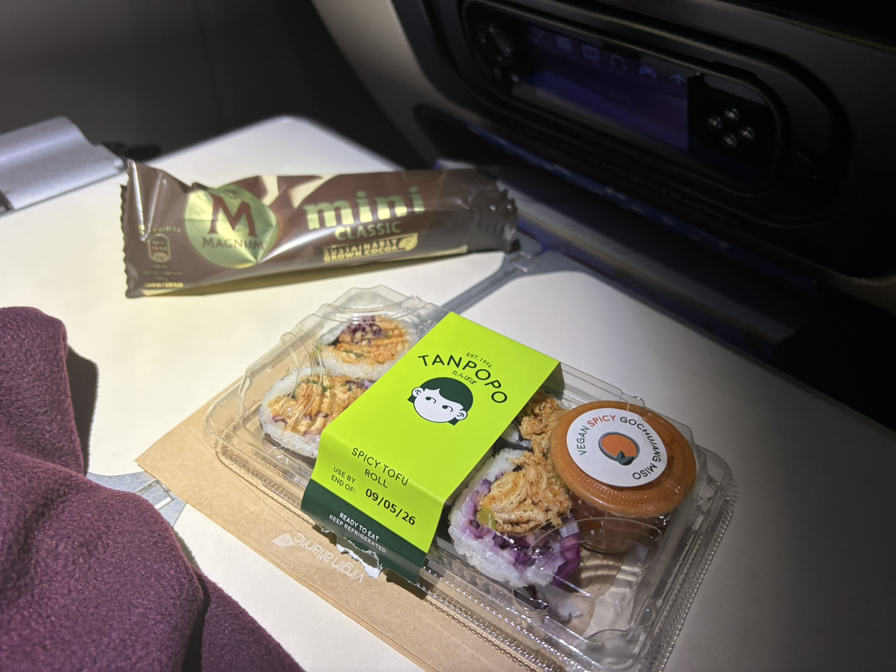
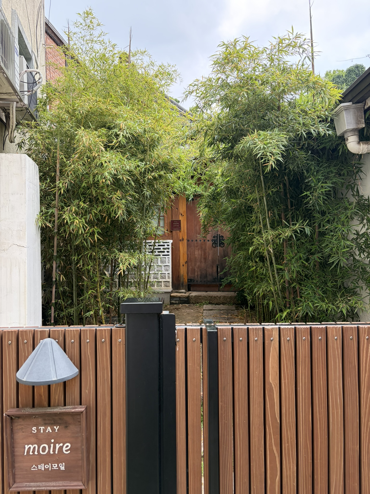
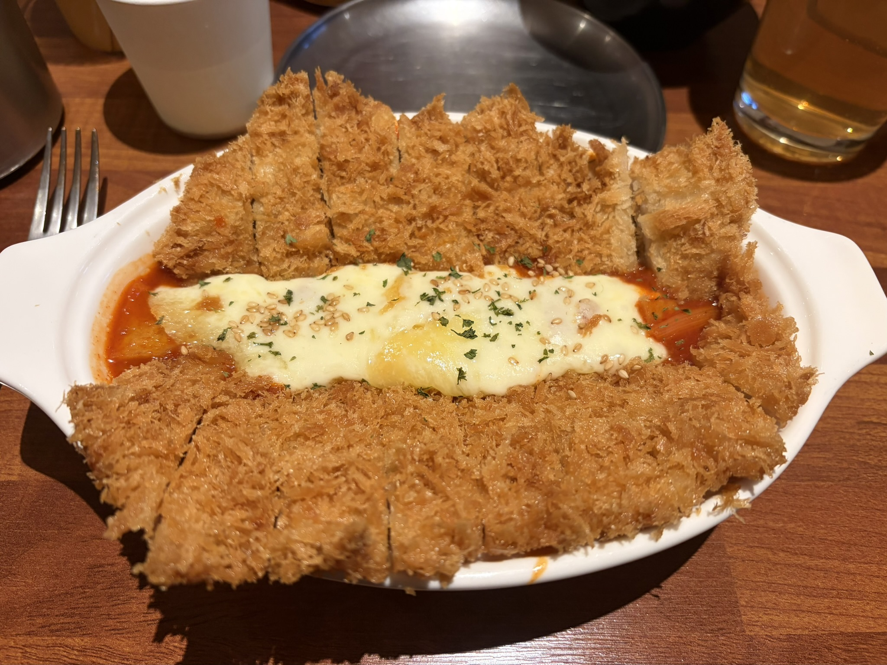
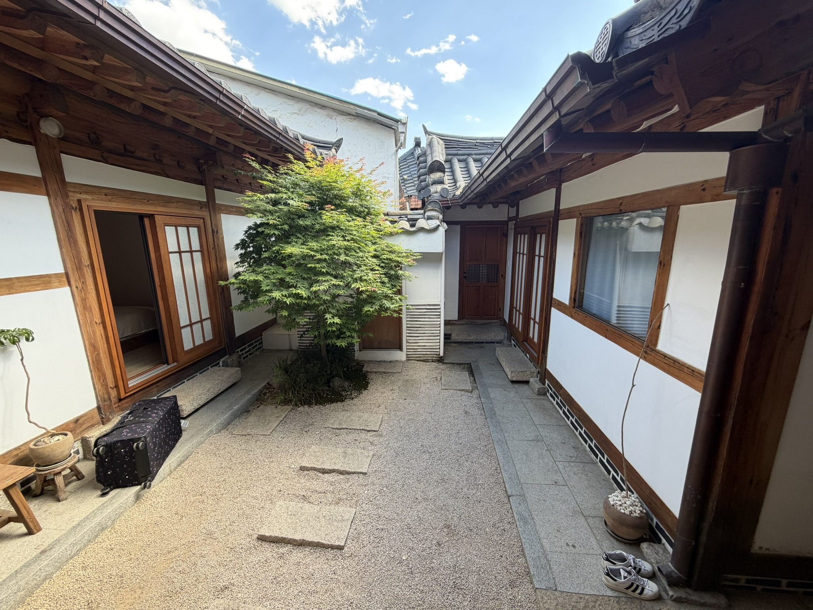
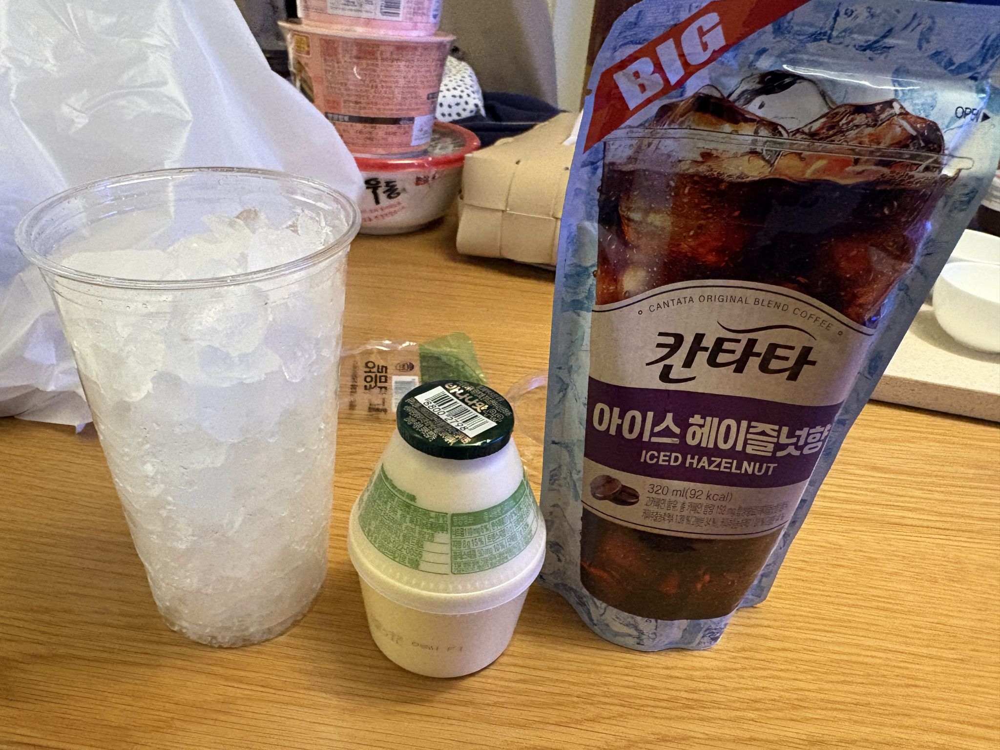
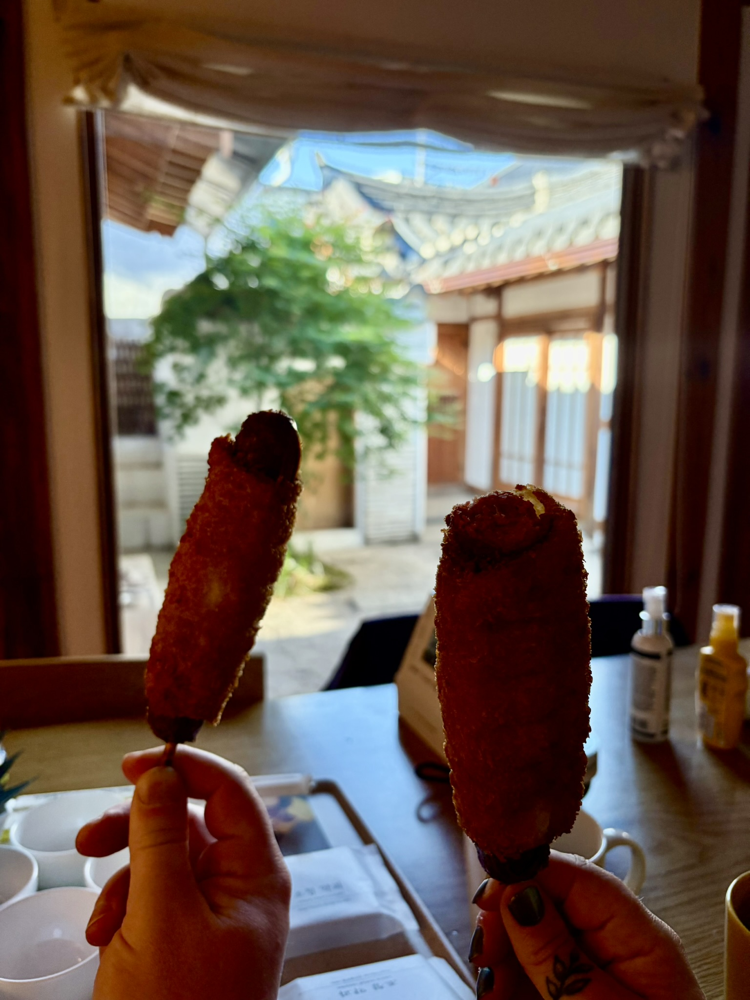
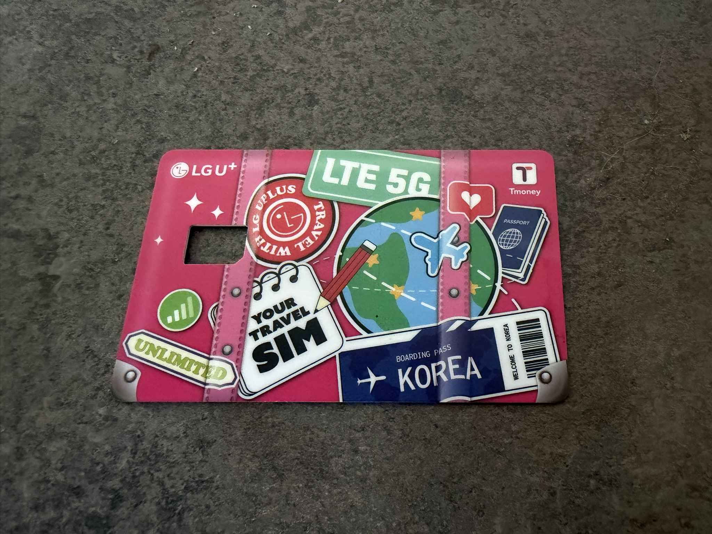
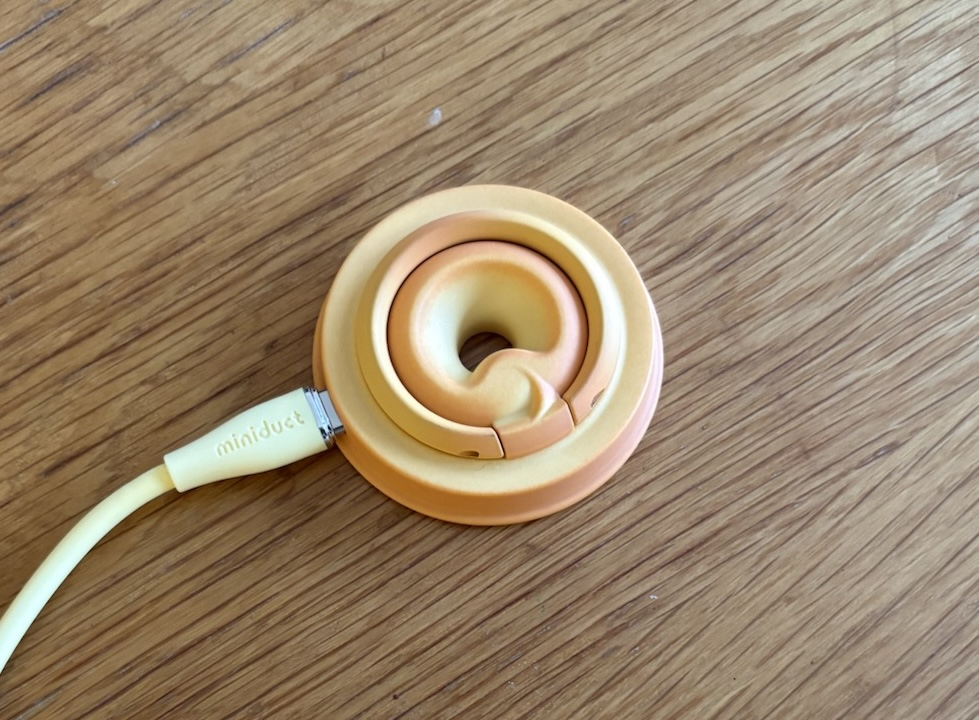
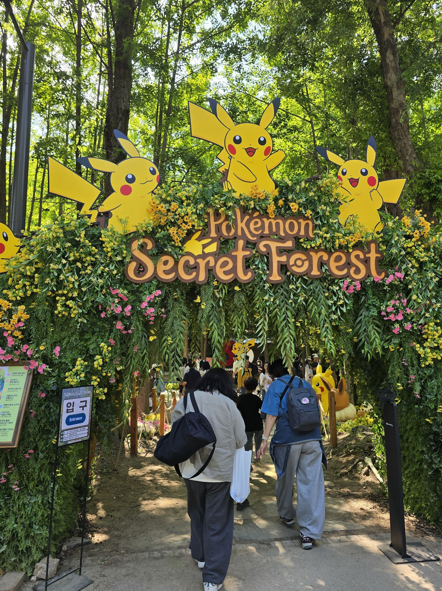
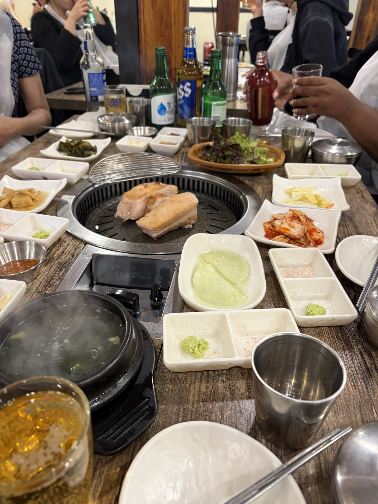

> [!INFO] Want to know less?
> This is a full breakdown of my holiday - day-by-day.
>
> If you want to just see the highlights, I will post a round-up at the end of this series.

## Previously

It's time for another ~~rambling~~ exciting travel blog.

This is my third swing at travel blogging after I went to [New Zealand]() back in May 2024, and [Italy]() last year.

After New Zealand, it took me four months before I decided to write about it, and many of the details were fuzzy by that point.
Now, I am trying to write about my latest holiday within a month of making the trip[^1], in an attempt to remember what happened.

[^1]: I even took notes every day while I was there, so I didn't forget anything.

Before you depart on this journey, let me warn you; I write these blogs primarily for myself.
My memory is notoriously bad for anything that's not tech, so these blogs help me remember what happened, as well as curating the 17.5GB and 1000+ photos and videos down into a manageable amount.

## 7^th^ May: Korea Bound



So the destination for this year's 'big holiday' &mdash; which we are blessed to be able to do every two years &mdash; is South Korea!

My other half keeps in very close contact with their secondary school friends, one of which has family in South Korea.
They travel a lot together, and it was suggested that I tag along with them this time, to see South Korea.

Now I knew next to nothing about the country apart from the following things:

1. K-pop Demon Hunters was a good film with a great soundtrack
2. Train to Busan is one of my all-time favourite Zombie films
3. Korea is the world heavyweight of skincare
4. Its location on a map

Now this isn't a great deal of information, but I was lucky that my partner and friends were excited to do all the planning, so I didn't have to.
This suited me fine.

When talking to my colleagues before I left, I was often asked _"What are you planning on doing?"_.
My response of _"No idea, I'll see what's up when I get there"_ often went down poorly.
Apparently it's normal to scour TikTok for ideas and places to see prior to travelling, so you can pack your itinerary.

The idea of having a plan for every day of my holiday fills me with dread; it feels too much like work.
I am lucky that others in the group felt the desire to plan ahead, which meant we got to go on some really nice tours.
If it was left up to me, I would have probably missed out.

### Taxi to Heathrow

The things I do plan however, includes the travel.
And there is no more important part of a journey than getting from your house to the airport and back again.

The first and final legs set the tone, and I don't want to have to worry about parking, or delayed trains.

This is why I always call up my main man Steve at [SC Airport Cars](https://sc-airportcars.co.uk/).
Steve has done airport transfer now for us for years.
Even re-routing to Luton airport from Gatwick when we had to jump to another flight when our first one was cancelled out of Fuerteventura, a couple of years ago.

Yes, it's about twice the price of a train, but the added comfort of being picked up and dropped off door to door is worth it.

We had opted for a midday flight, so a 8am start was on the cards.
Like the rising sun, Steve was there, and we got to Heathrow without issue.

Trust me, once you pay for private airport transfers, you'll never go back.

### Premium Economy

Terminal 3 has to be my least favourite terminal at Heathrow.
Terminal 5 makes Terminal 3 look like a run down hospital ward that has suffered years of neglect.
But alas, one cannot pick which terminal their flight departs from.

We were flying with Virgin Atlantic, mostly because they were flying direct to Seoul, South Korea.
My partner Loz berated me until we booked Premium Economy.

Earlier, Steve had correctly deduced that I "blame" Loz for strong-arming me, and they are a convenient scape-goat, but secretly I like flying Premium Economy.
As a moderately tall and wide person, the extra space, and two seats on the row, are very nice.

The gate was a decent walk away from the main area of the airport, so I got to make my stereotypical _"What, are we walking to Seoul?"_ dad-joke before takeoff.
It's the little things.



We got squared away for a 14 hour flight, but my one takeaway would be: Bring a USB A-to-C cable.
Door to door we were travelling over 21 hours, so a recharge was needed.
You are not allowed to use power banks onboard any more, and the plug in the back of the seat was a USB-A connector.

Two of the friends we were travelling with were in the economy area of the plane, and annoyingly, because the plane was half empty, they ended up with far more space than we had (and they paid half as much).

Another slap in the face: Economy got Korean Fried Chicken, and we did not.
We did however get a Sushi and an ice cream about 10 hours into the flight.

{style="width:50%;" class="items-center mx-auto text-center"}

I spent most of my time reading, finishing  and getting most of the way through .
Both very good books I will probably call out in my [end of year round up]().

### Arriving in Seoul

We (and importantly, our luggage) arrived unscathed to a Seoul in the midst of a heatwave.
Passport control had a bit of a queue, but we only had to wait 30 minutes.

We had asked our friend &mdash; who speaks Korean &mdash; to pre-book us a taxi big enough for the four of us plus three suitcases.
We met him at arrivals and he was very patient while we picked up some pre-paid SIM cards.

Fun fact: I can't sleep on planes.
Something about being sat upright doesn't allow me to drift off.
Unfortunately, this meant my brain was fully fried at this point of the journey, and I intensely struggled to find my booking confirmation even through it was starred and pinned at the top in my email; something past me had done to make sure I could find it.

> [!TIP] Travel Tip 1
> **We were told**: A Korean phone number is a _must_.  
> **Rating**: Sceptical
>
> I think we could have got by and used the concierge in our hotels the two times we needed to book taxis.
> Otherwise, it was not really needed.  
> Next time I would save myself the trouble of picking up a SIM at the airport, and just get an ESIM from someone like [Airalo](https://www.airalo.com/).  
> If you really want one, just get one for the group.

Sidestepping the shame of flapping around to find an email, SIM cards in hand, we jumped in the Taxi and head towards Seoul.



Incheon International Airport is located on an island west of Seoul city (which is a pretty great thing to be able to do), and it took us about an hour to get to the traditional Hanok we were staying in.
A Hanok, I learned, is a [traditional Korean house](https://en.wikipedia.org/wiki/Hanok) that is typically built in a square, with a central courtyard.
I imagined paper doors, beds on the floor, and a little courtyard to quietly contemplate in.
This sounded adorable, and I was super excited to see it, _very quickly_, before getting some sleep.

Unfortunately, check-in time was 16:00, and our flight had landed in Incheon at 10:00.
This left us with four hours to kill before the sweet embrace of sleep.
Fortunately, the owners allowed us to drop off our luggage, so we didn't have to carry it with us.

{style="width:50%;" class="items-center mx-auto text-center"}

From what I could see from the entrance hallway, the StayMoire Hanok ([Google](https://maps.app.goo.gl/snpraQsn3ZADP7VaA), [Naver](https://naver.me/GSDmZM7K), [Booking](https://www.booking.com/hotel/kr/staymoire-premium-entire-hanok-gyeongbokgung-5mins.en-gb.html)) was indeed, very adorable.

I cannot tell you how much I was _not_ up for going and seeing things at this very point in time[^2].
Feeling unwashed and nauseous, we went for a walk to get something to drink.

[^2]: I would have curled up in the entrance hallway behind the luggage, and it would have been great.

Cafe Els ([Google](https://maps.app.goo.gl/HpiHijqK2iRD3dyv8), [Naver](https://naver.me/xNnlC61t)) rescued us and was just around the corner.
It was a very narrow building &mdash; placing a three-storey coffee shop on the footprint of my lounge &mdash; but the seats from the second floor look out over a beautiful Hanok.
I had never had a Sweet Potato Latte before, and I am sad to say I was so tired I failed to appreciate it.
I'll make a mental note to seek one out in future.

One of the reasons we picked StayMoire was its proximity to many of the historical Palaces and Shrines.
Right next to us, hidden behind a very substantial wall, was Jongmyo Shrine ([Google](https://maps.app.goo.gl/f1tjAz7QosctTn5J6), [Naver](https://naver.me/xs3GxNy7)).
We busied ourselves by walking around its perimeter.

When the urge to wander was all but dried up, we decided to stop for food.
Jongno Bar ([Google](https://maps.app.goo.gl/rheNN7k5HXCuqoaE8), [Naver](https://naver.me/FcmAvqFR)) captured our attention with some 6 foot pictures of the food out the front.
Chicken cutlets with cheese on a bed of spicy [Tteokbokki](https://en.wikipedia.org/wiki/Tteokbokki)?
Yes please.

{style="width:50%;" class="items-center mx-auto text-center"}

After travelling for so long, some cheese, some chicken, and one of my favourite Korean foods, made for a perfect pick-me-up.
The decision to go for a walk was validated with every bite.

If you fancy some comfort food, this is the place for you.

### Settling in

We got word from the owners of the Hanok that we could head back at 15:00 because the cleaners were done.
I had never been so happy to hear anything in my life.

{style="width:50%;" class="items-center mx-auto text-center"}

Inside, the Hanok was immaculate and adorable.
From the outside it looked very traditional, but the inside had all the modern conveniences.

Every room had _very effective_ air conditioning units, sound deadening double glazing, comfortable beds, and USB chargers built into the walls.
Each bathroom had heated bidet toilet seats and showers that I could actually stand under (a running theme of this holiday will be that I'm about 30cm too tall for everything).

The main area was pretty fancily kitted out.
A [4K Beam Projector](https://www.lge.co.kr/projectors/hu715qw) (which sat on a coffee table and projected on the wall), as well as a Bang & Olufsen Speaker, must have cost somewhere in the region of £4K; which is a lot for a rental property[^3].

[^3]: Or maybe not in a country where people have respect for others possessions.

I appreciated this in passing however, as I just lay down and went to sleep.

> [!TIP] Travel Tip 2
> **We were told**: Mosquito bites are common, bring protection!  
> **Rating**: Verified
>
> If it wasn't for the constant zapping sound of the electric zapper in our room, or the bites my friends got, I would say this was overblown.
> But given the number of bites my friends received, I would say, _bring protection_!

### The Master's Sun

Later that evening, around 17:00 I awoke and made sure I got out of bed.
Every person I know that travels swears by 'pushing through' and sleeping at the right times, in an effort to force your body clock into changing.
In an effort to strong-arm my internal sleep cycle, I got up and headed into the Kitchen/Dining area, only to find one of my friends watching TV.

Now, I very rarely sit down and become completely engrossed in a film or series.
The last one was [Ted Lasso](https://www.imdb.com/title/tt10986410) which I discarded all my plans for a weekend and absorbed all three seasons in one marathon.

However, my friend was watching [The Master's Sun](https://www.imdb.com/title/tt3184674); a rather odd premise which I am going to pull from Wikipedia, because I don't think I can do it justice:

> Joo Joong-won is the cold and distant CEO of Kingdom, a conglomerate that includes a major department store and hotel. He meets the gloomy Tae Gong-shil, who started seeing ghosts after an accident.
> Their lives take a new turn as they discover whenever Gong-shil touches Joong-won the ghosts that surround her disappear; after much pleading from Gong-shil to allow her to stay by Joong-won's side in return she must help him recover a fortune that was stolen from him during a kidnapping attempt.
>
> &mdash; [Wikipedia](https://en.wikipedia.org/wiki/Master's_Sun)

Convoluted?
Yes.
Enthralling?
Also yes.

We got through a couple of episodes until my other half joined us, who also became completely drawn in.

### 7-Eleven

One cannot survive just on K-drama however, so we all dragged ourselves to a nearby 7-Eleven for snacks and iced coffee.

Personally I associate 7-Eleven stores with the United States of America, and was surprised to find them _literally everywhere_ in South Korea[^4].

[^4]: Busan had 4 within a 2-minute walk of each other.

Apparently our group had seen a couple of 'TikTok trends' for food which could be picked up at a 7-Eleven, one of which was a combination of hazelnut flavoured coffee and banana milk.

{style="width:50%;" class="items-center mx-auto text-center"}

I'm not a fan of coffee myself because I dislike the harsh taste, but for some reason when you add in some banana milk, and make it cold, I find it quite refreshing.

Pouring it is also quite visually appealing.



One way which the 7-Elevens differed from the corner stores we have in the UK, is that they have spaces for you to prepare your food.
Every corner store in Korea had a microwave at a minimum, and in some instances, had tables for you to eat at.
Countless YouTube videos recommend that you buy instant ramen, a cold sausage, some pre-cooked eggs, and assemble yourself a full meal.

Personally, I would love to have this in the UK, but we are too wedded to the fabled 'Meal-Deal'.
The cups of ice specifically, which you can either have there, or throw into the freezer for a nice cool drink later.

Back at the Hanok we shovelled instant ramen into our faces while watching more _Master's Sun_ before bed.

## 8^th^ May: Chilling in Seoul

On day two, a miracle happened.
Because of the havoc we had played on our internal clocks, my other half woke up bright and early and made the decision to go get breakfast.

Now I'm unsure if this is in any way traditional, and I cannot say that it was good, but we got battered hot dogs on sticks for breakfast.

{style="width:50%;" class="items-center mx-auto text-center"}

We also had another banana hazelnut coffee and I could feel an addiction forming.

Our plan for today was to visit a couple of the tourist hotspots in the city.
Two more of our group were flying in today, so we were holding off going to the palaces or doing any tours until they were all settled in.

### Myeongdong Market

Starting off was our first (but not last) visit to Myeongdong Market.
On pretty much every travel guide, Myeongdong Market is heavily recommended as a great place to shop.

Well, what better way to pass the time than to go shopping.



To get there we had to familiarize ourselves with Seoul's subway.
But, having travelled on the Metro de Madrid, the Paris Metro, and the London Underground, it was a very standardized experience.
Unlike the London Underground, you cannot pay by card.
The Seoul subway doesn't take contactless card payment, cash, or Phone payment (e.g. Apple Pay), so you need to get a T-Money card.

Remember those SIM cards we bought?
Well the SIM came embedded in a card, which doubled as a T-Money card.
Neato!

{style="width:50%;" class="items-center mx-auto text-center"}

> [!TIP] Travel Tip 3
> **We were told**: You will need a T-Money card for the subway.  
> **Rating**: Verified
>
> The Seoul subway doesn't take any form of payment except a T-Money card (a _special_ contactless card).  
> There are machines before the barriers at every subway station where you can buy a new card, or top-up your existing card.
>
> The South Korean Government has pricing information on their website, and ₩20,000 lasted us a week.

A few of things stood out.

Firstly, unlike the Metro de Madrid, there are a lot of English translations everywhere.
Every sign was written in both, but ultimately, as long as you know what line and station, most of it you can get by without.

Secondly, like the London Underground, some lines are more high-tech than others.
Line `3` and was immaculate, with screens displaying arrival information in Korean and English.
Line `2` still had some information, but it was hit-and-miss if it was displayed in English.
Platforms were well labelled, well air-conditioned, and spotless, so they get the Phill seal of approval.

Thirdly, was that a little tune is played when the train is arriving.
I cannot undersell the amount of joy this brought me.



Our hotel was about 10-minutes from the nearby station, and where we needed to get to required one line change.
The journey was only 3 stops and cost ₩1,550 (£0.76), which was outstandingly cheap.



My first daytime impression of Myeongdong was that it was a pretty-standard high-street.
Wide streets, _partially_ pedestrianized, with shops lining both sides made up the bulk of the area.
However, I was aware that the area transforms when the market stalls arrive in the evening; which we would come visit again.



Every store was brightly decorated, often with anthropomorphized animals, making it feel like every store had its own mascot.
Many of the stores sold healthcare products, but there were enough selling souvenirs that would draw me back later.

### Olive Young

I have heard South Korea described as 'The Skincare capital of the World', and our first stop when arriving at Myeongdong was an [Olive Young](https://en.wikipedia.org/wiki/Olive_Young_(company))[^5].

[^5]: I will come to realize that all roads in Korea lead to an Olive Young.

Not a Skincare appreciator myself &mdash; to my detriment &mdash; I followed my partner around the four-storey building marvelling at the sheer volume of creams, sprays, and gels one could apply to their skin.
More interestingly, Olive Young had a partnership with Pokémon, and had many products adorned with the small adorable pocket monsters.

There are times in a persons' life when they find out interesting things about themselves, and it was new that I found out that I don't really care about how good your face cream is, because it has Charmander on it and I want it!

This was where I found, what has to be the oddest collection of chargers and power banks I have ever seem.
One looked like a small Pepsi can, another like an ice-cream, and a one looked like a biscuit.
These stuck me as great presents.

{style="width:50%;" class="items-center mx-auto text-center"}

Having had our fill of shopping, we stopped at Dimding Wonton ([Google](https://maps.app.goo.gl/6ubSBh9FFbLp19NM6), [Naver](https://naver.me/FtouywaV)) and had our fill of noodles for lunch.

This is where I learned that it's quite common to get bibs in Korea.
Which, when you are eating noodles from a very-spicy red sauce, and you are wearing a light shirt, is a _really_ good idea.

### Seoul Forest

Next up on our casual wander across Seoul was to visit Seoul Forest ([Google](https://maps.app.goo.gl/yL2G51woW53veePL7), [Naver](https://naver.me/FN7XP1qD)).
We had heard that it wasn't just Olive Young having a Pokémon event; there was a '30th Anniversary Pokémon Mega Festa' going on, and part of it was a 'Pokémon Secret Forest', located in Seoul Forest.



We hadn't the faintest idea what it was, or how big it was, but it sounded like an interesting way to spend the afternoon.
So we jumped back in the tube and headed toward it.

> [!TIP] Travel Tip 4
> **We were told**: Google Maps doesn't work, you need to use [Naver Maps](https://map.naver.com/).  
> **Rating**: Verified
>
> Google Maps only works for public transport, but it is still not that good and has poor coverage.  
> Naver Maps has walking directions, the interior of stations, and better public transport routing (e.g. the fastest vs. the easiest routes).
>
> There is a _long_ story behind why Google Maps doesn't work; [here is a good article](https://edition.cnn.com/2025/09/05/travel/south-korea-google-maps-intl-hnk-dst) on why.

It was a bit of a walk from the station we alighted from because we still didn't have a hold on the finer details of Seoul's Metro.

As we wandered through the park, it had a very calming vibe, which was what we needed on a beautifully sunny afternoon.
If you find yourself in Seoul, I would say Seoul Forest is a must if the sun is out, and you need a day away from the cities' hubbub.



Outdoor fitness equipment was dotted along a wide circular path that ran around the central lake of the park, which took our interest.
This kind of 'body-weight' equipment is occasionally found in the UK, but in Seoul you could not take a walk without bumping into it.
It was not lost on me that almost every Korean, in every age range, was more physically fit than I was.

As we reached the Pokémon Secret Forest we took one look at the queue and decided to go get a cold drink tea and a gelato instead[^6].
It seemed to just be a bunch of plastic models hidden in the trees, which did not seem worth the wait.

[^6]: One of us joined the queue, only to realize it was a queue to join a digital queue.
      They started at 1108^th^ in the queue.
      4 hours later, we were 503^rd^.

{style="width:50%;" class="items-center mx-auto text-center"}

While we sat on a rock beside the lake I could swear I felt my blood pressure dropping.
Even while I was surrounded by thousands of people, serenity crept in.

But, all good things must end, so after a time we headed back to our Hanok; stopping to grab more iced-coffee on the way.
When we were back, we of course filled the down-time by watching more K-drama.

### Korean BBQ

The final stop for the day was dinner.
If Korea is not famous for being the skincare capital of the world, then it is famous for its food.
One of the things I had heard of before we arrived was 'Korean BBQ'.



So off to find Korean BBQ we went.
We welcomed two more of our friends who flew the day after us.
One of which spoke Korean, which really helped with booking the table.

"853" ([Google](https://maps.app.goo.gl/CSQgyBXc6jkmtvQw5), [Naver](https://naver.me/5DZj9Nzc)) was my first experience of Korean BBQ and my key takeaway was that there were _so many_ plates.
I am convinced there would have been more, but we ran out of space on the table.
I shouldn't complain however, as each side dish complimented the grilled meat (which was cooked in the centre of the table) well.

{style="width:50%;" class="items-center mx-auto text-center"}

As we had no idea what we were doing, the staff cut and cooked the meat on the grill for us.
Other tables were doing it themselves, but I didn't take it as a slight that they assumed we would give ourselves food poisoning.

> [!TIP] Travel Tip 5
> **We were told**: Tipping isn't a thing in Korea.  
> **Rating**: Partially Verified
>
> At no point on the holiday were we asked for a tip.  
> No card terminal prompts, or coercive optional percentages added to bills.
>
> However, we were informed that if the waiter cuts and cooks your meat for you at a Korean BBQ, then it is customary to tip 10%.

We tried to finish the evening by heading to a bar, but it was unfortunately full, and this minor inconvenience reminded us that we were all jet-lagged and deep down wanted to go to bed.

## Next Time

The 8^th^ was very much a 'settling in' day for us, waiting for the remainder of our group to arrive.

Tomorrow we were signed up for a tour of the North/South Korean .\
See you in part 2!

감사합니다!
