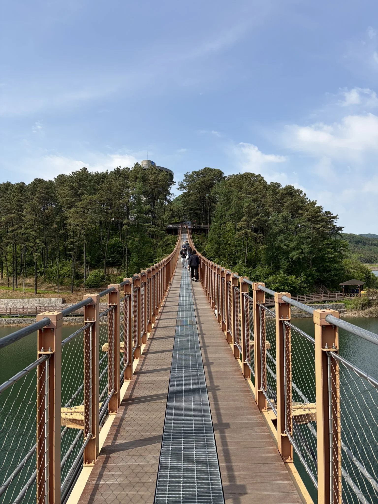
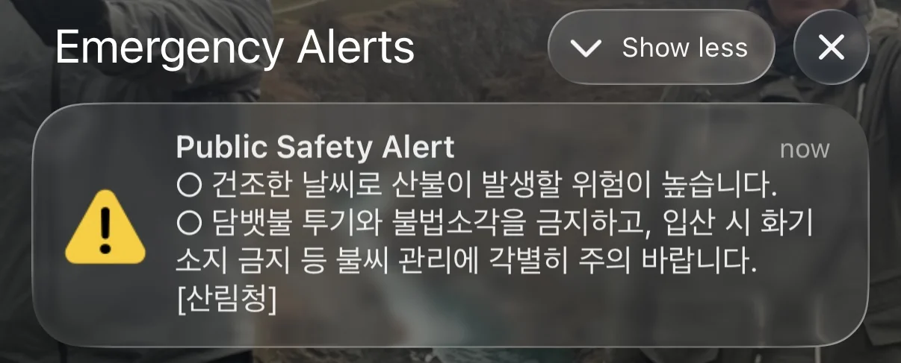
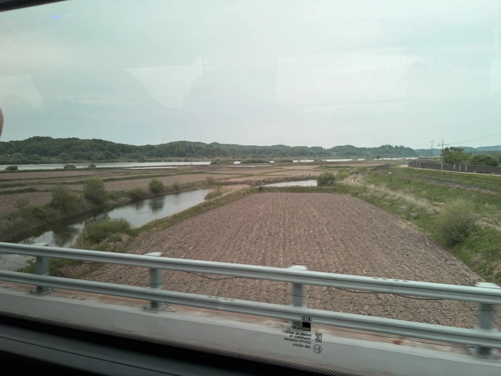
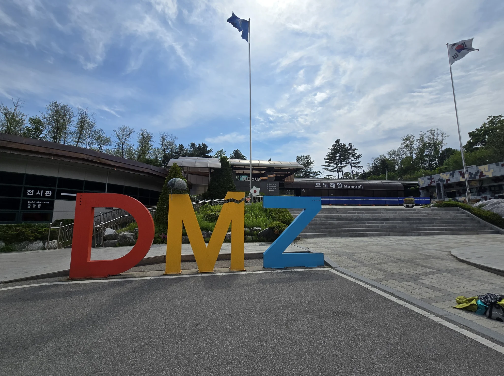

> [!INFO] Want to know less?
> This is a full breakdown of my holiday - day-by-day.
>
> If you want to just see the highlights, I will post a round-up at the end of this series.

## Previously

In [part 1]() we had arrived in Korea after a sleepless flight (for me at least) and had spent our second day mooching around the city, getting familiar with things like the Seoul Subway, and 7-Elevens.

Now it was time to get stuck into some serious sightseeing.

## 9^th^ May: Touring the DMZ

What better way to start a fun, relaxing holiday, than to sign up for a tour of the Korean DMZ (Demilitarized Zone).

If you are not familiar with Korean history &mdash; and I was not &mdash; and feel like the [Wikipedia](https://en.wikipedia.org/wiki/Korean_Demilitarized_Zone) page is not tangible enough, then I thoroughly recommend signing up for a tour of it in person.

I am going to be very honest up front that I was not bought into this tour before going, but I am very glad I went.
From the mental pictures I had of the , and it's description, I had made the assumption it was this barren World War One-style no-mans land; but I could not have been more wrong.

Most tours don't go all the way up to the demarcation line any more, due to [certain events](https://en.wikipedia.org/wiki/Travis_King#Detention_in_South_Korea_and_crossing_to_North_Korea), but we still got to see quite a bit, and learn quite a lot.

We were signed up on the [DMZ Insider Tour](https://gyg.me/Ki4vZEd8) by Get Your Guide (which I wholeheartedly recommend) and the coach was set to pick us up at Myeongdong Station at 8 _in the morning_.

Now it might be the hazelnut coffees (with banana milk) I had been chain-smoking since I found out about them, or it might just have been that our body clocks had no idea when sleep should be, but we were bright-eyed, bushy-tailed, and raring to go at 07:15 when we left the Hanok.

Having topped up our T-Money cards, and demystified the Seoul Subway the day before, we headed down to the pickup location without issue.

One of our group was really keen on picking up a coffee on the way, but it being a Sunday meant that all sensible Koreans were still in bed.
This meant that we had made it all the way to Myeongdong Station without seeing an open shop or café.

Luckily we were saved by 'A Twosome Place' right next to where the tour departed from[^1].

[^1]: From Wikipedia, 'The name "Twosome" reflects the brand's focus on pairing coffee with dessert items', which is not something I would have guessed in a million years.

Caffeine in hand, the day could start.

The coach was packed (and quite narrow for my _robust_ frame), and we were ushered on at a leisurely pace; which suited me fine.

Our tour guide, Cindy, introduced herself and immediately moved into a small collection of the most energetic and positive people I know.
Cindy constantly referred to Cindy in the third person, which was endearing.
I resolved to start doing this for myself, but have yet to pull it off without sounding pompous.

Cindy gave us a full break down of the day, and double-checked we had our Passports.
The  is a military controlled space, and as such, we needed to prove who we were prior to entering, and on the way back out.

Miraculously, for a group of 40 adults, we all managed to remember them.

Tourist numbers in the  are controlled, and our appointment was later that afternoon.
So, before we get to the , there were a few stops beforehand.

### Majang Lake Suspension Bridge

First up, was something completely unrelated; a lovely bridge over a lovely lake.



Majang Lake is a popular tourist spot for Koreans, and it is easy to see why.
An irregularly shaped body of water, surrounded by dense trees, looked perfect for walking (with dogs or without), and recently a suspension bridge had been built spanning the lake, acting as a tourist hotspot.

{style="width:50%;" class="items-center mx-auto text-center"}

As foot-bridges go, it was very impressive.
Certainly top 10 foot-bridges I have been on.
Relatively little sway, beautiful scenery, and good public amenities nearby.

When we had arrived, there were very few people on-site, which explained why we had left so early in the morning.
If we had come much later, Cindy told us, then we wouldn't be able to park the coach, as there would be too many cars.



The weather was perfect, and it was a privilege to be able to experience the suspension bridge on a sunny, fresh morning.

Near the bridge there was a small 'visitor centre' and a collection of cafés, where one could by refreshments.
Cindy recommended _'Bridge over the lake'_ ([Google](https://maps.app.goo.gl/We9BaEbKEN7USWxx9), [Naver](https://naver.me/x7eBxWhu)) which sold some delectable Coffee Bean Buns and Salt Bread.

I am convinced that we were given far too many Coffee Bean Buns which served as a tasty pick-me-up later in the day.

Overall we had just under an hour to explore before jumping back on the coach.

10 out of 10, would suspension bridge again.

### Meeting a North Korea Defector

Our next appointment was to meet a North Korea defector.

To be honest, this was the part of the tour I was dreading the most.
It is hard to explain, but I felt that getting a North Korean defector to present their story to us, like an attraction founded on their pain and suffering, was somehow shameful.

This however was me not respecting their choice to share those struggles.

Leaving the coach we approached a large sheet metal building with solar panels.
Inside, through a gift show, a stage sat below a fake watch tower with faux barbed wire fences on either side.

I don't have any photos of them (by their request for their safety), or did I keep track of where we stopped.
In some ways I think this adds to the mystery of the whole encounter, it could have been anywhere.

Growing up in the UK, in relative middle-class comfort, has left me without many experiences to ground stories of immense pain and suffering to.
But listening to this defector filled me with a deep appreciation for the stability of the UK.

In my lifetime we have not been in a war which affected our shores in a way that the Korean War has for South Korea.

We have complete freedom of thought in the UK.
Despite what some actors will espouse, I can pretty much go where I want, when I want, buy what I want, and say what I want (within reason); all without fear that the state will brutally beat and imprison me.
Listening to the defector's account of life in North Korean I was confronted with the reality of an existence I struggled to comprehend.

Not being able to talk about your struggles, for fear of arrest.
Not being free to spend your time how you like, for fear of arrest.
Being indoctrinated from birth to believe that your leaders are not just dictators, but deities worthy of constant worship.
Knowing that if you make any mistake, the worst members of society will be given open season to hand out punishment however they see fit.

All these things were so orthogonal to my entire existence, they stunned me to silence (which happens very infrequently).

My hesitation upfront seemed silly in retrospect.
This defector wanted to share their story, as the more who knew 2^nd^ hand about their experiences, then the more who could advocate for the suffering to stop.

Overall, the Q&A with the defector was very humbling, and left me feeling intensely reflective for the rest of the day.

I don't know who the defector was, and I couldn't pick them out of a crowd because their face was covered with some giant sunglasses, but I hope that the rest of their life is filled with comfort and joy, wherever they can find it.

I think the next non-fiction book I read will be an account from a defector.

Climbing back onto the coach I was happy we were headed to lunch, to free me from my melancholy.



As buffet lunches go, _'Haengbok Restaurant'_ ([Google](https://maps.app.goo.gl/2tJNCAZpzr18988D7), [Naver](https://naver.me/FK56R3Ho)) lacked the typical chaos I associated with them.

The coach formed an orderly queue past some of the largest rice cookers I had ever seen, and a wide range of vegetable-based side dishes awaited us.

I struck up conversation with an American father and son who were trying to speed run Asia before the son had to go back to school, which I felt was a very lofty goal.
This was not the first or last American I have met who has left the confines of the USA to min-max a holiday on another continent, so I wasn't surprised.

Once we had all had our fill, we could finally head towards the .

### Imjingak Resort

First up on our tour of the , was the [Imjingak resort](https://en.wikipedia.org/wiki/Imjingak).



Sitting so close to the , that getting lost on the way to the toilet might cause a diplomatic incident, Imjingak houses lots of memorials and an educational centre for the Korean War.
'Resort' summons thoughts of fairground rides and roller-coasters, and even though Imjingak did have those, our trip here was primarily to visit those memorials.

Our coach swung into a packed car park, as hundreds of people relaxed in an adjacent park.
Kites were being flown, picnics were being had, and people generally looked like they were having a grand time.

I had not expected such a nice atmosphere hundreds of meters from the Demilitarized Zone of an _ongoing_ war.
But then I feel like it's the best form of defiance to live the best parts of life in the face of conflict.

Our 50-year-old guide, Cindy, who had to get our passes for the , proceeded to leap from the coach like a gazelle, and run across the car park to the visitor centre, reminding me again that I am completely out of shape for my age[^2].

[^2]: In a couple of years I will remember Cindy doing a few backflips along the way.

Our coach continued on and pulled up outside the main memorials we came to see, _'Freedom bridge'_ ([Google](https://maps.app.goo.gl/gLRrLf2GvrhALFLC9), [Naver](https://naver.me/5oE3t8T4)) and the _'Peace Train'_.

Cindy appeared from nowhere, confirming my belief that she can teleport, and began our tour of the memorials.



While listening to our guide explain the significance of Freedom Bridge, I learned that, although the war was ongoing, reunification is foundational for the South Koreans.
North Korean defectors are South Korean citizens by law, and much of the state is set up to help them when they defect.
The memorials each stood to remind the public about a different aspect of the war, and each was uniquely informative.

Our visit was fleeting however, as we had an appointment with the  border guard.

### The Third Tunnel

Remember me saying the  is a military controlled space?
In order to get in we needed to show our passports.
So just after crossing the bridge over the river, we were stopped at a military checkpoint.

Staying put on the bus, a South Korean Soldier wandered down the isle, checking our passports.
Thankfully he didn't take objection to any of us, so we continued onwards.

Almost immediately afterward all the phones on the bus began blaring emergency alarms; scaring me half to death.

{style="width:50%;" class="items-center mx-auto text-center"}

iPhones make it impossible to translate an emergency alert because you can only read or dismiss them.
Thankfully you can take a screenshot and run it through a translation app:

> The risk of forest fires is high due to dry weather.
> Please refrain from littering cigarette butts and illegal burning, and exercise special caution in managing fire sources, such as prohibiting the carrying of fire-starting devices when entering mountainous areas.
> [Korea Forest Service]

I was very thankful that _'crossing into military controlled space in an ongoing war'_ and _'emergency alert'_ were not related, because my mind jumped to far worse things.

This is where my pre-conceived notion that the  would be a wasteland evaporated [^3].
Rice Paddies stretched as far as the eye could see, to a line of densely wooded hills.

[^3]: I really should read up on places _before_ I visit.

{style="width:50%;" class="items-center mx-auto text-center"}

We only had two destinations inside the , the first was _'The Third Tunnel of Aggression'_ ([Google](https://maps.app.goo.gl/ocVBqkM3QbPeq1XGA), [Naver](https://naver.me/F05Qedqz)).



[The Third Tunnel](https://en.wikipedia.org/wiki/Third_Tunnel_of_Aggression) is another educational centre, minus the fairground rides this time, aimed at taking a moment of national shock, into an opportunity for self-reflection.

Discovered in the late 70s, the third tunnel was part of an attempted surprise attack on Seoul from North Korea; where North Korea attempted to dig their way to the capital.
With the plan foiled, it now serves as an educational reminder of the depths (`#pun`) the North will go to.

{style="width:50%;" class="items-center mx-auto text-center"}

Now, if we quote the itinerary of our tour:

> Scenic & Relaxed(Majang Lake)

Sounds nice.
A lovely scenic and relaxing tour.

Well our visit to the Third Tunnel was anything but relaxed.

It began deceptively calm, with a quick spell through a small museum, with a diorama of the surrounding area.
We all gathered in an auditorium to watch a short film about the war.

The film showed images of the destitution in North Korea, and spoke about the South Koreans desire for reunification.
I understood the film was designed to act as a rallying story for the South Koreans, but the way the video was narrated and cut together left me thinking of ['Would you like to know more?'](https://www.youtube.com/watch?v=qjxof3MM7l4) from [Starship Troopers](https://en.wikipedia.org/wiki/Starship_Troopers_(film)).

No electronic devices were allowed down in the tunnel, so after placing all of our personal possessions in lockers on the surface, we passed through a metal detector, were handed a hard hat, and began our decent into the tunnel.

\" by [JoshBerglund19](https://www.flickr.com/photos/tyrian123/) [CC BY 2.0](https://creativecommons.org/licenses/by/2.0/deed.en)")
{style="width:50%;" class="items-center mx-auto text-center"}

The 358 meter long visitor access tunnel descended 73 meters underground.
It was very obvious to me that I would have to climb back up the 11.8° incline to get back to the coach, but that was an 'in 20 minutes time Phill' problem.

Once at the bottom, the tunnel excavated by the North Koreans began.
We were able to walk 265 meters to the '3^rd^ blockade', which lay 170 meters from the Military Demarcation Line (the middle of the ).

As I wasn't allowed to bring my phone, I have no record of what the tunnel looks like, but luckily there are some accounts on YouTube.



I'm about 1.83 meters tall, and even through the tunnel was touted as being 2 meters tall, I had to walk most of the length of the tunnel doubled over (see the video above at the 1-minute mark); which was great.

I can now, however, say that I have been within 170 meters of North Korea.

Banging my head endlessly on the way back I was faced with the 358 meter long, 11.8° incline up to the surface, which made me feel like I was going to die.
Halfway back up I was very close to becoming a mole-man and swearing my allegiance to the darkness of the tunnel, never to rise again.

Once again Korea had reminded me that the shape I was in was suboptimal.

Luckily however, we were given some time once we got back out to cool down in a small ornamental garden around the back of the center, before bundling back onto the coach.



### New Dora Observatory

Last, but by no means least, was a visit to the [New Dora Observatory](https://en.wikipedia.org/wiki/Dora_Observatory).



Sat on top of a hill, unlike other observatories, this one did not point its gaze to the stars, but instead into North Korea.



A vast row of binoculars, mounted on poles, stared out towards [Propaganda Village](https://en.wikipedia.org/wiki/Kijong-dong) in North Korea, and the surrounding rice paddies.

Through them, we could see North Koreans working the fields, and moving farming machinery around.
It was a rather surreal experience, bordering on being creepy.

Taking pictures in Dora was banned because, and I quote, "North Korea do not want to be treated like tigers in a cage".
So, here is a picture by Ben Kucinski to show what I am talking about.
The photo is technically from the previous Dora Observatory, but the general vibe was the same.

](https://www.flickr.com/photos/kucinski/4683729305)\" by [Ben Kucinski](https://www.flickr.com/photos/kucinski/) [CC BY 2.0](https://creativecommons.org/licenses/by/2.0/deed.en)")
{style="width:50%;" class="items-center mx-auto text-center"}

My other half temporarily became a South Korean spy by pointing out to our tour guide a glint from a forest on the North Korean side of the .
Cindy took them to talk to a South Korean Soldier who said (and I paraphrase), "North Korea is up to something".

Espionage complete, we headed back to the coach, and back out of the .
One more passport check at the border, and we were free to head back to Seoul.

Overall the tour was a solid five out of five stars for me.
It exceeded my imagination and had given me a far deeper understanding of the conflict and national opinion of the Korean War than I had expected.
Plus, it doesn't hurt that it is a unique place to visit.
How many Demilitarized Zones can you visit without causing an international incident?

### Fried Chicken

Getting dropped back at Myeongdong Station at 18:00, we decided that we had earned some Korean fried chicken.

We stopped by _'Kkaunbu Chicken'_ ([Google](https://maps.app.goo.gl/6xeGqt9cFkJ7HPk26), [Naver](https://naver.me/GQGNLL4u))[^4] and, frankly, ordered far too much.

[^4]: It had the oddest exit from a restaurant I ever encountered, requiring us to wander through a convenience store to get back to the street.

We carried it back on the tube to our Hanok, worrying about the smell we were leaving behind us.
Someone somewhere surely now has a story about annoying westerners stinking up the tube carriage.

The chicken was great (of course), and we finished the night off by absorbing more K-Drama.

## Next Time

We go play dress up at Gyeongbokgung.

See you in part 3!

감사합니다!
