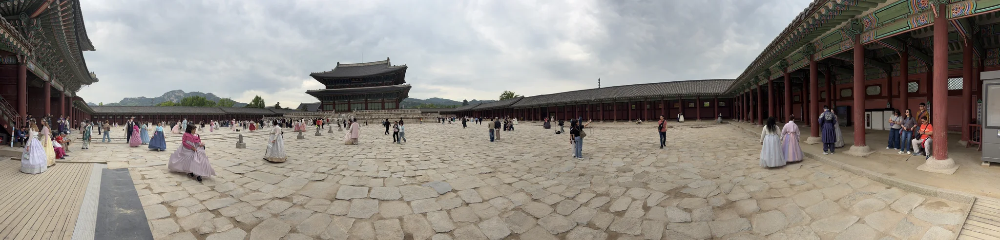

> [!INFO] Want to know less?
> This is a full breakdown of my holiday - day-by-day.
>
> If you want to just see the highlights, I will post a round-up at the end of this series.

## Previously

In [part 2]() we headed to the Korean  for a tour, met a North Korean defector, and learnt lots about the history of South Korea.

It was a very serious and sobering day.

## 10^th^ May: Dressing Up at Gyeongbokgung

But today our destination was a chance to lighten the mood.
A holiday palate-cleanser if you will.

I had been told that one of the 'must do' activities in South Korea, was to visit the 'Grand Palaces'.
Seoul has five of them, but the one I had heard about the most was [Gyeongbokgung](https://en.wikipedia.org/wiki/Gyeongbokgung), which has become a significant tourist attraction.

And, as a tourist, I was attracted to it.
I love old buildings (architecture if you want to be fancy), and I love wandering around them.

Sign me up!



Back in 2013, Korea began granting free admission to the palaces for visitors that were wearing hanbok (traditional Korean clothing).
This, and the fact it was a unique experience, resulted in it had becoming the _thing to do_ on TikTok &mdash; which I am not on, but others in my group are &mdash; so naturally we were going to do it.
Loads of hanbok rental places had sprung up around the palace, and we were set to visit one, rent some traditional clothing, and this would grant us free entry to the palace.

My feelings were mixed.
I don't really _do_ dressing up (except Halloween), and I was worried that dressing up would be seen as 'Cultural Appropriation'.
I was reassured[^1] that this is something that is promoted by the South Korean government, but I was still hesitant.

[^1]: If you're interested, here is a good article on when appreciation becomes appropriation: [Appreciation, Appropriation, and the Honest Answer](https://www.thekoreaninme.com/blog/is-it-appropriate-non-koreans-wear-hanbok.html).

### Daehan Hanbok

The place my other half had selected to pick up our hanbok was 'Daehan Hanbok' ([Google](https://maps.app.goo.gl/xwJvDoLWpeF9dLSu7), [Naver](https://naver.me/5Mvx69nJ)).
It was just down the road from the palace, which meant that we wouldn't have to go too far in the rain and/or sun after we changed.

After leaving our hotel at 09:00, we stopped at a café ([Google](https://maps.app.goo.gl/Wkaq3MtFFHxMWZne7), [Naver](https://naver.me/5mvUyJxe)) to buy breakfast, on the way to the palace.
This was my first experience of 'Sticky Rice Bread', which I found to be the densest food I had ever eaten.
I could not have eaten it all for breakfast even if I was starving; it is probably the closest thing to [Elven Bread](https://lotr.fandom.com/wiki/Lembas) I will ever encounter.
It would serve as a snack for practically the whole day[^2].

[^2]: Shout out to my cargo trousers; which can store the contents of a medium-sized corner shop.

It was at this point I decided: "Yes, I am going to do Hanbok today".
I don't know why, but I am glad I did.

From the outside, Daehan Hanbok is in a narrow four-storey building covered in adverts, attempting to lure people exactly like me, in.
From the inside, Daehan Hanbok was rammed with enough racks of clothes that one more might pop the roof off.
It was also very hot and very cramped because we had arrived at the same time as two tour groups.

This video from the _very_ charismatic owner shows off the inside of the store (and that he's a legend).



Floor three was for those wanting dresses to pick their outfit, and once selected, you head up to floor four, for those wanting trousers, to colour match to the dresses[^3].

[^3]: It's pretty hard writing this sentence in an inclusive way, but I think I nailed it.

Now my other half, who wanted to "be a pretty princess", is known for suffering from a bit of choice-paralysis.
Walking into this sea of possible outfits, I was very worried I would not be able to leave before I reached retirement age.

Ten minutes into waiting, standing awkwardly to the side of the dresses, I turned to one of my group and said "this is it for me, I'm going to be here forever".
Only for me to turn around to my other half standing there in hanbok.

They did a small victory spin, and I think this is the closest I will ever come to witnessing a miracle.

Unfortunately I'm about 10 cm taller than the average South Korean, and about 100% fatter than one.
Heading up to floor four, I had the choice between five different outfits on the 'fat rack'.
Luckily a pale purple one was available which matched perfectly.

Trousers for me were also an ordeal, with the assistant holding up pair after pair up to me until she found a pair that looked like they could cover a double bed.

Clown trousers in hand, I topped it off with a hat, and we were done.

The trousers were designed to fit over the trousers you came in, but the under shirt and the top (Jeogori) were designed to be worn by themselves.
This was useful because it allowed me to keep the plethora of things I was carrying in my cargo trousers on my person[^4], but also not be wearing three layers on my top half, which helped keep me cool.

[^4]: Remember the Sticky Rice Bread?

Daehan Hanbok had a lot of _free_ lockers for anything we didn't want to carry with us to the palace.

We sat and waited for all of our friends to finish up for what felt like an hour.

### Gyeongbokgung Palace

Once all of our group had figured out hair and makeup, we headed towards the palace.

Here's what we both looked like, and if I'm honest, I love it.
I was super hesitant, but I am so happy I pushed that aside and tried it out, because this is one of those photos you cherish for a long time.



The official entrance to the Palace is inside the initial courtyard that you enter and had a dedicated line if you were wearing hanbok.

Once inside, the palace was beautiful.

{class="items-center mx-auto text-center"}

I want to say we took in the palace, and we did.
But there was a significant amount of wandering around and taking photos of ourselves.

Even though the palace was the top tourist spot in the area (and it was a Sunday), there were parts that felt empty, tranquil, even secluded.
The sun was shining overhead, and the palaces buildings were immaculately maintained.



We spent about two hours in the palace, enjoying its architecture, and green spaces.
Coincidentally it began drizzling as we were leaving which was a good sign our time was up.

Dropping off our hanbok was simple, as the top floor of Daehan Hanbok was reserved for getting changed back.

I did leave my water bottle in the changing rooms, never to be seen again[^5].

[^5]: Pour one out.

If you find yourself in Seoul, and you have sunny weather on your side, going to one of the palaces and getting all dressed up is a wonderful use of a day.

### Sky Gimbap

Lunch had passed us by, and we were well toasted from the midday sun, so we decided to grab some food and head back to our rented Hanok.

Now I love Sushi, and one of our group said [Gimbap](https://en.wikipedia.org/wiki/Gimbap) is quite popular in Korea.
Imagine Sushi, but longer.
What's not to love?

As it was Sunday, our choice was very limited, but we found 'Sky Gimbap' ([Google](https://maps.app.goo.gl/t3nqrQ1hVquivtD56), [Naver](https://naver.me/Gow2S8R3)) open at the time of our greatest need.

One step up from a hole in the wall, inside was adorably decorated and big enough for two and a half tables, and every seat was taken.
We asked how long and were told half an hour, which suited us fine.
We were not in a rush.

People in the UK often say "Sushi? Oh, I don't like it".
Then, when you dig into _why_ they don't like it, it's because they have only eaten Sushi from a petrol station (or a convenience store).
If they tried this Gimbap, I think there wouldn't be anyone in the UK that disliked it.

Sky Gimbap took _forever_, but everything was made fresh to order.
Once we had got it back to our rented hanok, we found out it tasted divine.
Very much worth the wait.

Now, it was time for a well deserved afternoon nap.

### Myeongdong Market

Nap completed, we decided to go and enjoy Myeongdong market, at night.

If you remember [we visited during the day]() when we first arrived, enjoying the shops and department stores.
However, Myeongdong's '' was the market stalls which are set up in the evening.



So we jumped back into the Seoul Subway, which we were experts at now, and headed out for dinner on the streets.

And the streets had come alive.
The rather sedate alleys and roads of Myeongdong were now littered with small carts.
We tried Sugar covered fruit (Tanghulu), spicy fried chicken, gyozas, corn dogs, and red-bean filled buns.
I would be shocked if you could walk through and find nothing you wanted to try (unless your body is a temple, because it was mostly unhealthy).



Even though there were hundreds of people, and zero public bins, the streets were immaculate.

> [!TIP] Travel Tip 6
> **We found out**: Busy tourist locations rarely have rubbish bins.
>
> In many of the places we went to, there were no public rubbish bins for you to throw your food waste away in.
> We found out that this is because Koreans want to encourage you to not walk and eat.
>
> Buy your food, eat it, and then hand the rubbish back to the seller.
> They are always happy to take it back.

If we were staying much closer to Myeongdong I think I could have worked my way through every stall, to try everything.
I will have to live with the fact I didn't try crab meat corn dogs.

Myeongdong was much busier at nighttime, so we only spent an hour or so, before we headed back to our rented Hanok.

Determined to finish [Master's Sun](https://en.wikipedia.org/wiki/Master's_Sun) before we head back to the UK, we stayed up past midnight to try and make a dent in it.
There are only 17 episodes, but each was an hour.

## 11^th^ May: Eunpyeong Hanok Village

Monday was a day which began without any concrete plans.

We had a desire to see more 'traditional Korea', so one of our group suggested that we head to the traditional _'Eunpyeong Hanok Village'_ ([Google](https://maps.app.goo.gl/EZB6ap3LAYEjNKj96) / [Naver](https://naver.me/FRoc8PAh)).
Where we were staying was a 'traditional' hanok (with air-conditioning), but it was surrounded by other more modern buildings; so it was an outlier.

Apparently, Eunpyeong was a whole village of hanoks constructed recently for the purpose of promoting more traditional architecture.
'Neo-hanok' (which was the architectural style) takes the design and strengths of hanok, and augments it with modern practices (like reinforced concrete).

This sounded like a good way to spend the day (and to keep me from eating more street food).

Two of our group had risen far earlier than the rest of us (or maybe never slept), and sought out some breakfast from 'onion' ([Google](https://maps.app.goo.gl/6RhfBRQ2YdfzDbMS7), [Naver](https://naver.me/FtoucAYa)).
'onion' was very popular on [social media](https://www.instagram.com/cafe.onion/), and had the queues during the day to match; so going early was really the only time to grab something.

I remember the food was tasty, but for the life of me I cannot remember what I had.

> [!TIP] Travel Tip 7
> **We were told**: You need to use K-Ride because Uber won't work in Korea.  
> **Rating**: Debunked
>
> We had been told that [K-Ride](https://kride.kakaomobility.com/?lang=en) was _the_ taxi app for visitors.
> However, we pretty much exclusively used Uber.
> It was fast, cheap, and was available everywhere we went; Seoul, Busan, and Jeju island.

After breakfast, we grabbed an Uber and headed towards Eunpyeong.



Upon arrival, I will admit I was quite confused.
Eunpyeong seemed like a sleepy little estate back in the UK; you know, if you ignore the traditional Korean architecture.
Being built recently, it lacks a lot of the 'character' you would see at the older sites.



The village is intended to be a tourist destination, but is quite far down the list of recommended places to visit.
Because of that, it wasn't busy in the slightest.

We took our time wandering around and inspecting how the traditional hanok was augmented with newer building techniques; only from the outside however, as people lived in these.

Alongside the village there was a very sedate park which we took the opportunity to stroll through, and take in the lovely weather.

This led to a handful of photos of me looking like I'm lost, but not being paid enough to care.



Very, ['Pablo Escobar Waiting'](https://knowyourmeme.com/memes/pablo-escobar-waiting).

After we emerged, we saw a sign marked 'temple', and decided to go see what we could see.

### Jingwansa Temple

Sometimes the best things that you see are things you stumble upon.
Today, that was Jingwansa Temple ([Google](https://maps.app.goo.gl/ukg7yAj7nzmrKQG46), [Naver](https://naver.me/x5286yEU)), an absolutely gorgeous Buddhist temple, nestled about a 10-minute walk from Eunpyeong.



There was some pretty heavy machinery rolling around the temples main street as some significant work was being done.
It didn't take too much away from the experience and the temple still gave off an aura of serenity.



A small café and a shop with goods made by the monks were next to the temple, and we stopped for an iced fermented rice drink and a mooch in the shop.

Unfortunately the café didn't appear to sell food, so we head back to Eunpyeong to a restaurant we knew came well recommended.

### 1in 1sang

On the edge of the village there were a handful of taller buildings, and on the fourth floor of one was 1in 1sang ([Instagram](https://www.instagram.com/1in_1sang/), [Google](https://maps.app.goo.gl/StMKNh8bPJj6ETUv6), [Naver](https://naver.me/5reZtoOH)).

A cushion on the floor style meal, 1in 1sang was very traditionally themed.
I had some perfectly cooked Octopus, but the headline of the restaurant was the view (and the company of course).



I almost kept forgetting to eat because I was too busy gazing out of the window.

We jumped in an Uber back, and set ourselves to pack our belongings up, as this was our last night in our rented hanok.

## Next Time

It's time for us to move onto our next location.

Tomorrow we are booked on a Train to Busan.
See you in part 4!

감사합니다!
