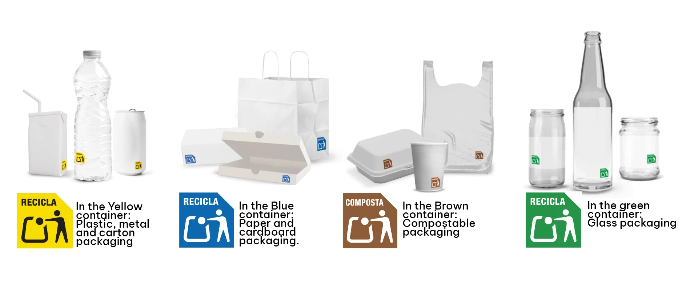
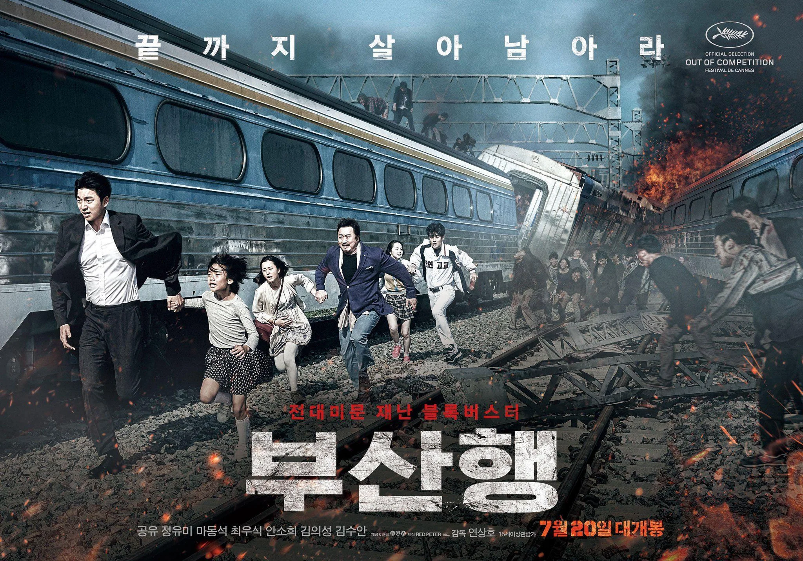
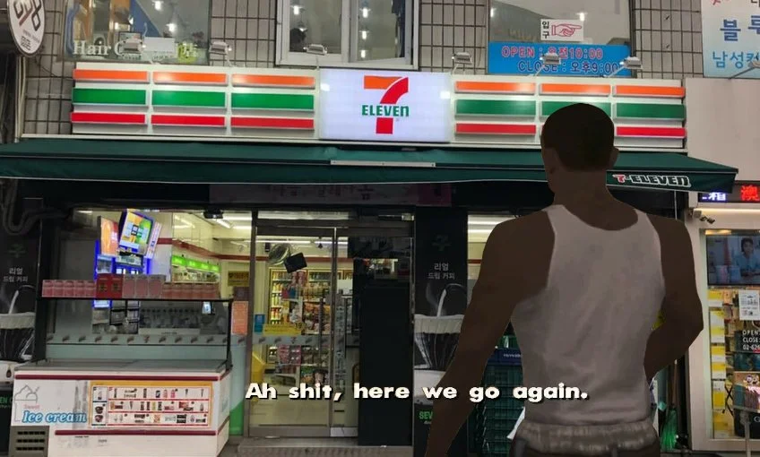
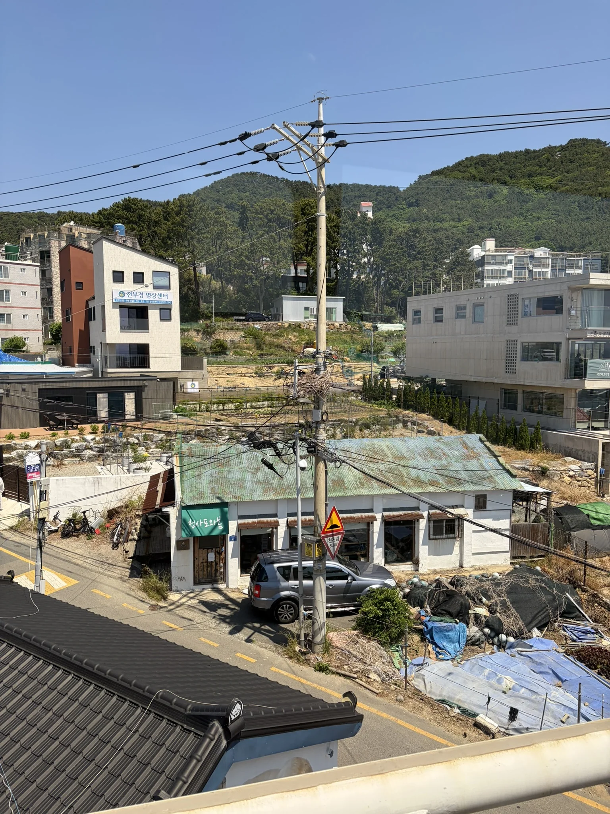

> [!INFO] Want to know less?
> This is a full breakdown of my holiday - day-by-day.
>
> If you want to just see the highlights, I will post a round-up at the end of this series.

## Previously

In [part 3]() we went for a magical day of whimsy at a palace; dressing up in traditional Korean clothing.

But now it was time to wave goodbye to Seoul (for now), and head to our next location.

## 13^th^ May: A Train to Busan

That next location was on the opposite end of the country.
Busan, known for its stunning beaches, was to be our escape from the city.



But before we head south, we had to check out of our rented Hanok.
The StayMoire Hanok ([Google](https://maps.app.goo.gl/snpraQsn3ZADP7VaA), [Naver](https://naver.me/GSDmZM7K), [Booking](https://www.booking.com/hotel/kr/staymoire-premium-entire-hanok-gyeongbokgung-5mins.en-gb.html)) which had housed us for the best part of a week, had been great, but I must admit I was looking forward to the beachfront hotel we had booked.

Before we could check out, we had to empty the bins.

### Recycling

As an aside, we were in Spain last year.
And in our rented accommodation we had to manage our own recycling.
This is normally a nightmare, because the recycling rules vary per county, and sometimes per region.

However, in Spain, all the packaging had a little bin symbol on the back which said which category the packaging belonged to.

Yellow for plastics, blue for paper, and so on.

{class="items-center mx-auto text-center"}

This was enforced in Spanish law as, in January 1, 2025, the requirement to add these symbols to packaging became mandatory for all products sold.
I would love to see this simplicity come to the UK.

Anyway, back to Seoul, we had no idea what packaging belonged where, as we didn't know what the local rules were.

Does all plastic go with the paper?
Are they separate?

My advice would be, if you run a rental property, then you should have a clearly labelled bin per recycling 'group'.
Firstly, this stops the occupants having a bunch of bags lying around, making the place look messy.
And second, this ensures that the occupants get it right.

Or lobby your government to follow Spain's example, I guess.

Rubbish in probably the wrong bins, we jumped in a taxi to the Seoul  train station.
The taxi had arrived early, so we did too.

### Seoul Train Station

Now I was, _stoked_, to get the .
Not in a 'train spotter' way, but in a 'witnessing modern infrastructure in a country that invests in public transport' way.

The UK still runs [Third rail electrification](https://en.wikipedia.org/wiki/Third_rail) near me, which caps the maximum speed of my journey to London at around 160 km/h.

The KTX operates at speeds up to 300 km/h, taking about 2.5 to 3 hours to go from Seoul to Busan.

Just over twice as fast?
I was _stoked_.

KTX station was spotless, and had a wide range of places to buy brunch from while we waited.
Giant screens kept us updated of where our train would depart from, and when the time came, we walked down the stairs and boarded our train.

Only after we sat down did I notice that our tickets were never checked.
We wandered through the station, down to the train, and sat in our seats.
Not once did anyone check we were supposed to be here.

Coming from the UK, where to get on a train you have to go through a barrier where your paper ticket has inevitably demagnetized, so you have to go seek assistance, this was unnerving.

The 10:58 to Busan departed with us all comfortably settled in.

### Film Tie-ins

Now, I would be amiss if I didn't mention [Train to Busan](https://www.imdb.com/title/tt5700672) while we were taking a Train to Busan[^1].

[^1]: Because I mentioned it so many times on the flight over my other half might divorce me.

The film takes place on the same train we were taking, however I can confirm we had no zombie outbreaks during our journey.

Train to Busan is my favourite film in the Zombie genre, and I would recommend you watch it if you haven't already.
And if you have, go see it again.

Korean cinema is refreshing to watch after a life spent consuming American Hollywood's output.

### Welcome to Busan

Arriving into Busan, the first thing I noticed was that it was _HOT_.
It was past two, but the sun was putting in a full shift.

Outside the station were two small flower displays, and my first interaction with Boogi, the Busan seagull.  



Boogi would pop up everywhere during our time in Busan, and they were adorable.
Every city should have a mascot.

The space outside Busan station was wide open with basically no shade, so we were fighting for our lives to get a taxi before we burned (or maybe that was just me).
Our group of six split into two taxis and headed towards the hotel.

My taxi almost ended in disaster, because as I was getting out, my phone fell out of my pocket.
If it wasn't for my friend asking "do you know how to get to your hotel?", I wouldn't have checked my pocket before the driver disappeared.
Moving the fastest I had in a decade, I leant through the window and grabbed it as he started pulling away.

The holiday would have _sucked_ if I had lost it.

My other half's taxi was interesting because the driver started heading to the wrong hotel, due to language barriers.
When our group noticed, he stopped on a dual carriageway to find the correct hotel on his phone.

This resulted in the police getting rather annoyed at the driver.

### Settling in

Both 'interesting' journeys complete, we were at our hotel; the 'L7 HAEUNDAE' ([Google](https://maps.app.goo.gl/KrAhevvLzFc9vpQ16), [Naver](https://naver.me/5GcpUyZN))[^2].

[^2]: Yes, it was in all-caps.

The view from our room on the seventeenth floor was exceptional.
I think we had paid about £20 extra for a sea view, and it was worth every penny.



Unbeknownst to us, there was a Haeundae Sand Festival set to take place in a couple of days, and we could already see the sand artists creations down below.

The hotel had all the modern conveniences, and might be the best hotel I have stayed in.
A massive bed, _very_ effective air conditioning, a futuristic bidet toilet seat, and a 7-Eleven in the lobby.

Remember my newly formed addiction from [part 1]()?

But man cannot live on iced coffee alone, so we sought out more traditional sustenance.
One of the foods on our 'must have' list was [marinated crab](https://en.wikipedia.org/wiki/Gejang).

Crab is in my 'don't eat things that are armoured' category of food, along with Lobsters, but when you marinate them, they become very tender, and far easier to eat.

'Sinsa kkotge dang, Haeundae' ([Google](https://maps.app.goo.gl/D9THNHKkSYPWRovt9), [Naver](https://naver.me/GQG11M0L)) was just around the corner, so we head on down to enjoy some crab.

> [!TIP] Travel Tip 8
> **We found out**: Electronic ordering tablets are common.
>
> In many of the restaurants we went to, electronic terminals were common.
> These allowed you to select your language and order without having to be embarrassed by how little Korean you speak.  
> These were more frequently found in places where you ordered individual dishes, not if you were ordering Korean BBQ for the table.



The crab was very succulent and flavourful.
It was _very_ messy, and my white shirt became a very poor choice almost immediately.

Overall though the meal was outstanding and breathed life back into the idea that crab is worth the effort.

### Dongbaekseom

To burn off the food we decided to go for a walk down the beach.
Even though the Haeundae Sand Festival was due to start in a few days, there were already musical acts up and down the beach.
Some sang very cheesy renditions of American pop music, while some played instruments.

A park at the end of the beach had caught my eye from the hotel room.
When we reached it, it had a boardwalk running around it's edge.

The view of the city behind us was breathtaking, but our walk was cut short because the mosquitoes were also out for a nighttime stroll.



To finish off the night, you guessed it, we watched more [The Master's Sun]().

Busan is, as the sign said, good.

## 14^th^ May: Seaside Tour

Thursday was the day for another tour.
This time we were booked on another 'Get Your Guide' day out, ['Busan: Top Coastal Highlights with Sky Capsule Full Day Tour'](https://gyg.me/Q9SxXt4l) (which is a mouthful).

Our [DMZ tour]() exceeded our expectations, so we had high hopes for this one.

What is a Sky Capsule?
Who knows, but it sounds fun.



This tour had a very leisurely start at 9:30 in the morning, allowing us to grab some food from the 7-Eleven in the ground floor of our hotel.

As we waited for the coach to pick us up I noticed a mobile phone sitting on a table, unattended.
If this had been the UK, it would have already been stolen, but here it sat for a good while.
We got on the coach before we saw its owner return.

Maybe the stories of South Korea having very low levels of crime were true.

### Haeundae Blueline Park

The first stop on our tour was the 'Haeundae Blueline Park' ([Google](https://maps.app.goo.gl/knNpB1ZRRKiHP9mN8), [Naver](https://naver.me/GgUWWQ85)).

The 'Haeundae Blueline Park' is a little attraction that runs along the coast.
Adorable little colourful 'Sky Capsules' slowly trundle along a track between Mipo station, and Cheongsapo station.



The queue to get on the Sky Capsules was over half an hour, but it was worth the wait.

It was a cloudless day, and as we slowly made our way along the coat, we put on some music from the Studio Ghibli films, to add to the magic.
And it was _magical_.
I wish it had lasted longer.

{style="width:50%;" class="items-center mx-auto text-center"}

Towards the end of our journey, I captured this interesting image of the less-polished side of Busan, with less stringent electrical standards; birds nest included.

### Cheongsapo Daritdol Skywalk

Once we disembarked, we continued down the coast on foot.
We had passed one 'sky bridge' on the capsule journey over &mdash; a walkway over the ocean &mdash; and we were set to visit another.

The 'Cheongsapo Daritdol Skywalk' ([Google](https://maps.app.goo.gl/okVkX4sc7dS4mMg48), [Naver](https://naver.me/FlBZZosY)) is a big metal U-shape footbridge, which extends out over the sea.
Not very far, but enough that it is an interesting experience.

The floor was made of glass, so you could see the water below, and the air was made of wind.
So.
Much.
Wind.

It was very apparent why umbrellas had been banned, because the wind was savage.
I was very thankful that my hair was my own, because 'bald' would have been the toupee fashion trend out there on the walkway.



The views were worth it, however.
Once out on the Skywalk you could see for miles in both directions down the coast.



I suspect if it were raining the experience would have been miserable, but as it was a beautiful summer's day, it was anything but.
In fact, the wind cut through the heat and made it positively pleasant.

But, one cannot sit and gaze into the depths of the ocean for too long on an empty stomach, so our next stop was a place whose name was 'CheongSapo Chakan Hoejip Grilled Clams' ([Google](https://maps.app.goo.gl/8mi5RbtWPsctNnqh6), [Naver](https://naver.me/Fc6LZWWq)).



Now the food was just as filling for the stomach as the name was for the mouth.
Like many of the places we had been to, there was a grill in the middle of a table where the wait staff grilled fresh clams.

I was wearing a white shirt, so I made the sensible decision to eat a vegetable [Bibimbap](https://en.wikipedia.org/wiki/Bibimbap), however my neighbour got a hotpot, which resulted in my shirt getting caught in the crossfire anyway.
C'est la vie.

### Gamcheon Culture Village

Our morning had been spent north of our hotel, and now it was time to head to the southern side.

We jumped back onto the coach with our bellies full, and our shirts stained with sauce.



The third stop on our tour would be the 'Gamcheon Culture Village' ([Wikipedia](https://en.wikipedia.org/wiki/Gamcheon_Culture_Village) [Google](https://maps.app.goo.gl/v7DZ6EsKf8LA8tKb9), [Naver](https://naver.me/56XRRxBx)).
Gaining popularity after an art project renovated it in 2009, nestled on a hill, Gamcheon is a densely packed town where no two buildings are alike.



After being dropped off at one end of a tourist route around the town, we were handed a map and told 'be back here in an hour'.
Now an hour felt like no time at all, but Gamcheon is small enough that you could get to one end and back with a bit of time for shopping on the way.

The road we were on took us around the hillside, unique touristy shops lining both sides.

Once we reached the end, we could see out over the town/city towards the ocean, and I remember thinking that it looked like a river of buildings being swept downstream; neatly contained by the mountains on either side.

Gamcheon is an adorable little town, and I would recommend a visit.
It is however quite busy, so leave a bit of time if you want to take some more of the classic tourist pictures with 'Le Petit Prince' looking out over the town, because they have quite long queues.

Back at the coach, we were delayed leaving by 15 minutes, which will become important later.

### Lisboa Cafeteria Busan

Our fourth stop was a bit odd, I must admit.

Pulling up to a non-descript bus stop we all stepped off the coach and into a side street.
At the bottom of a set of stairs we came upon the 'Lisboa Cafeteria Busan' ([Google](https://maps.app.goo.gl/PoNREZvFZvH8JJfj7), [Naver](https://naver.me/GsBjjttG)); a small café which looked out over the sea.

Our reason for stopping here was a narrow walkway which ran along the seafront &mdash; the 'Huinnyeoul Culture Village' &mdash; but to me, it just seemed like a walkway with some shops on it.



Before we set off down the walkway, our guide laid out that we had 45 minutes to explore, and one of the guests from our tour became instantly irate.\
His trigger?\
That we were supposed to have a whole hour to explore.

It became quite awkward, quite quickly, our guide capitulated and gave him an hour.

I don't know why this guy was so invested in getting the full hour here, but after we stopped to talk to the guide, to ask if he was OK, it turned out the reason we were delayed leaving our previous destination, was that this same guest was late returning to the coach.\
Fascinating.

I topped up my iced-milk tea addiction, and we headed off for a little walk down the coast.



The path had many small shops selling interesting things, but we were all shopped out from the previous location, so we walked past all of them.
Like the previous cultural village, almost everywhere you looked, there was a unique piece of artwork adorning every surface.

Lisboa Cafeteria Busan is perfectly placed with a gorgeous view out over the sea, and the drinks were good.
If you are in the area, I would recommend it; it had a very chill atmosphere.

### Oryukdo Skywalk

Out fifth and final location for our tour, was the 'Oryukdo Skywalk' ([Google](https://maps.app.goo.gl/MB4HSZJy9dkVxShZ7), [Naver](https://naver.me/xjYgg3kg)) which looks out over the Oryukdo Islets; a set of small rocky islets.



Earlier in the day, our guide had phoned ahead to check that the Skywalk was open, as it can get very windy, and when it is windy it closes.

When we arrived we found out that it had closed 15 minutes earlier.
The exact amount we were delayed by our resident angry man.



Was I sad that I missed out on a skywalk?
Not really.
The views were still outstanding.

But the thing that took the edge off?
That the guy who had delayed us was _pissed_.
Visibly.

The schadenfreude of his own self-inflicted situation sustained me for the rest of the journey back to the hotel.

The tour as a whole was very fun, but I felt like the destinations in the morning were better than those in the afternoon.
It was all good, but the highlight was the [Haeundae Blueline Park](#haeundae-blueline-park).

### Night Market

After a short pre-dinner nap, we went out for a very traditional Korean dish, known as an Indian Curry.
'Namaste Haeundae' ([Google](https://maps.app.goo.gl/wLZfLx9dzwScGqe38), [Naver](https://naver.me/GkIhJKAh)) felt like a nice change from the other food we had been eating.
Indian food is big in the UK, and it was comforting to have a naan[^3].

[^3]: Man, I love bread.

Energy levels topped up, we set out into the city.
We had heard Busan had a good night market, and we wanted to investigate.



The market was packed, and our group narrowed in on a store which let you iron patches onto luggage tags.
The store had hundreds of patches to choose from, and I began to think I had lost my other half to choice paralysis, before they eventually emerged, customized tag in hand.

With that, we retired back to the hotel (and yes we watched more K-Drama).

## Next Time

Tomorrow we go on another tour to some nearby UNESCO World Heritage Sites.

See you in part 5!

감사합니다!
