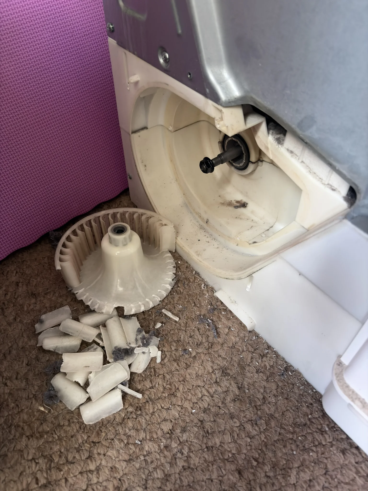
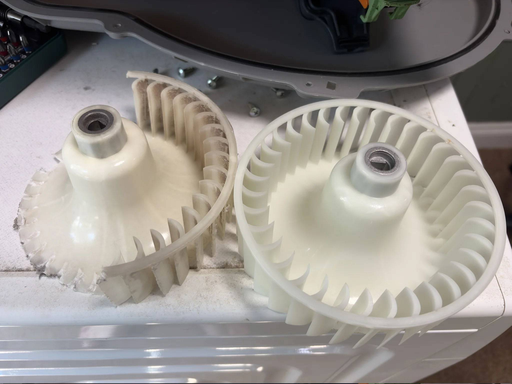
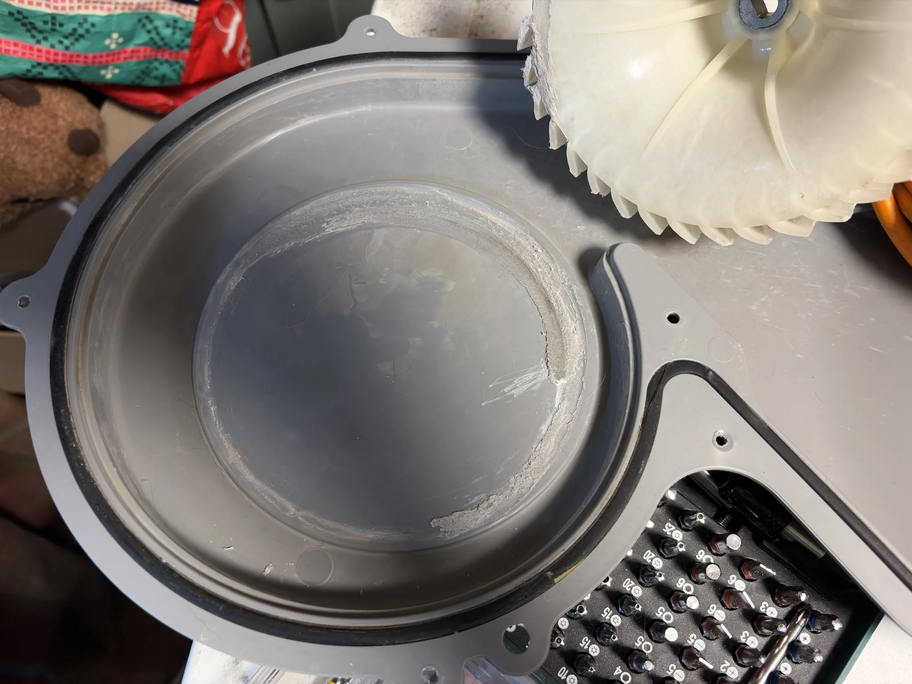

What happens when you mention to your D&D group, who mostly have ADHD, that your tumble dryer is broken?

Free labour!

<!--more-->

About six months ago, my tumble dryer started making a small grinding sound, as if something had been dislodged.

_Past Phill_ decided that this was very much a _Future Phill_ problem.

Two weeks ago _Future Phill_ had to deal with _Past Phill_'s laziness when the dryer began vibrating itself off the shelf it was on.



Our tumble dryer (a `DV70F5E0HGW/EU`) was manufactured in 2014 (in [Korea]()), so I made the initial assumption that because of its age, it was due to be sent to the big tumble dryer playground in the sky.

But last weekend, while I was running my monthly '[Storm King's Thunder](https://en.wikipedia.org/wiki/Storm_King%27s_Thunder)' D&D campaign, I asked one of the group to help me get the dryer down from the shelf.
Immediately the group set to work removing the back panel and trying to figure out what was wrong with it, _while_ still playing D&D.

{style="width: 50%;" class="items-center mx-auto text-center"}

I'm not a detective, but I think the impeller was broken.

Before the end of the session one of my group had sent me an [eBay link](https://www.ebay.co.uk/itm/358688132849) to a replacement, and the spare part turned up at my house on Thursday.

{style="width: 50%;" class="items-center mx-auto text-center"}

All I had to do was sand down the back panel where the old impeller had friction welded itself to it.

{style="width: 50%;" class="items-center mx-auto text-center"}

Additionally, I made sure to find all the old impeller pieces, so they didn't destroy the new one.
Replacing the part was really simple, and saved me £600-ish on a new tumble dryer.

I am happy to report that the tumble dryer is back on its shelf and humming away in a non-threatening manner.

---

Footnote: I stole the title **Dungeons and Dryers** from a mate of mine, and I'm giving him zero credit for it.
