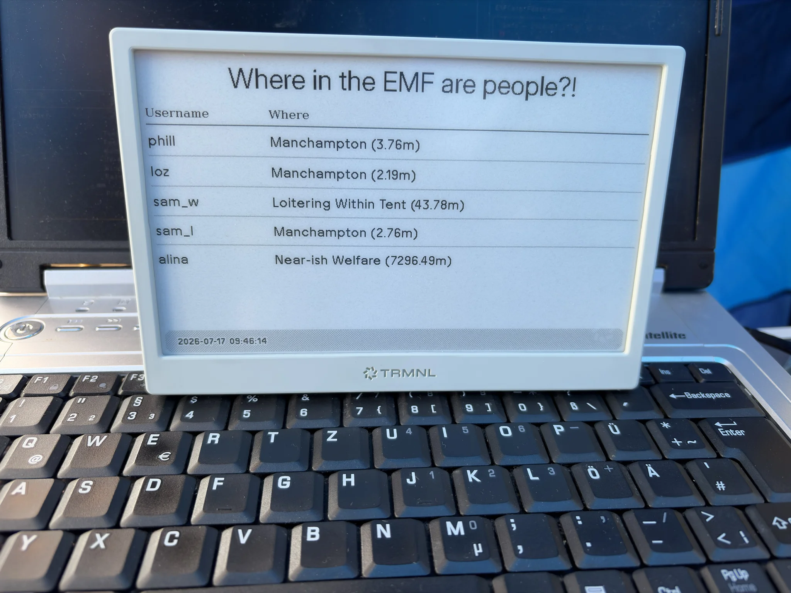
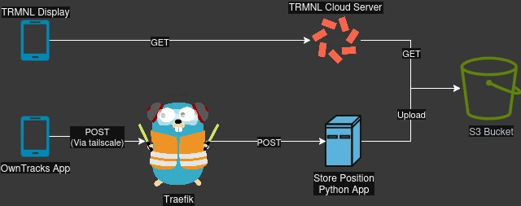

[EMF](https://www.emfcamp.org/) started yesterday, and last week I wanted to do _something_ nerdy to justify my attendance.

To quote the website:

> Electromagnetic Field is a non-profit camping festival for those with an inquisitive mind or an interest in making things: hackers, artists, geeks, crafters, scientists, and engineers

So, as conversation of attendance, and the [site began to be set up](https://social.emfcamp.org/@info/statuses/01KWPPZHY64RJGVV9QEJ06XBZ3), the nerdy bug caught me and I decided to build a thing.

Last time I went to EMF, I found that I kept losing people on site (because it's quite large).
So maybe I could build something to help people returning to my tent to find out where I was.

Cue the _'Where in the EMF are people?!'_ dashboard.

A completely overengineered alternative to texting me.

## Architecture

I bought a [TRMNL](https://trmnl.com/) ePaper display late last year, and I decided it would be a quick way to display data about where I am.
The device dials out to the trmnl cloud and loads a pre-rendered image.
It's a tiny device that literally only does that; pretty cool.

On the other end of the problem space, I wanted a tracker to periodically announce my location.
I also wanted to not forget do announce my location, so I needed something automated.

My iPhone seemed like it should reasonably be able to do that, so that was my end to end; somehow I was to get my iPhone to report my location on a schedule, and have my ePaper display the location.

To make it a bit more complicated, I wanted to show which on-site location I was closest to.
Latitude and Longitude are a bit tough to work with, so 'I'm in the pub' seemed more user friendly.

I started with a fully AWS system, but it became clear it was easier to just have a [Tailscale](https://tailscale.com/) network which allowed private access from anywhere.
I used a tailscale sidekick container to allow private routing.

So there are three main flows.

### Position Reporting

1. The phone uses the [OwnTracks](https://owntracks.org/) app to send an HTTPS POST request to the API Gateway
2. The request is routed over tailscale, to the Traefik container
3. Traefik authorizes and routes to the Python application
4. The Python extracts the OwnTracks payload, and stores it in a local SQLLite database
5. A 200 OK response is returned to the OwnTracks application with all known locations (which shows them in the app)
6. The list of users, their GPS location, their closest EMF location, and their distance from it, are all gathered
7. The closest location for each user is taken and if closer than 30 meters to the user, is selected as their current location
8. A `dashboard.json`, `dashboard.html`, and `dashboard.png` are written to S3 containing the information

### Image Rendering

1. A [Private Plugin](https://help.trmnl.com/en/articles/9510536-private-plugins) on the TRMNL cloud makes a GET request for the `dashboard.json` on S3
2. Custom Markup converts the JSON into HTML, which is captured and cached as an image

### Image Display

1. The TRMNL device queries the TRMNL server to get the pre-rendered image from the [Private Plugin](https://help.trmnl.com/en/articles/9510536-private-plugins)
2. Profit.

## Onboarding Users

Now, because this is a pet project (and there isn't a security department shouting at me), there are a couple of steps to onboard a user.

1. Add a hard coded username/password pair to the Traefik configuration
2. Invite the user to my tailscale

When those two bits of information are updated, a URL with the username and password can be put into the OwnTracks application, and it can start reporting positions.

## Future Improvements

- Some proper authentication
- Probably MQTT to support things other than the OwnTracks application

Maybe I will get to these (but we know I won't).

The source code can be found [on my GitHub](https://github.com/pwhittlesea/owntracks-trmnl-location-display).
