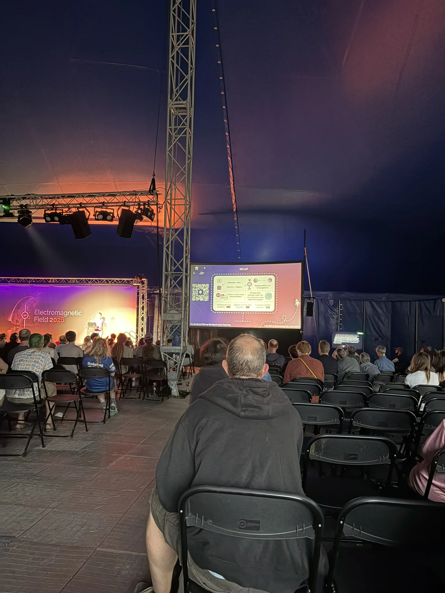

[EMF](https://www.emfcamp.org/) has flown by, and I completely failed at writing a handful of blogs about it while I was there.
So, my plan has changed to write a few retrospectively.

<!--more-->



The camping aspect of EMF was chaotic, with a sea of tightly packed tents, guy ropes overlapping, causing many trip hazards.

A group of us from Southampton and Manchester came together to form _'Manchampton'_, with our tents circling a main living space.
We had power, Wi-Fi and Ethernet connectivity, which might push it towards glamping.
The downside is that we are right next to the Karaoke tent, which goes until midnight each night.



Day one of EMF (Thursday) was reserved for getting settled in and to explore the site, but we mostly explored the pub.

Day two was when the main event kicked off; starting with an opening talk, which explained the sheer volume of volunteer hours, blood, sweat, and tears required to get the event to the state it was in now.
EMF has a general vibe of 'organized anarchy', because it is entirely run by volunteers.

The bar is run by volunteers, the bins are emptied by volunteers, etc.
There are a few core functions who are not, like the paramedics, security, and fire teams (because they kinda need specialist training)[^1].

[^1]: The food vendors are external companies too.

The rest of the functions are run by a giant pyramid of volunteers, down from the core EMF team, who do know what they want to go on (which might not actually be the same as what is going on).
Each volunteer does a shift, and then in the last 15 minutes, hands over to the next volunteer.

I took my turn on the entrance gate, welcoming people into the site between 13:45 and 16:00 on the Friday, and 00:45 and 03:00 on Saturday.

Yes, you read that right.
1am to 3am.

It was an absolute graveyard shift, but someone had to do it.
The earlier shift still had a gentle trickle of people, but it was a ghost town in the early hours if we exclude someone not being able to find their car in the car park (and the mostly naked man running to the toilets &mdash; we all have emergencies).

It felt good to give back[^2] and support EMF, and volunteering introduced me to some very interesting people, who I keep bumping into.

[^2]: Ignore the fact I got a free meal of out it.

There is an impossible amount of stuff to see at EMF.
Everyone has a cool project that they want to showcase.



Cool oddities litter the site, from an Electric bot that makes music as you push it around, to an effectively-infinite number of light displays, and everything in between.



Four years ago I remember someone built a jet engine in their garage, but it was a bit too dry to roll it out.

There were plenty of competitions, like capture the flag, and find [the RFID enabled ducks](https://duckfriend.online/) (which I came 71^st^ in).
I actually did win a round of 'Push the Button' &mdash; where you had to wait as long as possible to push a button to 'level up' &mdash; when I wandered past it at 4am.

Friday night, before my shift, [Venjent](https://www.venjent.com/) played in the 'Null Sector', a collection of shipping containers gathered together to make a unique night market and open-air club.
The set was immense, and it was a joy to see an artist who I have enjoyed for a couple of years.
Him headlining was a complete surprise, and only announced after all the tickets were sold.

I know I will never be able to explore the whole site.
With the intense sun we had during the event, I found a nice balance between relaxing, and going to talks and seeing things.

I think I will do a follow-up of the interesting talks I went to, and some more of the projects I saw.

{style="width: 50%;" class="items-center mx-auto text-center"}
