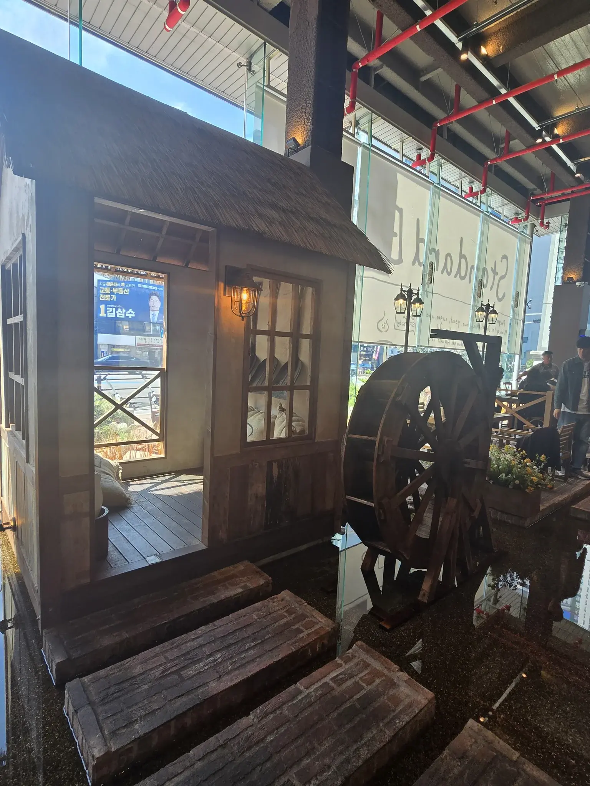
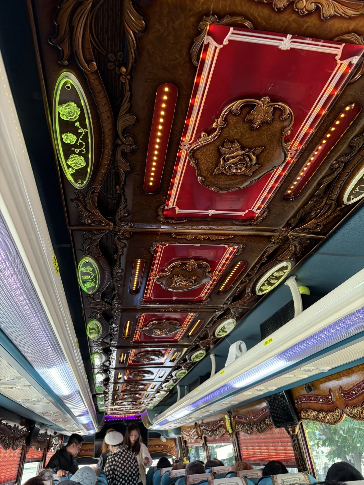
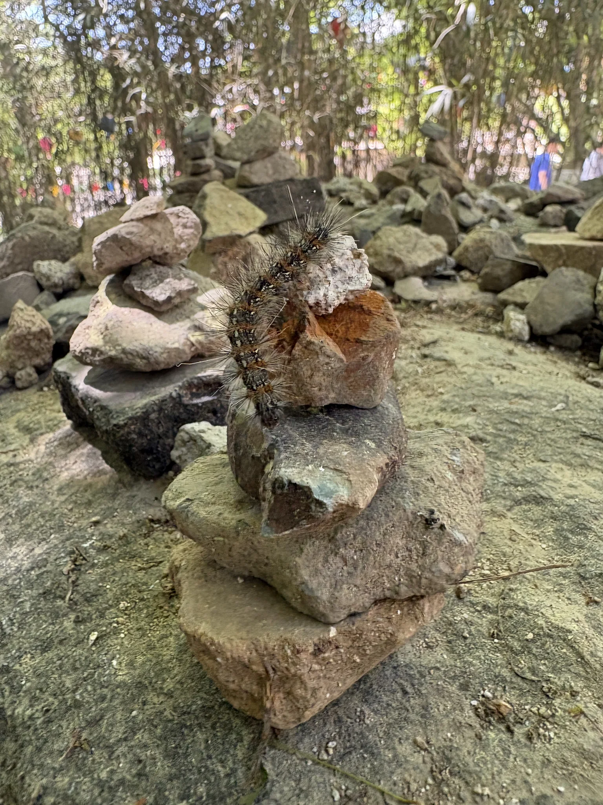
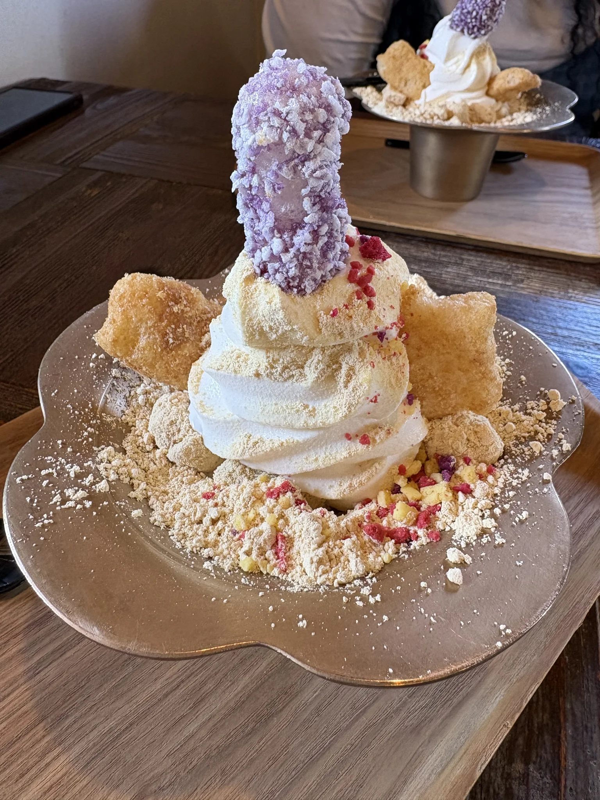
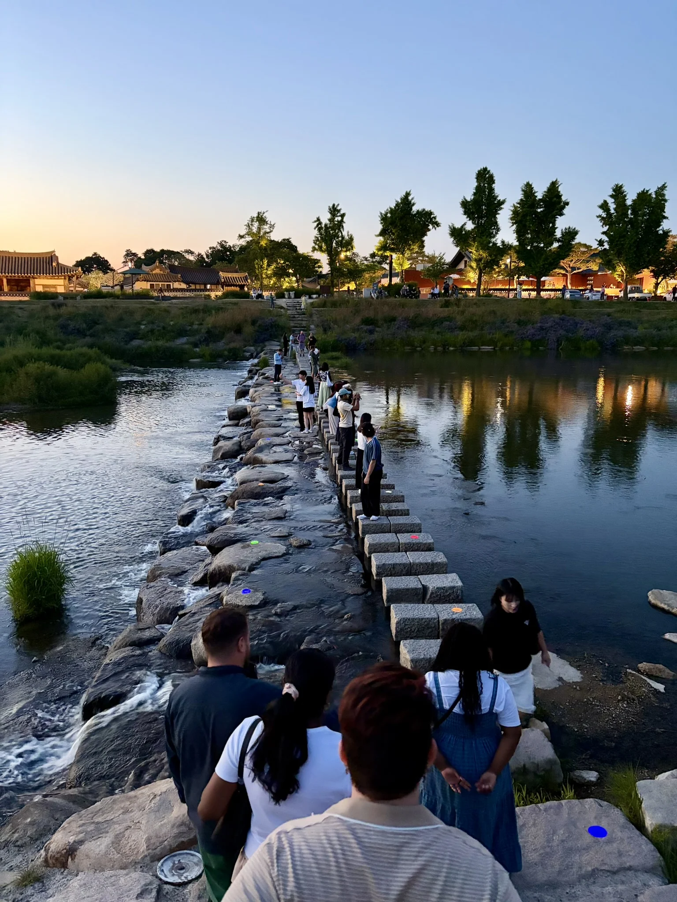
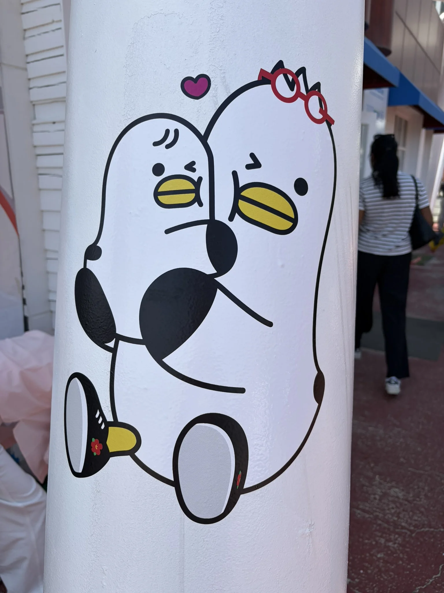
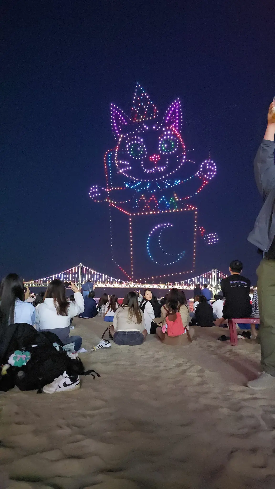
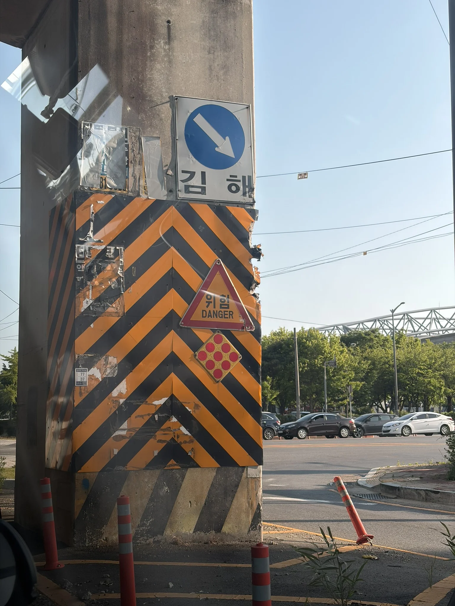
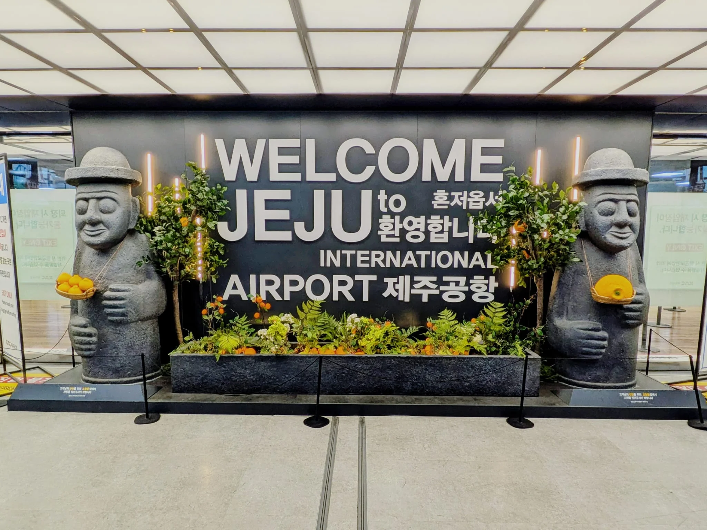

> [!INFO] Want to know less?
> This is a full breakdown of my holiday - day-by-day.
>
> If you want to just see the highlights, I will post a round-up at the end of this series.

## Previously

In [part 4]() we waved goodbye to Seoul and went on a whimsical tour of Busan.

This time we explore the Three Kingdoms Capital to the north-east, and leave for our next location.

## 15^th^ May: Gyeongju Tour

If you remember, [yesterday]() we did a seaside tour, and whilst we were on the coach back, we considered that we had no plans for tomorrow (today).

There had been a more historical tour which was on our shortlist, and we saw that there were slots free, so we made the quick decision to book it and spend the day doing _another_ tour.

I will be honest, I really like myself a tour &mdash; going from place to place, pointing at things, is my vibe right now &mdash; so I had no complaints.

This time we were off on the ['Busan: Gyeongju Guided Day Trip to Three Kingdoms Capital'](https://gyg.me/rXLDWsqj) tour.

### Standard Bread

But first, _breakfast!_

One thing I had noticed about Korea, is that there are a lot of amazing English business names; like 'No idea pizza' or 'We have your energy'.

'Standard Bread' ([Google](https://maps.app.goo.gl/sftodgYDz9hyUDZS6), [Naver](https://naver.me/Ge7U7Npe)) was one of those with an amazing name that did anything but describe the business.

Inside, a waterwheel over an indoor river awaited us.

{style="width:50%;" class="items-center mx-auto text-center"}

If the waterwheel wasn't enough, an absolute slab of Crème Brûlée toast arrived at our table.
Surely no one person could finish a full 5 cm deep slice of bread soaked in creamy sauce, but that seemed to be the standard serving size in 'Totally-above-average Standard Bread'.

It was delicious, and perfectly toasted, so I had no complaints after I and my other half polished one off.

To go with the diet-shattering apocalypse of a breakfast[^1], I also had something called an 'Ube Milk Tea', which was (I hope naturally) very purple.
It didn't last very long as it was quite delicious.

[^1]: And people complain about English Breakfasts.

It was at this point that my decision to [go to an Indian restaurant]() last night, became a very poor choice.
I will save you the details, but my stomach decided that it was going to rebel against the idea of 'not being in a bathroom'.
I was fighting for my life.
My friends almost sent in a search and rescue crew to recovery my body.

Why am I telling you this?
Well, because I am going to use it as a segue later in this post.

Gingerly, I managed to exit Standard Bread with the gang, and head towards our collection point for our tour.
Today's tour was _eleven_ hours, start to finish.
Mostly due to the distance between Gyeongju (where all our destinations were clustered), and Busan.

When I think back to the fact it was only £30 per person, I am astounded by the value for money.
In the UK, £30 would have got us half-way there; never mind back again.

Arriving at the coach, we were quickly checked in, and bundled onto an impossibly unique looking coach.

{style="width:50%;" class="items-center mx-auto text-center"}

I didn't realize that mahogany and LEDs went so well together.

As we began to drive away, my stomach took this moment to wrestle for control of my agenda.
I was thinking to myself, "I am not going to make it to Bulguksa. I need to get off".

This was when our guide began giving us a breakdown for our first stop.
It would be an hour and a half to our destination, **but** we would be stopping halfway for a toilet break.

Deep breaths.
I could do this.

> [!TIP] Travel Tip 9
> **We found out**: Public toilets are everywhere.
>
> And I mean _everywhere_.
> Subway stations, markets, beaches, mountains, waterfalls.
> You name it, there is one-or-more toilets there.
>
> All the ones we went in to were free, clean, and fully stocked.
> You never need to worry about being caught short.

True to their word, we stopped at a service station on the motorway.

I think Korea would be a great place to have something like IBS, where sometimes the need to use the toilet comes quite suddenly.
Far more so than the UK, where we shut all the public toilets because they cost too much to run[^2], and we have outsourced provision to private businesses (which require you to be a paying customer to use their facilities).

[^2]: The UK knows the cost of everything, but the value of nothing.

Right, toilet talk aside, let's carry on with the tour.

### Bulguksa Temple



First stop, 'Bulguksa Temple' ([Wikipedia](https://en.wikipedia.org/wiki/Bulguksa), [Google](https://maps.app.goo.gl/Ttnr3puqnijJta838), [Naver](https://naver.me/xXnLp9uX)).

Unlike our previous tour, the group was divided three ways.
A Chinese-speaking group, a Japanese-speaking group, and an English-speaking group, with one guide apiece.

The Chinese and Japanese guides did a very thorough introduction to our tour.
I couldn't understand a word of it, but many words were used.
When it came to our English guide, far, far fewer words were used; "Next stop Bulguksa Temple, then lunch".
I had a suspicion we were getting a semi-skimmed version of the introduction.

We arrived after a considerable coach journey in a car park surrounded by trees.

Our first view of Bulguksa Temple was a broad entrance gate, decorated in the bright colours we were used to.
I had checked Wikipedia beforehand, and it said "The temple is considered as a masterpiece of the golden age of Buddhist art", and it was easy to see why.
Even the entrance was beautiful.

Our group split up into our respective languages and the first part of the tour began.

The temple was gorgeous and was nice and cool in the midday sun as trees shaded the complex.
There were about 6 or 7 major points of interest and after an 'official' tour by our guide, we were given some time to explore on our own.



I got talking to our guide, and she mentioned it was her only her second tour, as she had only just started being a guide.
She also said that I had the honour of asking her first question: "were the statues in the main entrance wood or stone".
Like every Korean we met, she said she was a bit hesitant speaking in English, but it was flawless (and better than my Korean).

{style="width:50%;" class="items-center mx-auto text-center"}

We lapped up the very chilled vibe the temple had, even meeting a small but dangerous looking caterpillar, until the time came to walk into the nearby town for lunch.
A simple but filling meal awaited us at 'Jeonju Takbae' ([Google](https://maps.app.goo.gl/anz51rnrsKbwGQ3k9), [Naver](https://naver.me/IMZyaSGA)).

Once our bellies were full, we explored a nearby plaza/shopping centre before jumping back on the coach.

Even if all the other destinations on this tour were a waste of time (they were not), this temple alone was worth the price of the tour.

### Gyeongju Gyochon

Next up was the 'Gyeongju Gyochon Traditional Village' ([Google](https://maps.app.goo.gl/TbXzVEVP6d4KdCkd9), [Naver](https://naver.me/FjbWLahN)), a Korean folk village which was the home of a major aristocratic family.



Like previous [cultural villages]() we had been to, there were lots of similarities.
However, this was the first we had a guide for, so we got a bit more context for the construction and usage of the buildings.



I think the photo above of the traditional building, art, and the very modern air-conditioning units, is one of my favourite from this holiday.

My stand-out memory from this village however, was the [Injeolmi](https://en.wikipedia.org/wiki/Injeolmi) ice cream we ordered, partially because it looked _interesting_, but mostly as an excuse to get out of the sun (at least, that's what I am telling myself).
I was delicious, tasting sweeter than traditional ice cream you get in the UK.

{style="width:50%;" class="items-center mx-auto text-center"}

I think it's fair to say that we were a bit 'traditional village' fatigued at this point, so we spent our free time talking to our guide.

[Woljeonggyo Bridge]() was just over the road, so we would be coming back here later tonight.

### Daereungwon

Next up, was more 'free time' with a suggested visit to a tomb.



The Daereungwon complex ([Wikipedia](https://en.wikipedia.org/wiki/Daereungwon), [Google](https://maps.app.goo.gl/qtGexk31ci7fY1kW8), [Naver](https://naver.me/Gpr2E7cR)) is primarily home to a handful of tombs, one of which you can enter and look at a collection of historical artefacts recovered from the tombs.



The tomb itself was quite small, and didn't fill the hour and a half we were given to explore the complex, so we had a very nice walk in the accompanying park.
The main area is a handful of mounds surrounding a pond, and it was delightful to explore.
This _still_ didn't take up all the time we had, so we went to investigate the neighbouring 'Hwangnidan-gil' street.

If you look at ['Hwangnidan-gil'](https://en.wikipedia.org/wiki/Hwangnidan-gil) on Google Street View, you can see pictures from 2018 where it looks like a normal (if not a bit run down) street, but over the last decade it has had an immense 'glow-up', and is now the home to a lot of trendy tourist shops.

I don't really have anything to compare it to.
Myeongdong Market was a whole other level.
There were plenty of independent shops selling trinkets, lots of ice cream places, and a few restaurants that we didn't have enough time to eat at.
I think you could probably spend several hours here, but we didn't have that kind of time.

I did try ['Hwangnam Jjondigi'](https://www.trvlogue.com/en/hwangnam-jjondigi-gyeongju-review) which was like somebody tasted fries and decided they needed to both be chewy, and spicy.
Would I order them again?
Probably not, although I have heard that they are good with a beer.

### Donggung Palace & Wolji Pond

Now it was time to visit our second palace.



'Donggung Palace & Wolji Pond' ([Wikipedia](https://en.wikipedia.org/wiki/Donggung_Palace_and_Wolji_Pond), [Google](https://maps.app.goo.gl/Dn4c1w49ataVKN9n8), [Naver](https://naver.me/GDQsMBtp)) was another former palace turned tourist attraction.

Unlike the previous palace we visited in Seoul, this one had no structures I would consider houses.
It only had two pavilions overlooking the pond, surrounded with a winding path which brought you back to where you started.



As we explored the site, the sun began to set which only added to the beauty.
This was hour 8 of the tour, and the amount of time we had been given at each location had been intentionally orchestrated so that we were here during sunset.



### Woljeonggyo Bridge

Jumping back into the coach for the penultimate time, we head towards 'Woljeonggyo Bridge' ([Google](https://maps.app.goo.gl/jmDUtg1CX8hNBQD16), [Naver](https://naver.me/F5sB3pYk)).



Known for its beautiful nighttime lighting, this footbridge was a relatively recent construction, built on the site of a historical bridge.
I am not sure how you would know that you have correctly reconstructed a bridge when all you had was the stone footings, but this bridge is now considered a historic site, so they obviously felt they did a good job.

Regardless of how accurate it is, I cannot deny that it is one of the most elegant man-made constructions I have ever seen.
I am sad I didn't get more time to go on the bridge and see its rebuilt gatehouses.

We were mostly here to "get that 'gram shot", which required walking out to the middle of the river.

{style="width:50%;" class="items-center mx-auto text-center"}

Remember when I said that the timings of the tour were well calculated?
Well, we had been brought here during [blue hour](https://en.wikipedia.org/wiki/Blue_hour), when the sky is lit in a beautiful blue tone.



After a very rushed visit to the bridge we hopped back on the coach for the nighttime drive back to Busan.

An eleven hour tour is a damn long tour, so we were very tired.
Our group napped on the coach back, but once we arrived in Busan at 9pm, we decided that it was time to call it a night.

We grabbed some Sushi from the 9/11 below our hotel, and retired for the night.

## 16^th^ May: Resting in Busan

Today was a rest day, so I'm going to skim over large parts of it.

### Ignoring the Sunrise

One of the key parts of being an adult, is deciding when you _don't_ want to do something.
Those of you who suffer from  will struggle with this, but I do not suffer such an affliction, so when my other half asked if I would like to go watch the sunrise over Haeundae beach, I said I'd rather sleep in.



Here is one of the pictures they took, which is nice, but not nicer than a pleasant lie-in in a luxurious hotel bed.

In retrospect, I probably should have gone.
During the day the sun was so aggressive the beach was basically a no-mans land for my fair skin[^3], so I never actually got to enjoy it.

[^3]: It's a tough life being Ginger.

### Heading around town

The main bulk of our day was spent:

1. Grabbing some bakery items from 'Avant Bakery Haeundae' ([Google](https://maps.app.goo.gl/dYc9Xry7oiRwcKiQ7), [Naver](https://naver.me/GArLYg9g)) which was downstairs in our hotel.
2. Visiting the market during the day and buying a hat.
3. Eating lunch at 'Sushi maiu' ([Google](https://maps.app.goo.gl/gC9vQutRtUfuK5cv7), [Naver](https://naver.me/GWWe2Pbg)), a Sushi conveyor restaurant.
4. Visiting the Sand Festival.
5. Doing a bunch of laundry in our hotel.
6. Watching more "Master's Sun" K-Drama in the hotel room.

The sand festival was now in full swing, and the level of detail carved into sand was impressive.



I have to mention my favourite sighting of Busan's mascot, Boogi, outside the tourist information centre.

{style="width:50%;" class="items-center mx-auto text-center"}

### Drone show

The main event of today was our visit to Gwanganli Beach for a famous drone show.



Every Saturday, the ['Gwangalli M Drone Light Show'](https://www.gwangallimdrone.co.kr/en/home) takes place on the Gwanganli Beach.
With over 1000 drones generating moving images in the sky, the show has become a permanent fixture in Busan.

We grabbed an Uber _slightly_ too late, and got stuck in solid traffic by the beach, making it with only minutes to spare.
I would recommend arriving 30 minutes early if you get the chance to go.

The theme of the display changes every week, and this week's display was 'Fantasy Circus', which admittedly was still outstanding, but I would have loved to see one of the Pokémon themed displays.

{style="width:50%;" class="items-center mx-auto text-center"}

I have never seen a drone show before, so this display blew me away.
Seeing the lights hover around and form images, which then moved, was peak whimsy.

I sat back and took it all in, so I didn't take any video.
Luckily someone else did:



### Korean BBQ

Sitting around all day and doing nothing had left us hungry.

After the giant throng of people left the beach, every restaurant filled up, but we managed to find some space in a nearby Korean BBQ place.



I have no idea what the place's name was, so I cannot recommend it.

However, on our way back to the beach we stopped at 'Bingrida' ([Google](https://maps.app.goo.gl/DDk2TbHFKuxeEHtu7), [Naver](https://naver.me/5OlfZsoY)) for some very delicious deserts, which we carried back to the hotel.

## 17^th^ May: Plane to Jeju Island

Even though we had only just arrived in Busan, it was time to leave.

Today was to be spent burning time before our flight, with not much time to do anything big (like a tour).

After checking out from our hotel and leaving our luggage in very secure lockers, we headed for breakfast in another amazingly named restaurant.
"OH!CREPE" ([Google](https://maps.app.goo.gl/yLW1raGjkVkMjhry8), [Naver](https://naver.me/FAA2xmRn)) would win if there was a naming competition, and would absolutely have been asked to rename itself in the UK (because we are prudes who hate fun things).

We spent some time shopping before grabbing our last meal in Busan from "364" ([Naver](https://naver.me/GFsB11mE)); some delightful dumplings.

Then it was time to travel to the airport.
The journey was very uneventful, but resulted in us accidentally getting dropped at the international terminal instead of the domestic terminal.
Luckily one was a 2-minute walk from the other.

I did however notice this beautiful example of humans having tunnel vision when driving:

{style="width:50%;" class="items-center mx-auto text-center"}

The giant concrete pillar wrapped in a giant orange chevron, with a reflective diamond, and a danger sign, with multiple chunks taken out of it.
The orange bollard at a jaunty angle.\
Perfection.



Come 19:20 we boarded the KE1553 towards Jeju island, the third and semi-final destination on our holiday (if you ignore returning to Seoul for a night before our flight home).
I was very sad to say goodbye to Busan, because I had found myself really relaxing during our stay.

Haeundae had a very chill vibe to it, with lots of places to visit nearby.
I would 100% recommend visiting, as it was only three-hours from Seoul by train.

{style="width:50%;" class="items-center mx-auto text-center"}

By the time we had arrived it was nighttime, so we had a dark, winding taxi ride to look forward to.
Luckily, speed limits on the island were more of a suggestion, so we could add nauseating to that experience as our driver hit 70mph on a 30mph road.

We checked into 'heyy, seogwipo' ([Google](https://maps.app.goo.gl/oeBeMpch9sNEpitR6), [Naver](https://naver.me/GcAtljOx)), a small hotel on the southern coast of Jeju.
It was reasonably well presented, but a world away from our hotel in Busan.
The room was a very odd shape, which meant you had to pass by a window with no curtain to get to the toilet.
All the furnishings were tired and could have done with an update, but at a minimum, adding a headboard to the bed would have been a great first step.

The real selling point was the shop on the ground floor, where we grabbed some ramen from, before crashing out for the day.

## Next Time

Tomorrow we explore some waterfalls around Seogwipo, as well as visiting the famous Olle Market.

See you in part 6!

감사합니다!
