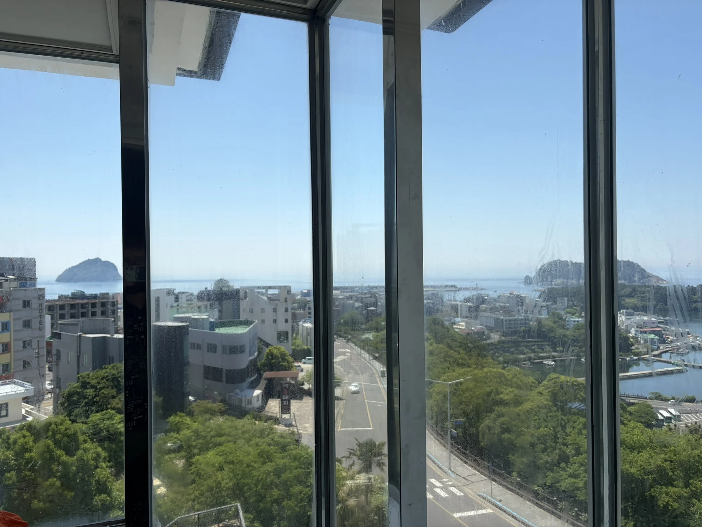
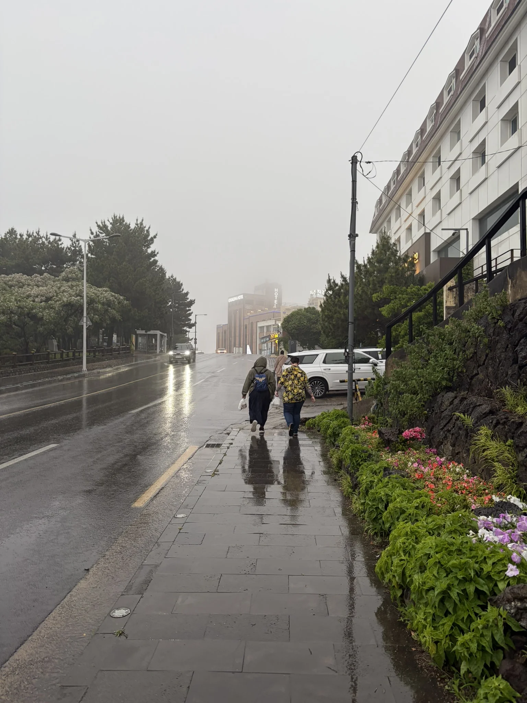
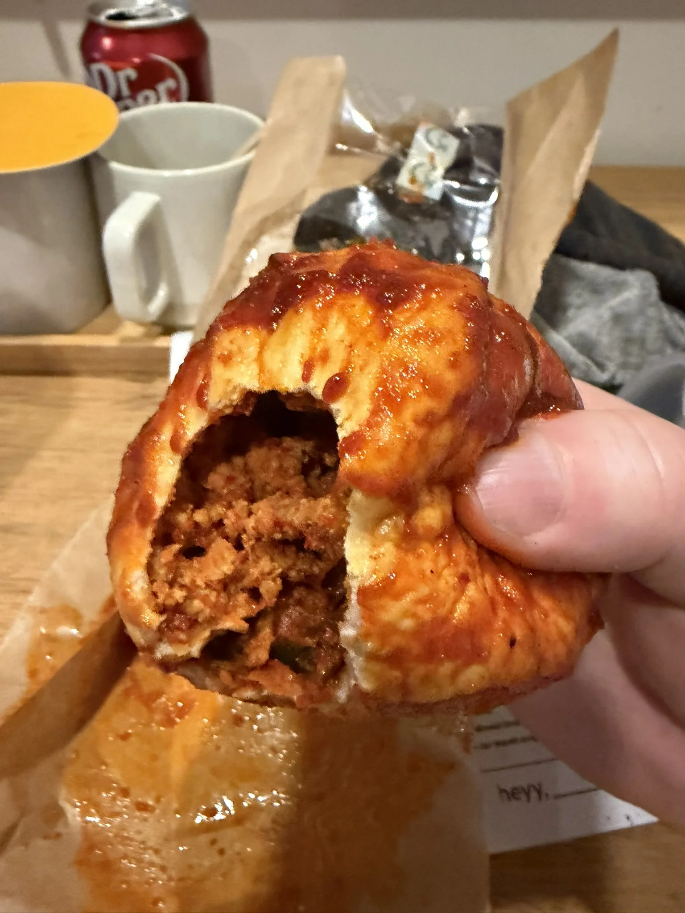

> [!INFO] Want to know less?
> This is a full breakdown of my holiday - day-by-day.
>
> If you want to just see the highlights, I will post a round-up at the end of this series.

## Previously

In [part 5]() we explored the Three Kingdoms Capital, before we flew to Jeju Island.

Now, it's time to explore the southern side of Jeju Island.

## 18^th^ May: 'heyy, seogwipo'

I think it's safe to say that our arrival in Jeju coincided with a downshift in our holiday, with more downtime and less touristing.

Today would be a very casual day of wandering around the vicinity of our hotel and seeing what Seogwipo has to offer.
The forecast was looking quite miserable in a couple of days time, as it was set to start raining and not stop, so we wanted to see something before the skies opened.



We also were a bit worn out from ten days of looking and pointing at things (aka a holiday), so we started this Monday with a very lazy start.

{style="width:50%;" class="items-center mx-auto text-center"}

### Jeongbang Waterfall

One of the major draws of Jeju Island is its nature, and specifically its waterfalls.
First up on today's very lazy agenda was the 'Jeongbang Waterfall' ([Google](https://maps.app.goo.gl/A316KUyQAFfCbBSA6), [Naver](https://naver.me/5JqpzS2d)).

Two of our group had been out and about, so we went to meet them at Olle Market (we head back again [later]() as this was only a fleeting visit).
Once we had gathered, we wandered west to our first waterfall on our holiday.

But first, some lunch at a little roadside café, 'Jejugot' ([Google](https://maps.app.goo.gl/UbRkmwXDjjLHrS9m6), [Naver](https://naver.me/5fdI2WF3)).
I am 100% convinced we would have not managed to get a table if one of our group did not speak Korean, as it was quite busy, so getting a table required a bit of back and forth.

'Jejugot' sold a very tasty spicy seafood ramen, and they did not reduce the heat level for my western palette.
I would recommend it if you are in the area.

The waterfall was 2000 ₩ a person (£1), and was down about 3-4 storeys of steps, from the car park, to the beach below the waterfall.
Yes, I did use the bench halfway up on the way back.



When we were admiring the waterfall, multiple busses of school children arrived, which signalled our time to leave.

The midday sun was high, and as such we might have well been walking back over the surface of a star.
Luckily on the way back, my iced coffee addiction was sated at 'Vacuum' ([Google](https://maps.app.goo.gl/FQxT8mPx92UQ4QAK9), [Naver](https://naver.me/FQuyfpHo)), a small coffee shop which appeared in the time of our greatest need.
I kinda felt bad for the staff in Vacuum, four very sweaty English people rock up and disturb their relaxed atmosphere.

It was truly impossible to spend time outside without drowning in your own sweat, so we called it off to spend some time in our air-conditioned hotel rooms.

### Saeseom Island

Evening rolled around and so did our stomachs, so we gathered the gang together and had dinner at 'Black Pork BBQ' ([Google](https://maps.app.goo.gl/C6mf3q9mHudx6gmf8), [Naver](https://naver.me/5SKSE1DM)).
It was a pretty small place, but they managed to squeeze all of us in.
Like most BBQ places, the staff's ability to fit so many small plates on a table with a grill in the middle was impressive.

Jeju island is famous for its 'Black Pork' and I will say the pork was nice, and had a very rich flavour, but not 'travel-halfway-around-the-world' nice, so I might stick to British Pork in my sausages.

Bellies full, we decided to go for a nighttime walk, heading towards the lit up Saeyeongyo Bridge as it looked quite pretty once the sun had gone down.



From the hotel the night before, I had seen the bridge fading through the full spectrum of colours, so like a moth to a multicoloured flame I walked in its direction.
It was a bit of a journey down the hill towards it (hills were becoming a theme in Jeju), but it was rewarding when we got there.

Walking across the bridge we were expecting to get to Saeseom Island, do an about-face, and head back.
But when we got to the Island we were greeted with a walkway with an exhibition of lights.

There was no entrance fee, or any minder which we could see, the lights were just there, and they were magical.



Maybe it was the fact we didn't expect them, but it was whimsical.

As you walked around the island, the light displays were around every corner.
The total length was just over a kilometre, which took us close to 40 minutes, but you could probably do it in half the time if you were in a rush.

Hands down the best part was a projected walkway:



In retrospect this was probably my favourite thing we saw in Jeju[^1].

[^1]: Well I guess that means this holiday is downhill from here.

10/10 would stumble upon again.

## 19^th^ May: Day 12

Today was the day for another tour, and here we were set to see the ['UNESCO Highlights' of Jeju](https://gyg.me/AkT4V9ep).
It was due to start at 10:30, so we took the time to grab breakfast at a local coffee shop.

When the time to depart rolled around we bundled into a tiny bus, big enough for fifteen people.

### Ilchulland

First on our list of stops was 'Ilchulland' ([Google](https://maps.app.goo.gl/EUdGvRKva21JukzJ7), [Naver](https://naver.me/Fz8SkBVv)), a renowned botanical garden on the eastern side of Jeju Island.



Ilchulland is a popular activity centre, which hosts events for schools, but our main reason for going was a lava tube whose opening it was built around.
Jeju Island is volcanic, and as such has a vast collection of lava tubes across the island.
Micheongul Cave &mdash; the lava tube in question &mdash; is said to have a full length of 1,700 meters, but currently, only 365 meters have been opened to the public.



On arrival, Ilchulland struck me as uniquely beautiful; with a wide range of plants, trees, and flowers making it seem like a tropical paradise.

We were on a deadline however, so we made a beeline to the cave.
On descent, the temperature dropped from a tropical high, to a northern England chill.



Close to the entrance of the tunnel, the cave was about five meters tall, but 300 meters into the cave it got down to 1.5 meters.
It wasn't the first time on this holiday that I had to [practically crawl]() through low tunnels, so what was another low ceiling between friends.

The tunnel was interesting, but more interesting was the collection of spiritual/religious importance tied to the cave.
'Touch the water to your chin for wealth', or 'if the water drips in the right bowl you will be blessed with a boy', for example.

We exited the tunnel and had thirty minutes to explore the botanical gardens, which was nice, but not as unique as the lava tube itself.

### Seongsan Ilchulbong

Second on our tour were the world-famous [Haenyeo](https://en.wikipedia.org/wiki/Haenyeo) at 'Seongsan Ilchulbong' ([Google](https://maps.app.goo.gl/ntLP77qSDLMyHR2t8), [Naver](https://naver.me/5ho1tYsG)), a mountain on the very eastern coast of Jeju Island.



'Haenyeo' &mdash; also known as 'Diving Ladies' &mdash; are female divers whose livelihood consists of collecting molluscs, seaweed, and other sea life from the ocean.
The career has been declining since industrialization, but regular displays are still run for cultural education, which was what we were heading to see.

We arrived in a car-park overshadowed by a mountain by the coast.
The display began in half an hour, so we made our way down to the beach to ensure that we had a good spot.



Like most events, I took zero pictures or footage, so I will leave it up to the reader to hunt down videos on the divers.

The actual display was a bit of dancing (I assume for our benefit), followed by about 15-20 minutes of diving.
It was unique to see something that was important one thousand years ago, but has been replaced by more modern methods; like seeing a roof being thatched.

After the display, we loitered to listen to stories from the divers, before making our way back up top to have some very tasty burgers at 'Greenroof' ([Google](https://maps.app.goo.gl/FRNw9pJd6i7PznZB9), [Naver](https://naver.me/5OltsUtf)).

### Seongeup Folk Village

The last stop on our trip was the 'Seongeup Folk Village' ([Google](https://maps.app.goo.gl/PynkxTVUnvXj3Z4x8), [Naver](https://naver.me/GP2lAUS2)).



Like many of the [Hanok villages]() we had visited before, the setup was mostly the same, however this village was in the traditional Jeju style, with stone walls and thatched roofs.
Unlike many of those Hanok villages, this one has been continually inhabited for around 600 years; making it quite old.



We wandered around looking at various houses, many of which were lived in, and quite a few of which were available to rent for tourists.

My most interesting takeaway was their local method of signifying occupancy, by the '[Jeongnang](https://en.wikipedia.org/wiki/Jeongnang)'.
Each house had three sticks that act as a front gate, and each post had three places to hang the stick.
From Wikipedia:

> The position and number of the poles also served to quickly communicate where the owner of the house was.
> If all three poles are placed in parallel, then the owner of the house was far from home.
> If the poles are hanging from one pillar diagonally, then the owner is at home.
> If two poles are parallel and one hanging, then the owner is away and will be back soon.

Once we had done a loop of the village, we hopped back on the bus, back to our hotel.

### Olle Market

A quick refresh in our hotels and our group made its way toward 'Olle Market'.

Olle Market is known for having a wide array of food, so we hoped to find something unique and tasty for dinner.

Unfortunately it began to rain and pour.

First order of business was to buy an umbrella, which luckily were everywhere.
The Koreans frequently use umbrellas to protect themselves from the sun, but protection is protection.

{style="width:50%;" class="items-center mx-auto text-center"}

When we arrived, my first thought was that Olle Market was a sensory overload.
A collection of covered pedestrianized streets, with stalls running their full length, as far as the eye could see.

You could buy anything from umbrellas (check), to live fish.
Importantly, there were lots of places to buy a wide variety of food from.

I forgot to take a picture, but here are two great photos by [Michelle Leong](https://www.flickr.com/photos/131730496@N05/20623584625/) and [Chin Eu](https://www.flickr.com/photos/100468964@N04/52586074521/) which show the atmosphere in the market.

Two of our group stopped to buy fresh fish for Sashimi, but the real draw for me were the very unhealthy looking buns at [Jeseong bakery](https://naver.me/52aRSBvf).
These buns look positively evil, coated in spicy sauce and filled with spicy pork.

Food in hand we sprinted back to the hotel for hunker down for the night, watching the rain wash down the streets outside.

The bun lived up to expectations, and was one of the spiciest things I ate all holiday.

{style="width:50%;" class="items-center mx-auto text-center"}

Perfect.

## Next Time

Tomorrow we go visit a Tea Museum, then we fly back to Seoul for some last minute shopping.
Then, unfortunately, we head home and say goodbye to South Korea.

See you in part 7!

감사합니다!
