> [!INFO] Want to know less?
> This is a full breakdown of my holiday - day-by-day.
>
> If you want to just see the highlights, I will post a round-up at the end of this series.

## Previously

In [part 6]() we explored the southern side of Jeju Island.

Now, it's our final days on Jeju Island.
We take the time to visit a Tea Museum, before flying back to Seoul for some last minute shopping.

## 20^th^ May: Osulloc

The weather up until yesterday had been glorious, allowing us to see all the sights of Korea in their full glory.
But then the heavens opened, and today was more of the same.

The rain fell so hard overnight that I was woken at 04:00 by the sound of it hammering the outside of our hotel room window.

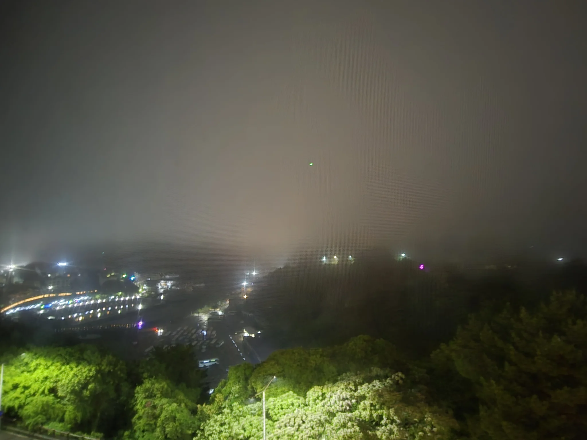
{style="width:50%;" class="items-center mx-auto text-center"}

As I said [last time](), the holiday had slowed down as it had gone on, so we were not bursting to get out and about.
There were only a handful of things we wanted to see before we headed back to the mainland.

### The Tea Museum

One of those was the 'OSULLOC Tea Museum' ([Google](https://maps.app.goo.gl/S8vvNSBWK5PPnm2o9), [Naver](https://naver.me/xsZlBfPt))

O'Sulloc are a traditional tea manufacturer in Korea, who have tea fields dotted across Jeju island (and one on the mainland).
Back in 2001 they opened a tea museum to teach tourists about the tea (and hopefully sell us some at the same time).

As an Englishman, I could not say no to visiting somewhere dedicated to tea.
Even though I mostly drink black tea[^1], I suspected it would be interesting to see the history around Korean tea manufacturing, so after a _very_ relaxed start to the day, we jumped in a taxi to the museum.

[^1]: Praise be our lord and saviour [Yorkshire Tea](https://www.yorkshiretea.co.uk/).



The journey to the museum found us driving through thick fog, which resulted in me in finding out that fog lights are not mandatory on Korean cars.
Most drivers had their hazards on, and I wondered why.
One rabbit hole later I found out that advancements in headlight technology mean that fog lights have become redundant.

Surrounded by a multitude of flashing orange lights, we progressed towards our destination.

On arrival, we were met at the front door by four or five coachloads of school children.
Somehow, we had managed to time our trip to align with a school outing for what seemed like every school child on the island.

Squeezing through the front door, two things struck me.

Firstly, this was not a museum, but a small informational entranceway with a shop and café attached.
Museums to me elicit thoughts of the [Natural History Museum](https://en.wikipedia.org/wiki/Natural_History_Museum%2C_London) in London; large expansive buildings with lots of displays and tours.

Second, it was chaos inside.
With the volume of people who had just arrived alongside us, every millimetre of space within the shop and café was occupied.

The café had an electronic ordering system, which meant we didn't need to struggle to convey our order, and we were graced with a table opening up just as we wandered past it.

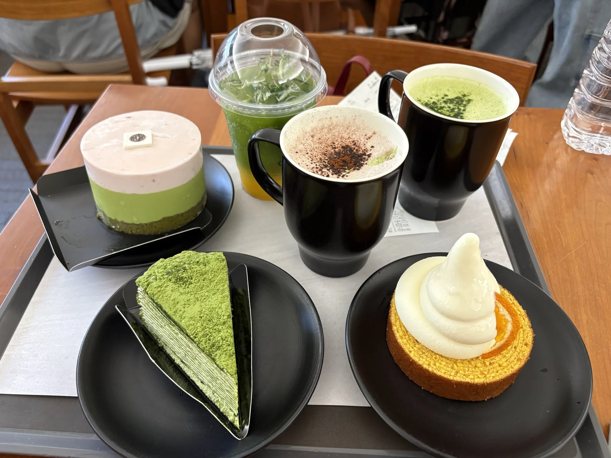
{class="text-center"}

It's safe to say that the desserts we ordered were _very_ high quality, and the warm drinks hit the spot.
Everything was delicious, so it was easy to see why the café came so highly recommended.

We spent the next few hours wandering around looking at the modest 'museum'.
A 'vault' exhibit showed how the tea is stored to age it, with boxes of tea lined up along the walls.

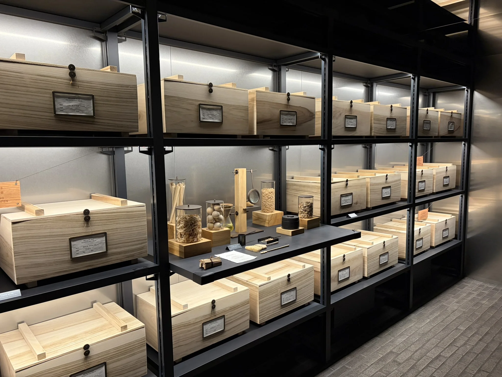
{class="text-center"}

The rear of the museum was surrounded by dense fauna and tree cover, giving it a very secluded and quiet aura.
Amongst the trees and bushes, we found a noodle bar and an Innisfree skincare shop, where we spent more time than I care to admit.

Lunch called, and so did the 'OSULLOC Tea Terrace Matcha Noodle Bar', where we had a very light but filling bowl of Matcha Noodles with a side of pork belly.
If you ever find yourself at the tea museum, I would argue that lunch at the noodle bar is a must.
I'm sure that it might have been a more pleasant experience if the sun had been shining and the wall-to-wall glass doors could have been opened.

Before we headed off, we made sure to see the tea fields, which was of course what the tea museum is all about (not the shopping or the café, of course).
Large fans for circulating air during the summer sat idle, and straight rows of tea bushes which carried on into the grey fog which still hung over the horizon.

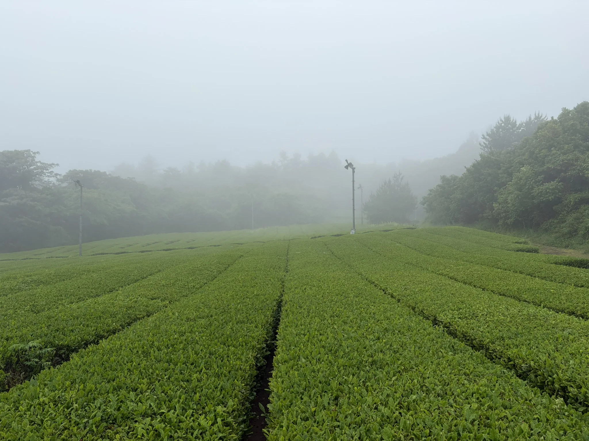
{class="text-center"}

Part of me expected the tea bushes to smell of, you know, tea.
Unfortunately the only smells to be found were the dampness of the air.

Before we took a taxi through the rain, back to our hotel, we made sure we visited the shop to buy souvenirs for our friends back home.

### Dinner of Shame

One of our group had heard about a local restaurant which blended Italian and Korean cooking, and we all decided that 'Pasta Studio Jeju'[^2] was the place for us.
After relaxing in the hotel (read: hiding from the rain) all afternoon, we set out in search of food.

[^2]: It seems that Pasta Studio Jeju is now closed, and has been replaced by a 'western food' bistro.

Unfortunately, the pasta fusion was not meant to be, as all of their tables were full, so we wandered towards the market to see what would take our fancy.

On the way, a small pub took our fancy, so we wandered in and were seated.

This is where I experienced the difference between the Korean menu, and the English menu.
The English menu, in an effort to be helpful, contained the meal name and pictures.
It did not, however, contain any information on serving size.

In my defence for what was about to happen, the pictures on the menu showed a small bowl of hot pot.
But what arrived was enough hot pot for a family of four.

Each person in our group had made the same mistake, leaving us with far too much hot pot, and a huge helping of embarrassment.
We should have twigged when we each had a small propane stove put in front of us, but we were not familiar with what that meant.

Now you could look at the meal as four foreigners being completely inept, or you could elevate yourself above the shame, like I did, and finish all of your hot pot as a hero.
Yes, I felt like I needed rolling home, but ignoring the volume of the food, it was very good.

Apologizing for the wasted food, we slunk home to our hotel.

Maybe we will be remembered as 'those four English folk who ordered too much', or maybe legend will tell stories of the man who ate over four people's worth of hot pot.
Only time will tell.

## 21^st^ May: Last Day on the Island

Waking up to our last full day on the island we resolved to visit some of the nature we had come all this way to see.

It was going to be a bit of a random day which took us all around the immediate area.



### Cheonjiyeon

First up on the docket was a nearby waterfall.
Cheonjiyeon Waterfalls ([Google](https://maps.app.goo.gl/RNg7bXf8BxxvqiXR6), [Naver](https://naver.me/FvEdPgWH))
was only 500 metres from our hotel, but unfortunately we could not go as the crow does, due to the large cliff between us.

We had taken the long way around before at night when we visited the [night lights on Saeseom Island](), but it was equally pleasant to walk during the day.
The sun had come back out and the weather was positively pleasant.

Upon arrival at a giant car park, we noticed a small entrance booth on the far side.
An automated machine charged us ₩2,000 per person (£1), and we headed towards the waterfall.

Expecting something similar to [Jeongbang Waterfall](), where we just walked down some steps and there we were, I was greeted by a small cluster of shops, past which was a 20-minute shaded walk through the forest, before arriving at the waterfall.

Out of the two waterfalls, this waterfall is number 1.

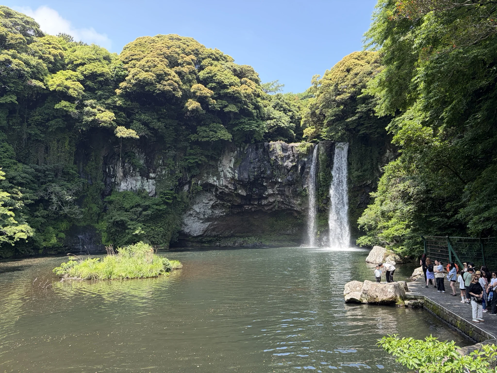
{class="text-center"}

'Pleasant' as a word keeps coming to mind when writing about this because the whole walk up, the walk back, and the little souvenir shops, were pleasing.
After the miserable rain yesterday, it was nice to be out in the sun again.

On the way back I did buy a 'Bungeo-Ppang' &mdash; a Korean Fish Shaped Pastry &mdash; which was filled with red bean paste.
I'd been eyeing them up since we arrived in Seoul, and I felt like now was the right time to try one.
It was interesting, but I think the seller overcooked it, so I'm not going to phone home about this specific one.

### Wrong side of the island

When we originally booked our time on Jeju Island, we had a hotel on the northern side of the island, near Jeju City.
We had then booked a flight at 07:00 from Jeju airport thinking that we would only be a 20-minute taxi ride away; a 05:00 arrival for the flight was not an issue given we wanted as much time in Seoul for last-minute shopping as possible.

Then however, one of our group decided to book a hotel on the south side of the island, as Seogwipo had come well recommended due to its proximity to a lot of natural sights.

Left with the choice of splitting up, or joining, we decided to also move our hotel down south, but, this left us with an hour taxi ride to the airport, as we were on the wrong side of the island.

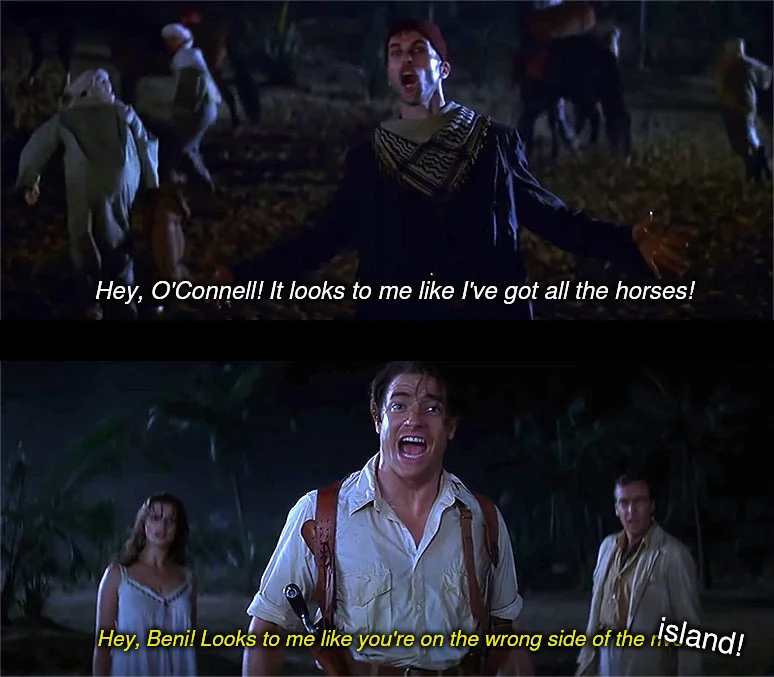
{class="text-center"}

So a 04:00 taxi was in store for us which meant getting up at 03:30 (who needs sleep?).

I was pretty worried about booking a taxi that would reliably pick us up at four in the morning.
In the UK, that's a time that will likely result in you not getting picked up and the driver ghosting you.

Luckily, having one person in your group who speaks Korean comes in handy, and she very graciously booked us a taxi with the firm that brought us from the airport in the first place.

### Bread and Pasta

Having booked the taxi for the morning we shot off to get some lunch from a place called 'All live bread' ([Google](https://maps.app.goo.gl/7BS7Zt24WYLWy642A), [Naver](https://naver.me/GvWS5fsb)); remember me saying [I loved Korean business names]()?

'All live bread' was a small, unique bakery which sold a small selection of sandwiches, breads, and desserts.
The interior decoration was _interesting_ and felt like my grandmother's lounge, with dark woods and patterned wallpaper.

Ignoring taste in decor, the flavours of the bread were outstanding, and we couldn't resist grabbing some more for the road.

If you were in Jeju and have a craving for some baked goods, you would not regret popping in here.

After our live bread experience, we headed back to the hotel to pack our bags for our early start tomorrow.

Remember when we had been turned away from 'Pasta Studio Jeju'?
Well today we made a second attempt, and this time managed to get a table for our whole group.
Did having someone on the team who spoke Korean today help get us this table?
Possibly[^3].

[^3]: I don't blame locals for giving better service to those who speak the language, it's kind of the deal of being a tourist in a foreign country.
      When am I going to be able to download languages to my brain, like in the Matrix?

The food was a delicious fusion of two different cultures, but mostly I was happy to have some cheesy pasta, because it's a comfort food of mine.
I was less happy that I let the chef argue me down to having less spice because 'it would have been too hot for him'.
What arrived had a warming spice, and I felt like I needed more of a kick; I should have stuck with my gut.

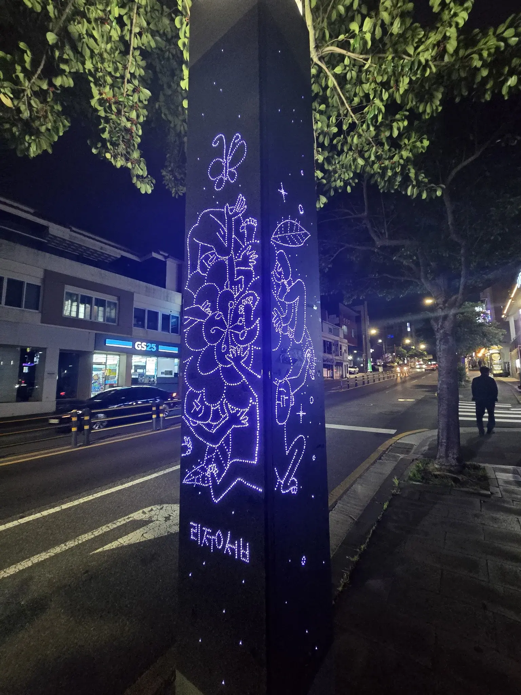
{style="width:50%;" class="items-center mx-auto text-center"}

On our way back to our hotel, the city struck me as particularly stunning tonight.
Small details like lit posts with artwork, or the clarity of the night sky above us just stuck out to me for no particular reason.
Maybe I was just sad to be leaving.

## 22^nd^ May: Seoul Again

Today was the day we flew back to the mainland, for one final day.

### Two Aircraft for the Price of One

_Eager_ to get our 07:00 flight to Seoul on time, we awoke at 03:30 to shower and get downstairs for the taxi.
And on the dot, on the dimly lit street outside our hotel, a taxi was waiting for us.
He spoke no English, and we spoke no Korean, but that was fine.

The roads were empty as we took the main road clockwise around the mountain which sits in the centre of the island.
This route was far less winding than the one we had taken to get from the airport to Seogwipo, so we arrived at the airport without everyone feeling seasick.

On arrival, it became clear that we were 30-minutes too early to check our luggage (which means we could have had more time in bed).
I suspect because it was first thing in the morning, and the airport was empty, there was no need to check baggage two hours before the flight.



Luggage checked, the freshest sandwich I had ever eaten consumed, and security passed, we walked to our arrival gates.
However, even though we had all booked on the 07:00 flight from Jeju to Seoul Gimpo which arrived at 08:15, it turned out that two of us were on one flight and two a different flight, doing the same route at the same time.

Not a massive issue as we all knew where we wanted to end up, so we went to our separate departure gates and got on our separate planes.
From what I can tell the plane was full of commuters, which might explain why there needed to be two of them doing the same route.

We landed first in Seoul and waited for the other pair to appear, then we all jumped in a Taxi to our hotel, the ENA Suite Hotel ([Google](https://maps.app.goo.gl/dGTFRaDumrg7KX6B7), [Naver](https://naver.me/GT46ymLX)) in the city centre.



Gimpo International Airport isn't too far out of the city, so the taxi ride wasn't too long.
I did notice a fun name for a petrol station on the journey:

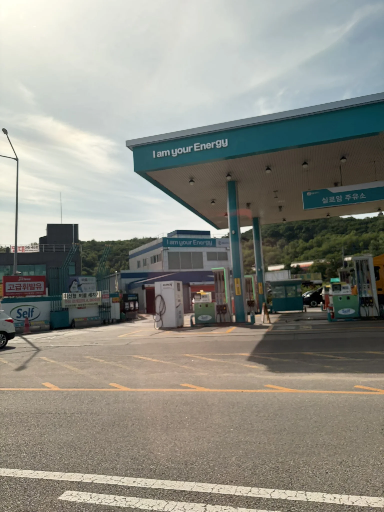
{style="width:50%;" class="items-center mx-auto text-center"}

### Luggage Dump

We were set to be in the city for only one night, so we had opted for a typical hotel.
The ENA Suite Hotel was located closer to the city centre, but further away from the Temples which had drawn us in when we were here before.

As we were so early, we dropped our luggage and head off into the city with the goal of doing the things we didn't do before (which was mostly buying souvenirs).

I am still trying to get over the embarrassment of saying the Korean for 'thank you', instead of the Korean for 'hello', as I walked through the front door.
The staff were gracious and didn't laugh too hard.



First stop on what would turn out to be a tour of the Seoul Line 2 was the 'Kakao Friends' Hongdae Flagship Store ([Google](https://maps.app.goo.gl/Pq46V1a4xfZNuzKE8), [Naver](https://naver.me/5FDEjrVj)).
I had never heard of Kakao Friends before, so I was confused why someone would trek to a specific store to find a keychain for a friend, but that's what we were doing.
Apparently the flagship store had products not found elsewhere, but to me, it was just somewhere I could use the bathroom before we went to find food.

I'm a simple man.

### ShinLeeDoGa

Korea had not been short of adorable food and adorable buildings, but 'ShinLeeDoGa' ([Google](https://maps.app.goo.gl/PjuU7EJ9w5qcRZtJ6), [Naver](https://naver.me/G3vPZa9w)) was a mixture of both.

We arrived through a 'portal' which guided us into a corridor leading into the main space of the café.
A small courtyard with a fake river and water feature sat behind floor to ceiling windows.

It was very whimsical.



The food itself was worth the walk over, with their 'Internet Famous' special being small mousse desserts in the form of a sleeping bear as especially photo worthy.
My cheese toasty was rather pleasant as well.

### Gangnam

Our final stop on our tour of line two was the Gangnam District of Seoul.
There were two tourist spots close to one another that we wanted to visit before we left, and there was no time like the present.

Hauling ourselves out of ShinLeeDoGa was a struggle because the seats were far more comfortable than they had any business being.

Between ShinLeeDoGa and the nearest subway station is 'University Street', which is a street lined with lots of shops and stalls, but all I remember it for is this absolute legend selling gimbap:

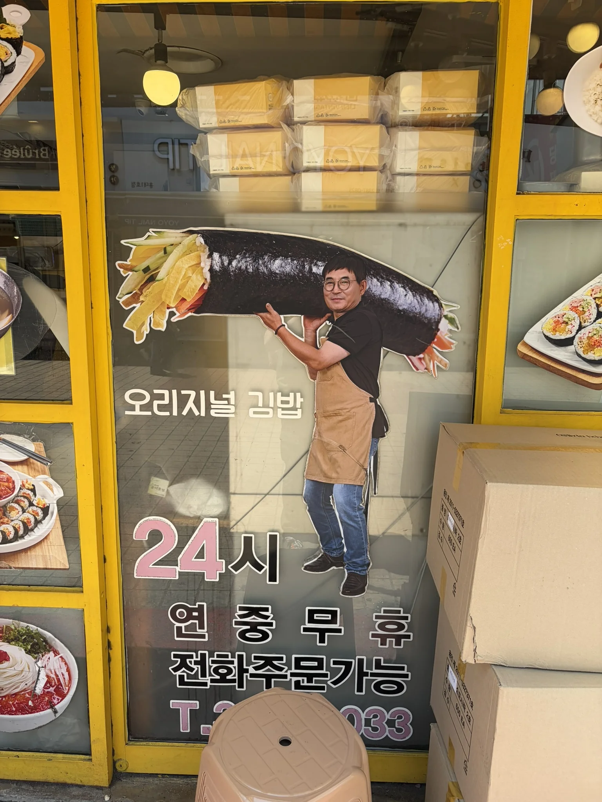
{style="width:50%;" class="items-center mx-auto text-center"}

As we sat on the subway towards Gangnam, it was safe to say that we had burned out.
I sat quietly and read a book, occasionally looking up to watch as the city flew past.

I was ready to go home.

We arrived in Gangnam resenting the midday sun, which reminded us we had dressed for a colder morning start.

The Gangnam District is a very affluent area of the city, and is thick with fancy high-rise glass buildings.
Amidst all of that there lay the first of two tourist 'attractions'.

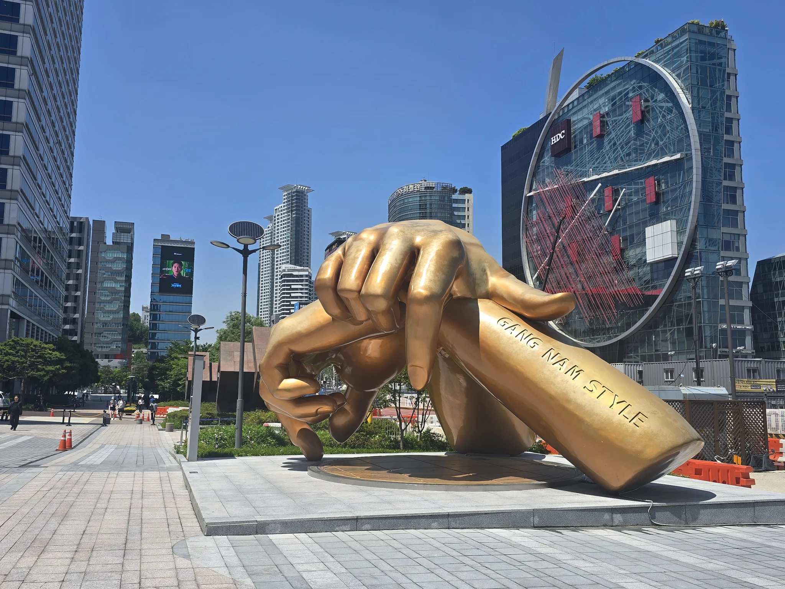
{style="width:50%;" class="items-center mx-auto text-center"}

Giant golden 'Gangnam Style' hands, in the style of [Psy](https://en.wikipedia.org/wiki/Gangnam_Style).

It was, and I'll be honest here, a _touch_ underwhelming.
I'm sure it would probably be cool if you have a strong love for the song, but I am at best 'a casual fan'.

Next up was a visit to the 'Starfield COEX Mall', which heralds itself as the world's largest underground shopping centre.
Heading into the mall you could have convinced me I was in any up-market mall in any country in the world.
Many of the same brands lined the stores, and adverts for the same brands adorned all the walls.
Is it possible to escape Pandora?

One thing that was unique, however, was the Starfield Library; which was our second tourist destination in Gangnam.

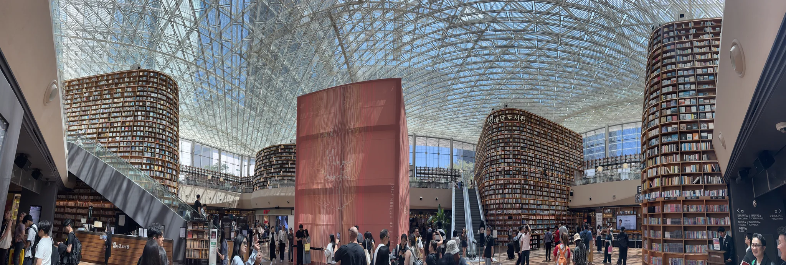
{class="text-center"}

Now I know not all of the books are real, and many of those on the upper shelves are just for display, but it was still impressive to stand between shelves that went up, and up, and up.

Tourist battery drained, we hit up a nearby restaurant called 'The place', and grabbed some lunch.
Sitting there in the 'could have been in an airport' restaurant we made ourselves useful and checked into our flights; another reminder that we were at the very end of our trip.
I was so looking forward to getting back home and seeing my dogs again.

After extracting ourselves from the mall which seemed more like the Backrooms when you want to leave, we hopped back on line 2 to complete our loop.

Lap complete, we finally checked into our hotel, and collapsed for an afternoon nap.
We had taken a sleep-based loan by getting up at 03:00, and now it was time to pay it back.

### Myeongdong Again

Unfortunately, we had been seriously lacking in picking up presents for people back in the UK.

We had grabbed chocolate from Jeju Island, and magnets from the [DMZ](), but now it was time to frantically fill in the gaps with gifts from the skincare capital of the world.

No better place to do that than Myeongdong Market (for the third time).



[Olive Young]() was naturally first on our list, to buy a novelty MagSafe charger and a _mental_ volume of skincare.

A nearby store sold small three-button mechanical keyboards where you could choose a variety of key caps.
For anyone with friends with ADHD who like fidget toys, these were a great find.

Several makeup and skincare stores later we bounced onto the street to buy our final street food of the holiday.
I can't remember what I had, as it was all blending together.

Last, but by no means least, we visited a store that seemed to contain every variety of instant noodle, every type of KitKat, and anything in between, for some final food-based gifts.

Filled with anxious energy after a day of sitting on subways and waiting for _someone_ to pick which type of face mask they wanted to buy, I decided to leave the rest of the group and walk back to the hotel.

The city was quiet, with most of the shops being closed.
I did stumble upon a homeless camp, hidden from view in an underground footpath, which did answer a question I hadn't consciously asked.

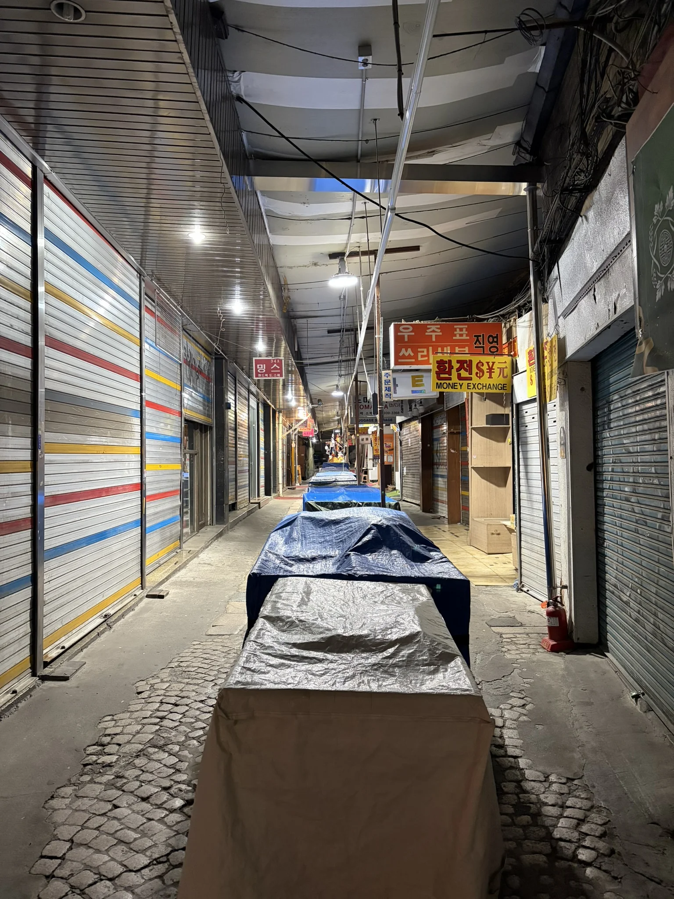
{style="width:50%;" class="items-center mx-auto text-center"}

Fifteen minutes later I was back at the hotel, before the rest of my group's taxi had even arrived.

## 23^rd^ May: Homeward Bound

And, like a flash, that was it.
My last day in South Korea and I was eager to leave.

I missed my dogs.

But before I could get back to them, I needed to travel 5,000 Nautical Miles.



There's not many unique things you can write about when leaving a hotel, getting a taxi to the airport, checking in, and heading through security.

So, I think I will skip mentioning them.

My only callout would be that getting through security took almost an hour, leaving us enough time to grab a snack before we were called for boarding.

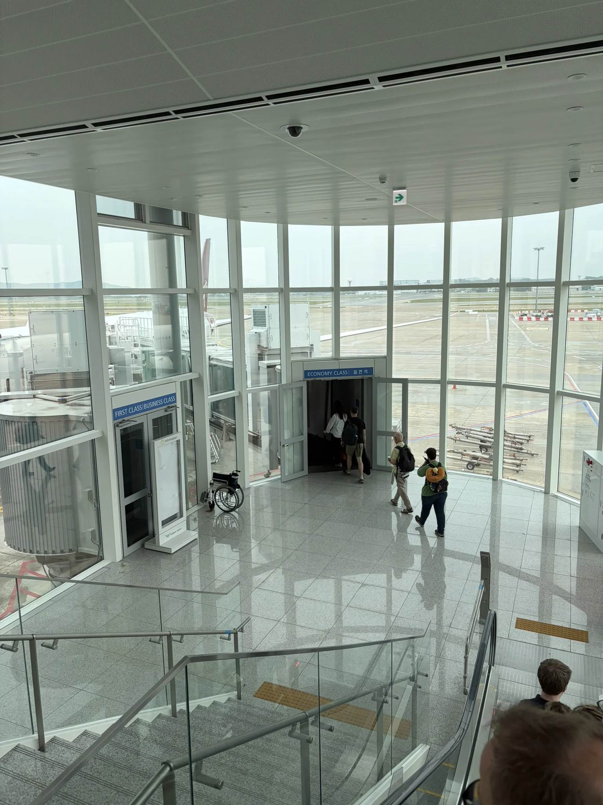
{style="width:50%;" class="items-center mx-auto text-center"}

The flight back was uneventful as flight that had to divert around multiple active war zones can be.
We were scooped up by a pre-booked taxi driver[^4] at arrivals and delivered back to our house, and more importantly, our dogs.

[^4]: Another call out to [SC Airport Cars](https://sc-airportcars.co.uk/)!

## Fin

If you have read this far, thank you.

South Korea was an absolute blast.

I was a _huge_ sceptic about 'hopping' from place to place, but our four different locations (Seoul, Busan, Jeju Island, and Seoul again) kept the holiday fresh.
Consider me sold on the idea for future holidays.

I'm going to do a round-up with all of my favourite places to eat and visit, and the handful of travel tips I picked up while I was in Korea.
So, to those of you that did read all of these, you could have saved yourself all the hassle.

Again, thank you, and thanks to South Korea for having me.
I hope to visit again someday.
